# LOCAL ROUTE 기획 통합 정리본

> 검증된 로컬 장소로 실행 가능한 일정을 만들고, 외국인 여행자가 현장에서 실제로 이용할 수 있도록 돕는 여행 동행 서비스

- 문서 상태: 팀 논의용 통합 초안
- 기준일: 2026-08-25
- 통합 기준: 기존 `LOCAL_ROUTE_기획서.md`의 핵심 의도 + 현재 데모 구조 + 추가 기능 피드백
- 주의: 이 문서는 구현 확정서가 아니다. 기능 범위, 우선순위, 데이터 확보 가능성은 팀 논의 후 확정한다.

---

## 1. 문서 목적과 표기 원칙

이 문서는 기존 기획의 방향을 보존하면서 흩어진 아이디어를 하나의 사용자 여정과 기능 우선순위로 정리한다. 특히 외국인 여행자가 한국에서 겪는 탐색·이동·주문·결제·기록의 단절을 보완하는 데 초점을 둔다.

| 표기 | 의미 |
| --- | --- |
| **[핵심 원칙]** | 서비스 정체성을 위해 유지해야 할 기준 |
| **[현재 기반]** | 현재 데모 또는 기존 기획에 이미 존재하는 기반 |
| **[개선 제안]** | 사용자 가치가 높아 추가 검토할 기능 |
| **[MVP 후보]** | 데모에서 핵심 가설을 보여주기 좋은 범위 |
| **[후속 단계]** | 가치가 있지만 데이터·비용·기간상 이후로 미룰 범위 |
| **[검증 필요]** | 사용자 조사, 공식 API, 법률 또는 운영 검증이 필요한 항목 |

시장 규모, 전환율, 매출, 정확도 목표 등 실측되지 않은 수치는 모두 가설로 취급한다.

---

## 2. 서비스 정의

### 2.1 한 문장 정의

> LOCAL ROUTE는 현지인의 실제 방문과 재방문으로 검증된 장소를 바탕으로 여행자의 기간·예산·이동수단·취향·식단·외국인 이용 조건을 계산해 실행 가능한 시간표를 만들고, 여행 중 이동·대화·이용과 여행 후 기록까지 연결하는 로컬 여행 동행 서비스다.

### 2.2 해결하려는 문제

1. 기존 AI 여행 추천은 장소를 나열하지만 운영시간, 이동시간, 예산을 함께 만족하지 못하는 경우가 많다.
2. `현지인 맛집`이라는 표현은 많지만 실제 방문과 재방문으로 검증되는 경우가 적다.
3. 알레르기, 식단, 해외카드, 외국어 응대 같은 조건이 검색 결과가 아니라 실제 일정 계산에 반영되어야 한다.
4. 외국인은 한국 음식 이름을 알아도 어떤 식당에서 어떻게 주문해야 하는지 모를 수 있다.
5. 카카오맵·네이버지도·한국 전화번호·카카오 계정에 익숙하지 않은 사용자는 추천 장소를 알아도 현장에서 이용하지 못할 수 있다.
6. 여행 계획, 현장 행동, 사진과 후기, 만족도 데이터가 서로 분리되어 다음 추천으로 이어지지 않는다.

### 2.3 핵심 가치 제안

- **실행 가능성**: 운영시간·이동시간·예산·체류시간을 검증한 일정
- **로컬 신뢰성**: 광고 문구가 아닌 실제 방문·재방문 기반 추천
- **포용성**: 외국인 조건을 부가 옵션이 아닌 정식 제약으로 처리
- **현장 실행력**: 길찾기, 한국어 문장, 주문·결제·예약 정보를 한 흐름에서 제공
- **여행의 연속성**: 계획에서 끝나지 않고 기록과 만족도가 다음 추천으로 연결
- **추천 투명성**: 추천 근거, 정보 출처, 확인 날짜, 추정 여부를 명확히 표시

### 2.4 서비스가 지켜야 할 원칙

1. LLM은 설명·번역·의도 해석을 돕지만 장소 선정과 시간표 계산의 최종 결정자가 아니다.
2. 알레르기·운영시간처럼 안전과 실행에 영향을 주는 정보는 구조화 데이터와 출처를 우선한다.
3. 정보가 없으면 안전하거나 이용 가능하다고 추정하지 않고 `확인 필요`로 표시한다.
4. 광고비는 자연 추천 점수와 로컬 점수에 영향을 주지 않는다.
5. 정확한 위치와 민감한 여행 기록은 최소 수집하고 공개 범위를 사용자가 통제한다.
6. 기능 수보다 한 명의 사용자가 여행 전·중·후 흐름을 완주하는 경험을 우선한다.

---

## 3. 핵심 사용자

### 3.1 외국인 초행 여행자

- 한국어와 국내 지도·예약 앱이 익숙하지 않다.
- 한국에서 꼭 먹어보고 싶은 음식은 있지만 식당 검색과 주문 방법을 모른다.
- 해외카드, 영어 메뉴, 예약 방식, 환승 난이도를 미리 알고 싶다.
- 현장에서 바로 보여주거나 들려줄 수 있는 한국어가 필요하다.

### 3.2 로컬 경험을 원하는 국내 여행자

- 유명 관광지의 반복보다 현지인이 다시 찾는 장소를 원한다.
- 장소 나열보다 실제로 따라갈 수 있는 동선과 시간표를 원한다.
- 여행 후 사진과 경로를 정리하고 공유하고 싶다.

### 3.3 로컬 사용자와 큐레이터

- 실제 반복 방문한 장소와 동네 코스를 공유하고 싶다.
- 잘못된 영업시간·메뉴 정보를 수정하고 싶다.
- 광고비가 아닌 실제 유용성과 방문으로 인정받고 싶다.

---

## 4. 전체 사용자 여정

```mermaid
flowchart LR
    A[언어 선택] --> B[여행 조건 입력]
    B --> C[먹고 싶은 음식·취향 선택]
    C --> D[식단·외국인 조건]
    D --> E[실행 가능한 일정 생성]
    E --> F[날씨·준비물 확인]
    F --> G[오늘 일정·지도 이동]
    G --> H[장소별 한국어 말하기]
    H --> I[방문·사진·영상 기록]
    I --> J[만족도·정보 정확성 피드백]
    J --> K[여행 지도·피드·다음 추천]
```

### 여행 전

- 언어와 여행 조건 설정
- 먹고 싶은 음식·필수 방문 장소 선택
- 식단·알레르기·결제·예약 조건 설정
- 추천 근거가 있는 일정 생성 및 수정
- 날짜별 날씨와 준비물 확인

### 여행 중

- 오늘 일정과 다음 장소 확인
- 앱 내부 이동 정보와 외부 지도 선택
- 장소별 필수 한국어 문장 재생
- 현장 정보 변경 신고
- 사진·영상과 간단 기록 저장

### 여행 후

- 장소별 만족도와 추천 정확도 평가
- 날짜·경로·사진이 연결된 여행 지도 생성
- 여행 일기 또는 피드 공유
- 실제 만족도를 다음 추천에 반영

---

## 5. 기능 단위 통합 제안

### 5.1 온보딩과 언어

**[현재 기반]** 한국어·영어 UI와 영문 장소 정보가 존재한다.

**[개선 제안]**

- 첫 화면에서 `English / 한국어`를 즉시 선택한다.
- 선택한 언어가 입력, 오류, 지도, 장소 상세, 공유 화면까지 유지되어야 한다.
- 한국어를 읽지 못하는 정도와 한국 방문 경험을 선택적으로 받는다.
- 국적처럼 추천에 직접 필요하지 않은 개인정보는 수집하지 않는다.
- 번역된 문장에는 필요한 경우 원문을 함께 표시한다.
- 미번역 문자열과 동적 화면 번역 누락을 별도로 검증한다.

### 5.2 여행 조건과 일정 생성

**[현재 기반]** 기간, 예산, 인원, 출발지, 이동수단, 취향, 여행 속도, 운영시간, 외국인 조건을 반영한 일정 생성이 있다.

**[개선 제안]**

- 필수 조건과 선호 조건을 UI에서 구분한다.
- 조건이 너무 강해 일정 생성이 불가능하면 어떤 조건을 완화할지 설명한다.
- 추천 결과마다 사용자의 어떤 선택이 반영됐는지 보여준다.
- 장소 고정·삭제·교체 시 전체가 아닌 영향 구간을 우선 재계산한다.
- 일정 생성 결과는 장소 목록이 아니라 도착시간, 체류시간, 이동, 비용, 추천 이유가 포함된 시간표로 제공한다.

### 5.3 먹고 싶은 한국 음식 탐색

**[개선 제안 · 높은 우선순위]** 외국인은 식당 이름보다 음식 이름으로 한국 여행을 계획하는 경우가 많다. 취향 태그와 별개로 음식 중심 탐색을 제공한다.

#### 입력 방식

- `한국에서 꼭 먹어보고 싶은 음식이 있나요?`
- 음식명 검색 + 대표 음식 추천 칩
- `꼭 먹기`와 `관심 있음` 구분
- 부산 대표 음식과 전국 대표 음식을 구분
- 사용자가 모르는 음식도 사진과 짧은 설명으로 발견할 수 있게 한다.

#### 음식 정보

- 한국어명, 영어명, 발음
- 대표 사진과 한 줄 설명
- 주요 재료, 맵기, 날것 여부
- 돼지고기·소고기·해산물·알코올 성분 가능성
- 채식·비건·할랄·알레르기 주의
- 보통 가격대와 1인 주문 가능 여부
- 부산 향토 음식 여부

#### 일정 반영

- 선택한 음식을 판매하는 식당을 일정 후보에 연결한다.
- `밀면을 꼭 먹고 싶다고 선택해 2일 차 점심에 반영했어요`처럼 이유를 표시한다.
- 조건에 맞는 식당이 없으면 무단 대체하지 않고 알려준다.
- 일정에서 해당 음식을 먹는 식당을 교체하거나 다른 날짜에 추가할 수 있다.
- 실제 방문 후 `먹고 싶었던 음식 달성`으로 기록할 수 있다.

### 5.4 식당 상세와 현장 이용 가능성

장소가 인기 있는지보다 사용자가 실제로 이용할 수 있는지가 중요하다.

- 대표 메뉴, 사진, 가격
- 한국어 메뉴명·영문명·발음
- 맵기, 주요 재료, 날것 여부
- 영어 메뉴와 영어 응대 가능 여부
- 해외카드, 현금 필요 여부
- 혼밥 가능 여부와 최소 주문 인원
- 브레이크타임, 라스트오더, 재료 소진 가능성
- 웨이팅 방식과 한국 전화번호 필요 여부
- 예약 시 카카오·네이버 등 한국 계정 필요 여부
- 포장 가능 여부
- 정보 출처와 마지막 확인일

정보 상태는 `공식 확인`, `현장 확인`, `사용자 제보`, `추정`, `정보 없음`으로 구분한다.

### 5.5 식단·알레르기 안전

**[핵심 원칙]** 안전 관련 정보의 부재는 안전함을 의미하지 않는다.

- 채식, 비건, 할랄, 글루텐 프리 등 식단을 지원한다.
- 할랄 인증, 일부 할랄 메뉴, 돼지고기 미사용을 서로 구분한다.
- 채식 메뉴의 육수·젓갈·생선소스 포함 가능성을 구분한다.
- 알레르기 성분은 번역어와 원재료명을 함께 관리한다.
- 정보가 없으면 식당을 무조건 안전 후보로 표시하지 않는다.
- 사용자가 선택한 알레르기로 현장 확인 문장을 자동 구성한다.

예시:

> 저는 갑각류 알레르기가 있습니다. 새우, 게, 조개가 들어간 음식을 먹을 수 없습니다.

### 5.6 장소별 한국어 말하기

**[개선 제안 · 높은 우선순위]** 장소를 클릭하면 그 장소 유형에서 바로 필요한 문장을 제공한다.

#### 공통 UI

- 사용자 언어와 큰 한국어 문장
- 한국어 발음 표기
- 한국어 음성 재생
- 느리게 재생
- 문장 복사
- 상대에게 보여주는 전체 화면
- 즐겨찾기와 최근 사용 문장
- 네트워크가 없어도 쓸 수 있는 핵심 문장 묶음

#### 식당 문장

- 이 메뉴 하나 주세요.
- 안 맵게 해주세요.
- 물 주세요.
- 이거 얼마예요?
- 카드로 결제할 수 있나요?
- 포장해 주세요.
- 돼지고기가 들어가나요?
- 저는 땅콩 알레르기가 있어요.
- 주문한 음식이 아직 나오지 않았어요.

#### 택시 문장

- 이 주소로 가주세요.
- 여기에서 세워주세요.
- 카드로 결제할게요.
- 트렁크를 열어주세요.

#### 숙소 문장

- 체크인하고 싶어요.
- 짐을 맡길 수 있나요?
- 수건을 더 받을 수 있나요?
- 방에 문제가 있어요.

**[MVP 후보]** 실시간 자유 번역보다 검수된 상황별 문장과 한국어 TTS를 먼저 구현한다. 안전 문장은 자동번역 결과만으로 제공하지 않는다.

### 5.7 실시간 대화 번역

**[후속 단계]**

- 사용자 언어 음성을 한국어로 번역하고 재생한다.
- 상대방의 한국어를 사용자 언어로 표시한다.
- 양쪽 문장을 큰 글씨로 보여주고 화면 뒤집기를 지원한다.
- 메뉴명, 주소, 고유명사는 원문을 함께 유지한다.
- 대화 저장 여부와 마이크 사용 여부를 명확히 알린다.
- 의료·알레르기·법률 상황에는 번역 한계를 고지한다.
- 소음 환경, 네트워크 장애, 음성 인식 오류에 대한 대체 입력을 제공한다.

### 5.8 날씨와 여행 준비물

**[현재 기반]** 데모형 날짜별 날씨와 우천·폭염 경고의 기반이 있다.

**[개선 제안]** 날씨를 정보에서 행동으로 연결한다.

- 날짜별 최저·최고기온, 체감온도
- 시간대별 강수 가능성
- 바람, 자외선, 미세먼지
- 일출·일몰
- 정보 출처와 갱신 시각
- 우산, 겉옷, 방수 신발, 모자, 선크림 등 준비물 추천
- 우천·폭염 시 실내 장소 교체 제안

예시:

> 2일 차 오후에 비가 예상됩니다. 우산을 준비하고 야외 장소를 실내 장소로 교체할까요?

### 5.9 지도와 이동 지원

**[현재 기반]** 날짜별 경로, 카카오 지도, 길찾기, 택시용 주소 카드가 있다.

**[개선 제안]** 국내 지도 앱을 모르는 외국인도 핵심 이동을 완료할 수 있어야 한다.

- 서비스 내부에서 핵심 경로와 이동 요약 제공
- Google Maps, Apple Maps, Kakao Map 등 외부 지도 선택
- 한국어 장소명과 주소 복사
- 지하철 호선, 역 번호, 출구 번호
- 버스 번호, 환승 횟수, 도보 거리
- 막차와 운행 종료 경고
- 택시 기사에게 보여줄 한국어 목적지 카드
- 교통카드 구매·충전 안내
- 길을 잃었을 때 숙소로 돌아가는 빠른 동작

외부 지도 연결 가능 여부와 API 약관은 구현 전에 공식 문서로 재확인한다.

### 5.10 여행 중 편의와 안전

- 경찰 112, 구급·소방 119, 관광통역안내 1330
- 숙소 한국어 주소 저장
- 병원, 약국, 화장실, 짐 보관, 환전, Wi-Fi
- 공항·부산역 이동
- 여권 분실 등 비상 상황 안내
- 비상용 한국어 문장
- 오프라인 핵심 일정

의료·법률·긴급 정보는 공식 출처와 갱신일을 표시하고 별도 검증한다.

### 5.11 방문 기록과 개인 만족도

앱의 추천과 사용자의 실제 만족도는 다를 수 있으므로 방문 후 부담이 적은 피드백을 수집한다.

- 전체 만족도
- 음식, 가격, 접근성, 혼잡도
- 외국인 이용 편의
- 설명과 실제의 일치 여부
- 영어 메뉴·해외카드 실제 이용 여부
- 다시 방문할 의향
- 기대보다 좋음 / 비슷함 / 아쉬움
- 추천 장소 제외 또는 교체 이유

개인 맞춤에 쓰는 비공개 데이터와 공개 리뷰를 분리하고 각각 동의를 받는다.

### 5.12 지도 기반 여행 기록

여행 전에는 계획 지도, 여행 중에는 실행 지도, 여행 후에는 추억 지도로 전환한다.

- 날짜별 방문 경로와 실제 방문 장소
- 장소별 사진·짧은 영상
- 먹었던 음식과 만족도
- 방문 날짜와 당시 날씨
- 사진이 있는 장소의 썸네일 마커
- 도시·지역·연도별 여행 기록
- `부산에서 보낸 3일` 같은 자동 회고

정확한 위치는 기본 비공개로 하고 공유 시 장소 또는 지역 단위로 낮춘다. 숙소, 출발지, 연락처, 실시간 위치는 공유 대상에서 제외한다.

### 5.13 여행 피드와 소셜

**[현재 기반]** 장소 기반 스토리, 지연 공개, 팔로우, 피드, 신고·검토 구조가 있다.

**[개선 제안]** 일반 SNS 복제보다 여행 맥락을 강화한다.

- 장소·날짜·여행 일차와 연결된 게시물
- 사진·짧은 영상과 한 줄 기록
- 일차별 여행 일기
- 여행 코스 공유와 복제
- 저장한 장소를 내 일정에 추가
- 같은 음식을 먹은 여행자의 후기
- `좋아요` 외에 `도움이 됐어요`, `실제로 방문했어요`, `정보가 달라졌어요`
- 여행 중 비공개 작성 후 종료 뒤 공개하는 기본값
- 신고, 삭제, 공개 범위, 차단 등 기본 안전 기능

### 5.14 추천 학습과 로컬 검증

- 방문 인증, 일정 채택, 제외, 재방문, 만족도를 추천 품질 개선에 활용한다.
- 실제 재방문과 검증된 리뷰가 단순 클릭보다 높은 신뢰 신호다.
- 사용자 개인 취향과 전체 로컬 점수는 분리한다.
- 만족도가 낮았다는 이유만으로 장소의 객관적 로컬 점수를 즉시 낮추지 않는다.
- 광고와 자연 추천은 후보군, 점수, API, UI를 분리한다.
- 추천 근거와 데이터 출처를 사용자가 확인할 수 있어야 한다.

---

## 6. 프런트엔드 정보 구조 제안

### 6.1 여행 단계 중심 구조

| 단계 | 주요 화면 | 핵심 행동 |
| --- | --- | --- |
| 여행 전 | 발견, 조건 설정, 일정 결과, 준비물 | 음식·장소 선택, 일정 생성·수정 |
| 여행 중 | 오늘 일정, 지도, 장소 상세, 말하기 | 이동, 주문, 현장 확인, 기록 |
| 여행 후 | 여행 지도, 만족도, 피드 | 회고, 공유, 다음 추천 학습 |

### 6.2 주요 내비게이션 후보

- 일정
- 지도
- 말하기
- 기록
- 내 여행

`말하기`는 현장 불안을 즉시 해결하는 기능이므로 여행 중에는 중앙 버튼 또는 플로팅 액션으로 노출할 수 있다.

### 6.3 프런트엔드 설계 원칙

1. 정보 구조와 사용자 흐름을 먼저 확정하고 장식은 나중에 한다.
2. 첫 화면에서 모든 기능을 설명하지 않고 현재 여행 단계에 필요한 행동만 강조한다.
3. 장소 카드는 평점보다 `이용 가능성`, `추천 이유`, `확인 수준`을 우선한다.
4. 색상만으로 상태를 구분하지 않고 아이콘·텍스트를 함께 사용한다.
5. 터치 영역, 글자 크기, 대비, 키보드 탐색, 스크린리더를 고려한다.
6. 한국어와 영어의 문자열 길이가 달라도 레이아웃이 무너지지 않아야 한다.
7. 로딩·오류·데이터 없음·API 폴백 상태를 정상 화면만큼 설계한다.
8. 모바일 현장 사용을 우선하고 데스크톱은 계획·회고 화면에 최적화한다.

---

## 7. 기능 우선순위와 범위 제안

### 7.1 데모 핵심 가설

> 외국인 사용자가 원하는 경험과 필수 조건을 입력하면, LOCAL ROUTE가 실제로 따라갈 수 있는 일정을 만들고 현장에서 이용까지 도울 수 있는가?

### 7.2 우선순위

#### P0: 핵심 데모

1. 여행 조건·취향·외국인 입력
2. 운영시간·예산·동선을 반영한 일정 생성
3. 추천 이유와 데이터 확인 수준 표시
4. 장소 고정·삭제·교체와 부분 재최적화
5. 한·영 핵심 사용자 흐름

#### P1: 외국인 차별화 데모

1. 먹고 싶은 한국 음식 선택과 일정 반영
2. 장소별 검수 한국어 문장과 음성 재생
3. 식당 메뉴·가격·식단·주문 정보
4. 날짜별 날씨와 준비물
5. 한국어 주소·목적지 카드와 외부 지도 선택
6. 방문 후 간단 만족도

#### P2: 기록과 재사용

1. 지도 기반 사진·여행 기록
2. 여행 피드와 코스 공유
3. 장소 정보 정확성 제보
4. 만족도 기반 개인화

#### P3: 후속 확장

1. 실시간 양방향 음성 번역
2. 실제 대중교통 시간표 기반 경로 최적화
3. 실시간 예약·결제
4. 대규모 하이브리드 추천과 실시간 재랭킹
5. 전국·다국어 확대

### 7.3 지금 과감히 미룰 항목

- 모든 기능의 프로덕션 수준 완성
- 자체 실시간 대중교통 엔진
- 의료·알레르기 자유 번역의 자동 보장
- 그래프 기반 부정탐지 완성
- 복잡한 광고·정산·구독 결제
- 대규모 분산처리를 위한 과도한 인프라
- 일반 SNS 수준의 영상 편집·추천 피드

---

## 8. 대표 데모 시나리오

### 사용자

영어권 첫 방한 여행자 Emily, 부산 2박 3일, 자차 없음, 해외카드와 영어 안내 필요, 밀면과 돼지국밥을 먹고 싶음.

### 흐름

1. 첫 화면에서 English를 선택한다.
2. 여행 기간, 부산역 출발, 예산을 입력한다.
3. `Milmyeon`은 꼭 먹기, `Dwaeji-gukbap`은 관심 있음으로 선택한다.
4. 영어 메뉴, 해외카드, 알레르기 조건을 설정한다.
5. 앱이 운영시간·이동·예산을 계산한 3일 일정을 생성한다.
6. `밀면을 꼭 먹고 싶다고 선택해 2일 차 점심에 반영함`이라는 추천 이유를 확인한다.
7. 2일 차 비 예보와 우산·얇은 겉옷 준비물을 확인한다.
8. 지도에서 지하철역과 출구, 한국어 주소를 확인한다.
9. 식당 카드에서 `이 메뉴 하나 주세요`, `안 맵게 해주세요`를 한국어 음성으로 재생한다.
10. 방문 후 음식·가격·영어 메뉴·해외카드 이용 여부를 평가하고 사진을 남긴다.
11. 여행이 끝나면 날짜별 경로와 사진이 연결된 부산 여행 지도를 확인하고 선택적으로 공유한다.

이 시나리오는 `추천 정확도`뿐 아니라 `현장에서 실제로 쓸 수 있음`을 한 번에 보여준다.

---

## 9. 데이터와 신뢰 정책

### 9.1 데이터 출처 등급

1. 공식 API·업체 직접 확인
2. 현장 방문 인증 사용자 확인
3. 복수 사용자 제보
4. 단일 사용자 제보
5. 규칙 기반 추정
6. 정보 없음

화면에는 출처 등급 전체를 그대로 노출하기보다 `확인됨`, `변경 가능`, `추정`, `확인 필요`로 요약한다.

### 9.2 민감정보

- 알레르기는 민감한 사용자 정보로 최소 수집한다.
- 정확한 GPS는 방문 확인 후 필요한 기간만 보관한다.
- 숙소와 실시간 위치는 기본 공유하지 않는다.
- 음성 대화는 기본적으로 저장하지 않는 방향을 우선 검토한다.
- 사진·영상의 EXIF 위치정보를 제거한다.
- 개인화 데이터와 공개 게시물을 분리한다.

### 9.3 생성형 AI 사용 범위

- 추천 이유 요약
- 구조화된 데이터의 다국어 설명
- 사용자의 자연어 수정 요청을 구조화된 명령으로 해석
- 리뷰 번역과 여행 회고 초안

운영시간, 가격, 알레르기, 주소 같은 사실은 생성형 AI가 임의 생성하지 않는다.

---

## 10. KPI 제안

### 일정 품질

- 일정 생성 완료율
- 일정 확정률
- 추천 장소 채택률과 제외율
- 일정 완주율
- 부분 재최적화 요청률
- 예상 이동시간과 실제 체감의 일치도

### 외국인 경험

- 영어 사용자 일정 생성 완료율
- 먹고 싶은 음식의 일정 반영률
- 필수 한국어 문장 재생률
- 장소 상세에서 외부 지도·주소 복사 사용률
- 영어 메뉴·해외카드 정보 정확성
- `현장에서 실제로 이용할 수 있었음` 응답률

### 여행 기록

- 방문 후 만족도 입력률
- 사진·영상 연결 장소 수
- 여행 지도 생성률
- 여행 기록 공유율
- 공유 코스 복제율

### 데이터 신뢰

- 정보 확인일이 있는 장소 비율
- 정책 변경 신고 처리시간
- 알레르기·식단 정보의 `확인 필요` 비율
- 사용자 제보와 기존 데이터 일치율

KPI를 늘리기보다 데모에서는 핵심 지표 5~8개만 선택한다.

---

## 11. 주요 리스크와 대응

| 리스크 | 대응 방향 |
| --- | --- |
| 외국인 편의 정보가 추정에 의존 | 추정 배지, 확인 날짜, 사용자 제보, 업체 확인 파이프라인 |
| 알레르기·식단 정보 오해 | 정보 없음은 안전으로 처리하지 않고 현장 확인 문장 제공 |
| 한국어 TTS 문장의 부자연스러움 | 핵심 문장 사전 검수, 속도 조절, 원문·번역 동시 표시 |
| 실시간 번역 오역 | MVP에서 자유 번역보다 검수 문장 우선, 고위험 상황 경고 |
| 카카오 지도 종속 | 내부 이동 요약과 복수 외부 지도 선택 제공 검토 |
| 여행 기록의 위치·사생활 노출 | 기본 비공개, 지연 공개, 지역 단위 공유, EXIF 제거 |
| 피드 운영 부담 | 신고·차단·검토 큐와 공개 범위를 기능보다 먼저 설계 |
| 기능 과다로 핵심 데모 약화 | P0/P1만 핵심 데모로 묶고 P2/P3는 로드맵으로 제시 |
| 실제 장소 데이터 부족 | 소수의 검증된 부산 장소와 음식으로 깊은 시나리오 구성 |
| 로컬 점수 콜드스타트 | 초기에는 규칙 기반·수동 검증 데이터를 명확히 표시 |

---

## 12. 추가 개선 의견

### 12.1 서비스 정체성 집중

발표에서는 다음 순서로 메시지를 단순화한다.

1. 실행 가능한 일정
2. 현지인이 다시 찾는 장소
3. 외국인이 실제로 이용 가능한 조건
4. 여행 후 피드백이 다음 추천의 신뢰를 높임

### 12.2 외국인 기능의 기준 변경

`영어 번역이 있음`을 외국인 지원 완료로 보지 않는다. 다음 질문에 답할 수 있어야 한다.

- 이 장소를 찾을 수 있는가?
- 입장·예약할 수 있는가?
- 원하는 음식을 주문할 수 있는가?
- 결제할 수 있는가?
- 알레르기와 식단을 전달할 수 있는가?
- 문제가 생기면 도움을 요청할 수 있는가?

### 12.3 추천보다 실패 회복 경험

좋은 일정은 한 번에 완벽한 일정이 아니라 휴무, 우천, 지연이 생겨도 쉽게 회복되는 일정이다. 장소 교체와 조건 완화 제안을 핵심 가치로 보여주는 것이 좋다.

### 12.4 기록 기능의 목적

여행 기록은 단순 체류시간 증가를 위한 SNS가 아니라 다음 세 가지 목적을 가져야 한다.

1. 사용자의 추억 정리
2. 다음 여행자를 위한 실제 이용 정보
3. 개인 취향과 추천 정확도 개선

이 목적에 기여하지 않는 일반 SNS 기능은 후순위로 둔다.

### 12.5 데이터의 양보다 깊이

데모에서는 장소 수를 무리하게 늘리기보다 대표 음식과 장소 몇 개에 메뉴, 주문 문장, 식단, 결제, 이동, 최신성 정보를 깊게 연결하는 편이 설득력이 높다.

---

## 13. 팀 논의가 필요한 결정 사항

다음 항목은 구현 전에 팀이 명시적으로 결정해야 한다.

1. 1차 핵심 타깃을 외국인과 로컬 여행자 중 누구로 둘 것인가?
2. 먹고 싶은 음식 데이터를 어느 범위까지 직접 구축할 것인가?
3. 음식·메뉴·알레르기 정보의 공식 출처를 어떻게 확보할 것인가?
4. 한국어 TTS는 브라우저 기본 기능, 외부 API, 사전 생성 음성 중 무엇을 사용할 것인가?
5. 지도는 카카오 중심을 유지하면서 외부 선택지만 제공할 것인가?
6. 사진·영상 저장과 공개 범위를 데모에서 어디까지 구현할 것인가?
7. 방문 만족도를 개인화에만 쓸지 공개 리뷰에도 쓸지 어떻게 동의를 나눌 것인가?
8. 6주 데모의 P0/P1 범위를 어디까지 확정할 것인가?
9. 기존 구현 중 실제 데이터가 아닌 Mock·추정·수동 시드 항목을 발표에서 어떻게 표시할 것인가?

---

## 14. 최종 권고

LOCAL ROUTE의 가장 강한 방향은 `여행지를 추천해 주는 앱`이 아니라 다음 경험을 하나로 연결하는 것이다.

> 먹고 싶은 한국 음식을 고른다 → 이용 가능한 식당이 포함된 일정을 받는다 → 날짜별 날씨에 맞춰 준비한다 → 지도와 한국어 안내로 현장까지 이동한다 → 필요한 문장을 음성으로 들려준다 → 실제 만족도와 사진을 남긴다 → 여행 지도와 피드가 완성되고 다음 추천이 더 정확해진다.

프런트엔드는 이 전체 흐름을 한 번에 넓게 구현하기보다, 외국인 사용자가 `음식 선택 → 일정 반영 → 현장 주문`을 끝까지 성공하는 세로 흐름을 먼저 완성하는 것이 좋다. 이후 날씨·기록·피드가 자연스럽게 연결되도록 확장한다.

데모의 성공 기준은 기능 개수가 아니라 사용자가 추천된 장소에 실제로 도착하고, 이용하고, 만족도를 남길 수 있다는 것을 설득력 있게 보여주는 것이다.
