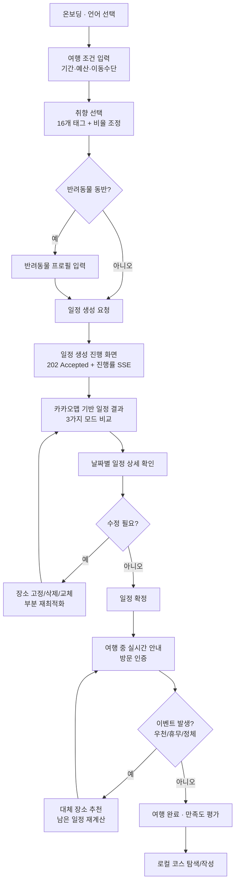
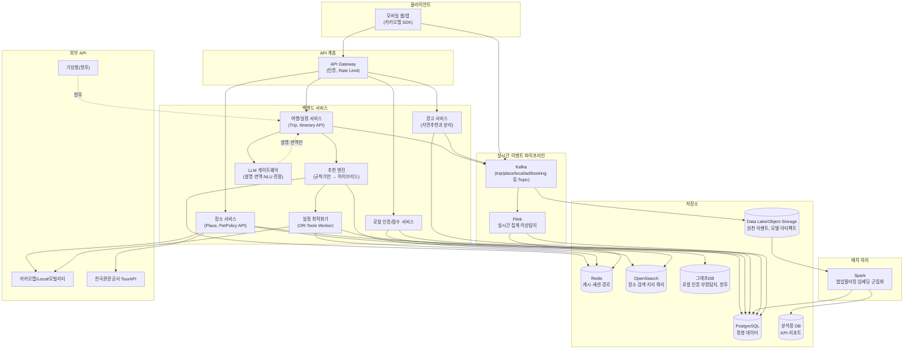
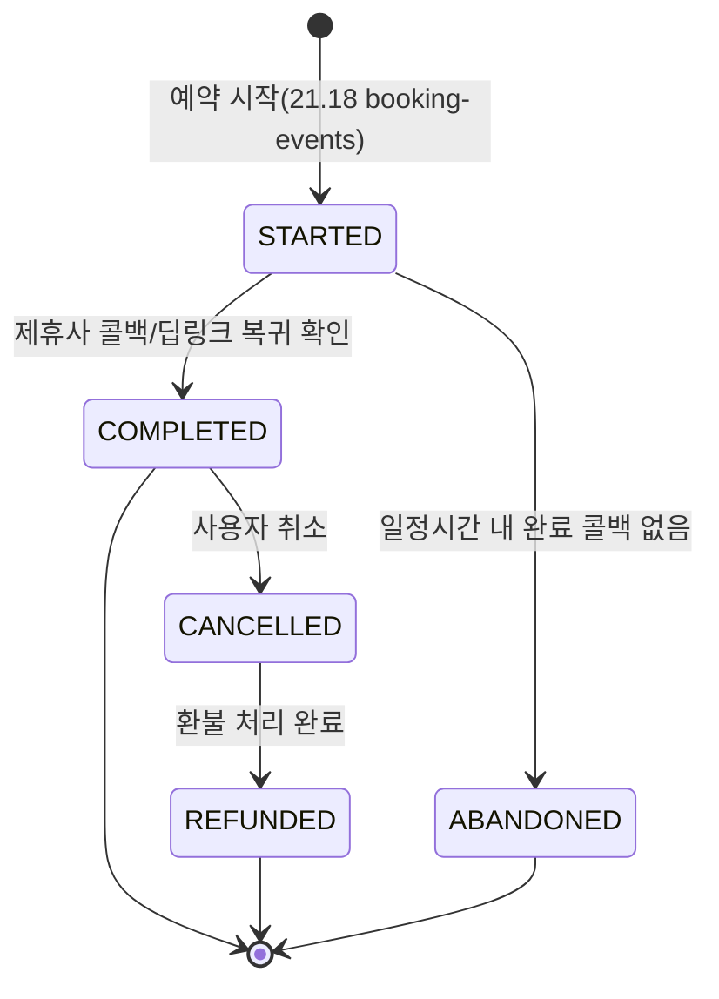
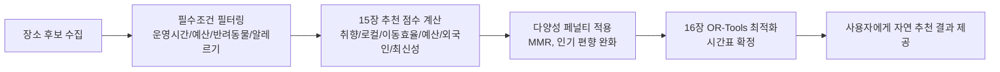
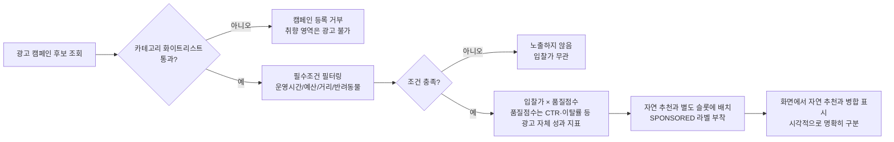

# LOCAL ROUTE 서비스 기획서

**부제**: 현지인이 다시 가는 곳으로, 반려동물과 외국인도 걱정 없이 — 실행 가능한 로컬 여행 코스 자동 생성 플랫폼

작성일: 2026-08-20 | 문서 버전: v1.0 (초안)

---

## 문서 표기 규칙

이 기획서는 서로 성격이 다른 세 종류의 문장을 명확히 구분하여 표기합니다.

| 표기 | 의미 |
| --- | --- |
| **[확정 사실]** | 공식 문서·공개 자료로 확인된 사실. 조사 시점과 출처를 함께 표기 |
| **[설계 제안]** | 본 기획서에서 새로 제안하는 구조·정책·알고리즘. 팀 논의로 변경 가능 |
| **[가설·추정]** | 시장 규모, 가격, 전환율 등 검증되지 않은 수치. 반드시 실측·시장조사로 검증 필요 |
| **[추가 확인 필요]** | 공식 문서에서 명확히 확인하지 못한 항목. 계약·개발 착수 전 재확인 필수 |

가격, 매출, 트래픽, 전환율 등 시장 데이터가 필요한 모든 수치는 별도 언급이 없어도 **[가설·추정]**으로 간주합니다.

---

## 목차

1. Executive Summary
2. 서비스명 및 한 문장 소개
3. 문제 정의
4. 시장과 기존 서비스의 한계
5. 핵심 타깃 사용자
6. 페르소나 4명
7. 사용자 요구사항
8. 핵심 가치제안
9. 서비스 차별점
10. 주요 사용자 여정
11. 핵심 기능
12. 현지인 검증 시스템
13. 반려동물 동반 시스템
14. 외국인 지원 시스템
15. 추천 알고리즘
16. 경로 최적화 알고리즘
17. 외부 API 및 데이터
18. 시스템 아키텍처
19. 빅데이터 분산처리
20. 데이터 모델과 ERD
21. API 명세
22. 화면구조와 IA
23. 요구사항 명세 (기능·비기능)
24. 수익모델
25. 광고 신뢰 정책
26. KPI
27. 6주 개발계획
28. 테스트 계획
29. 발표·데모 시나리오
30. 리스크 및 대응방안
31. 향후 확장계획
32. 서비스명 후보 10개
33. 최종 결론

---

## 1. Executive Summary

LOCAL ROUTE(가칭)는 사용자가 여행 조건(기간·예산·이동수단·취향·반려동물 동반 여부·외국인 이용 조건)을 입력하면, 현지인이 실제로 검증한 장소 데이터와 운영시간·이동시간·예산 제약을 반영하여 **바로 실행 가능한 일 단위 여행 일정을 자동 생성**하는 여행 코스 최적화 서비스입니다.

기존 AI 여행 추천 서비스 다수는 유명 관광지를 나열하거나 자연어로 "대략적인 코스"를 생성하는 수준에 머물러 있습니다. LOCAL ROUTE는 다음 세 가지 지점에서 이를 구조적으로 넘어서는 것을 목표로 합니다.

첫째, 추천은 LLM의 직관이 아니라 **검증 가능한 로컬 점수를 가진 장소 데이터 + 제약조건 최적화 알고리즘**이 만듭니다. LLM은 결과를 설명하고 번역하는 역할만 담당합니다. 둘째, "현지인 추천"이라는 표현이 마케팅 문구로 그치지 않도록 GPS 방문 인증, 반복 방문, 리뷰 축적 등 **행동 기반의 로컬 인증 체계**를 둡니다. 셋째, 반려동물 동반 여행객과 외국인 여행객을 부가 기능이 아니라 **일정 최적화의 1급 제약조건**으로 다룹니다. 반려견 크기별 동반 정책, 외국어 메뉴·결제 가능 여부가 장소 추천 단계부터 필터링과 점수에 반영됩니다.

MVP는 부산, 한국어·영어, 반려견(소형·중형·대형), 자차·도보 이동을 중심으로 6명 팀이 6주 안에 만들 수 있는 범위로 제한합니다. 여기에 **지역축제 안내, 기념품샵 지도, 날씨 안내, 동행자 공동 편집, 소셜(스토리·팔로우)** 까지 포함해 여행 전·중·후 경험을 잇습니다. 전국 확장, 대중교통 완전 지원, 실시간 예약, 다국어 확대, 고양이 등 타 반려동물 지원은 후속 단계로 분리합니다.

다만 이 범위는 6명·6주 기준으로 **매우 공격적**입니다. 27.2장에 각 기능의 MVP 구현 범위를 좁게 못 박고, 자리를 만들기 위해 무엇을 덜어냈는지를 함께 기록했습니다.

수익모델은 자연 추천에 영향을 주지 않는 예약 제휴 수수료, 지역 업체 광고, 업체용 구독, 사용자 프리미엄, 로컬 코스 마켓, 관광 데이터 B2B의 6가지 축으로 설계하며, "광고비는 로컬 점수와 자연 추천 순위에 영향을 주지 않는다"는 원칙을 시스템 레벨(별도 후보군·별도 랭킹 파이프라인)에서 강제합니다.

**[가정 표시]** 팀 인원 6명, 개발 기간 6주라는 조건은 사용자가 명시적으로 지정한 기본 가정입니다. 27장(6주 개발계획) 서두에서 이 가정이 본 기획서의 전체 범위(추천 엔진, 제약조건 최적화기, Kafka/Flink 실시간 파이프라인, 다국어, 반려동물 정책 관리, 22개 화면, 24개 테이블 ERD, 로컬 인증 체계) 대비 왜 타이트한지, 어느 부분을 시연용으로 축소해야 하는지를 별도로 표시합니다.

---

## 2. 서비스명 및 한 문장 소개

### 2.1 가칭

**LOCAL ROUTE** — 프로젝트 전 구간에서 가칭으로 사용하며, 최종 서비스명 후보 10개는 32장에 별도 제안합니다.

### 2.2 한 문장 서비스 정의

원안: "외국인과 국내 여행객이 현지인이 검증한 장소 및 반려동물 동반 정보를 바탕으로 자신의 여행기간, 예산, 이동수단과 취향에 맞는 실행 가능한 여행 코스를 자동 생성하는 서비스"

**[설계 제안] 개선된 정의**:

> "LOCAL ROUTE는 현지인이 실제로 반복 방문한 장소와 반려동물 동반 정책을 검증된 데이터로 확보하고, 여행자의 기간·예산·이동수단·취향·반려동물 조건을 제약조건 최적화 알고리즘에 입력해 시간표 단위로 실행 가능한 여행 일정을 자동 생성하는, 국내·외국인·반려동반 여행객을 위한 로컬 여행 설계 서비스입니다."

### 2.3 핵심 메시지

> "관광객에게 유명한 곳이 아니라, 현지인이 다시 가는 곳으로.
> 반려동물과 외국인도 걱정 없이 떠나는 맞춤형 로컬 여행."

이 메시지는 서비스의 두 축(① 로컬 검증, ② 반려동물·외국인 포용)을 그대로 반영하며, 이후 모든 기능·화면·수익모델 설계의 기준선으로 사용합니다.

---

## 3. 문제 정의

여행 일정 계획 과정에서 사용자가 실제로 겪는 문제는 다음과 같이 구조화할 수 있습니다.

| 문제 영역 | 구체적 어려움 | LOCAL ROUTE의 접근 |
| --- | --- | --- |
| 정보 신뢰성 | 블로그·SNS 상위 노출 장소 다수가 협찬·대행 콘텐츠이며, "현지인 맛집"이라는 표현이 검증되지 않은 채 남용됨 | 행동 기반 로컬 인증 + 로컬 점수 공식을 공개하고 광고비와 분리 |
| 실행 가능성 | AI 추천 코스가 운영시간·이동시간·예산을 고려하지 않아 실제로는 따라가기 어려움(문 닫은 가게, 동선 왕복, 예산 초과) | 제약조건 최적화기(OR-Tools)가 운영시간·이동시간·예산·체류시간을 동시에 검증 |
| 반려동물 동반 정보 부재 | 동반 가능 여부가 장소별로 흩어져 있고 최신 정보인지 알 수 없어 방문 후 거부당하는 사례 발생 | 정책 데이터에 확인일·확인자 수·출처를 구조화하고, 오래된 정보는 방문 전 전화 확인 UX 유도 |
| 외국인 여행 장벽 | 언어, 결제수단, 환승 난이도, 알레르기·식단 정보가 코스 추천에 반영되지 않음 | 외국인 이용 편의성을 추천 점수의 정식 항목으로 포함, 구조화된 다국어 안내 제공 |
| 일정 수정 비용 | 장소 하나를 바꾸면 전체 일정을 처음부터 다시 짜야 함 | 고정 장소를 유지한 채 해당 구간만 부분 재최적화 |
| 광고와 추천의 혼재 | 대가를 받은 장소가 "추천"으로 위장되어 신뢰가 무너짐 | 자연 추천과 광고를 별도 후보군·별도 점수 체계로 분리, UI에서 명시적으로 구분 표시 |

---

## 4. 시장과 기존 서비스의 한계

**[가설·추정 — 시장조사 필요]** 아래 서술은 공개적으로 알려진 서비스 카테고리의 구조적 특징에 대한 정성적 분석이며, 각 서비스의 정확한 사용자 수·매출·점유율은 별도 시장조사가 필요합니다.

| 서비스 유형 | 대표 성격 | 구조적 한계 |
| --- | --- | --- |
| 지도/내비게이션형 (카카오맵, 네이버지도 등) | 장소 검색과 길찾기는 강력하나 "일정"을 만들어주지 않음 | 여행기간·예산 전체를 고려한 시간표 최적화 기능 부재 |
| 콘텐츠 큐레이션형 (여행 블로그, SNS 맛집 리스트) | 풍부한 콘텐츠, 감성적 소개 | 정보 최신성·신뢰성 검증 체계 부재, 협찬 구분 불명확, 개인화 없음 |
| AI 챗봇형 여행 플래너 | 자연어로 빠르게 코스 초안 제공 | LLM이 운영시간·이동시간·예산을 정확히 계산하지 못해 실행 불가능한 일정을 만드는 경우가 많음, 반려동물·외국인 조건 반영 미흡 |
| 예약 플랫폼형 (OTA, 액티비티 예약) | 예약 전환에 최적화 | "일정 설계"보다 "개별 상품 판매"에 집중, 코스 간 이동시간·동선 고려 없음 |
| 반려동물 동반 전문 서비스 | 반려동물 동반 장소 정보 제공 | 일정 최적화·외국인 지원과 결합되어 있지 않아 개별 검색에 그침 |

LOCAL ROUTE는 이 다섯 카테고리의 교집합 — **지도 시각화 + 로컬 검증 콘텐츠 + 제약조건 기반 일정 자동화 + 반려동물/외국인 특화 필터 + 예약 연결** — 을 하나의 파이프라인으로 통합하는 것을 차별점으로 삼습니다.

---

## 5. 핵심 타깃 사용자

| 구분 | 설명 | MVP 반영 여부 |
| --- | --- | --- |
| 국내 여행객 | 부산 등 타 지역으로 짧은 여행을 떠나는 내국인, 유명 관광지보다 로컬 콘텐츠 선호도가 높아지는 추세 | MVP 포함 |
| 외국인 여행객 | 한국 방문 경험이 적거나 처음이며 언어·결제·교통에 불편을 느끼는 여행객. 영어권 우선 | MVP 포함(한국어·영어) |
| 반려견 동반 여행객 | 반려견과 함께 국내 여행을 떠나고 싶으나 동반 가능 장소를 찾는 데 시간이 오래 걸리는 사용자 | MVP 포함(반려견, 소·중·대형) |
| 지역 소상공인·로컬 큐레이터(공급자 측) | 자신의 가게·코스를 검증된 방식으로 알리고 싶은 지역 주체 | MVP는 정보 열람 중심, 관리자 기능은 4주차 이후 |

---

## 6. 페르소나 4명

### 페르소나 1. 국내 여행객 — 김서연(29세, 콘텐츠 마케터)

- 목표: 주말 1박 2일로 부산 여행, "SNS에 이미 많이 나온 곳 말고" 동네 느낌 나는 카페·식당을 가고 싶음
- 좌절: 블로그 상위 노출 맛집이 실제로는 관광객 전용 상권인 경우가 많음
- 필요 기능: 현지인 코스, 로컬 점수 근거, 지도 기반 동선 확인
- 성공 시나리오: 로컬 점수 상위 카페 3곳, 현지인 반복 방문 식당 1곳이 포함된 1박 2일 일정을 5분 안에 확정

### 페르소나 2. 외국인 여행객 — Emily Carter(34세, 미국, 첫 방한, 소형견 동반)

- 목표: 2박 3일 부산 여행, 반려견(8kg)과 함께, 영어 메뉴가 있는 식당 선호, 환승 최소화
- 좌절: 반려동물 동반 가능 숙소·식당 정보가 파편화되어 있고 영어로 확인하기 어려움
- 필요 기능: 다국어 안내, 반려동물 정책 구조화 정보, 해외 카드 결제 가능 장소 필터, 택시 기사에게 보여줄 한글 문장
- 성공 시나리오: 반려견 동반 숙소 예약 링크까지 연결된 실행 가능한 3일 일정을 확보

### 페르소나 3. 반려견 동반 여행객 — 박도윤(38세, 국내, 대형견 리트리버 보호자)

- 목표: 대형견과 함께 자차로 이동하며 실외 위주 일정을 원함, 산책·휴식 시간 확보가 중요
- 좌절: 대형견은 소형견보다 동반 가능 장소가 훨씬 적고, 견종·크기 제한 정보가 부정확한 경우가 많음
- 필요 기능: 반려동물 안심 코스, 크기별 필터, 근처 동물병원·용품점 표시, 정책 정보 최신성 표시
- 성공 시나리오: 대형견 동반 가능 장소만으로 구성된 2일 일정과 비상시 인근 동물병원 위치를 확인

### 페르소나 4. 로컬 큐레이터(공급자) — 이하늘(41세, 부산 영도 카페 사장 겸 로컬 인플루언서)

- 목표: 자신이 실제로 다니는 동네 상권을 코스로 만들어 소개하고, 자신의 가게 정보를 정확히 관리하고 싶음
- 좌절: 지도 서비스에 등록된 영업시간·반려동물 정책이 실제와 달라 손님과 마찰이 생김
- 필요 기능: 업체 관리자 화면(영업시간·반려동물 정책·메뉴 직접 수정), 로컬 코스 작성 및 판매, 노출·클릭 통계
- 성공 시나리오: 본인 코스가 여행객에게 실제로 사용되고, 코스 판매 수익과 가게 방문 전환을 함께 확인

---

## 7. 사용자 요구사항

사용자가 여행 일정을 생성할 때 입력하는 정보를 4개 그룹으로 정리합니다. 국적처럼 추천에 직접 영향을 주지 않는 개인정보는 최소화하고, **실제 이동·이용 편의와 직결되는 조건 위주**로 설계했습니다.

### 7.1 기본 여행 정보

| 입력 항목 | 타입 | 필수 여부 | 최적화 알고리즘에서의 용도 |
| --- | --- | --- | --- |
| 출발 장소 | 주소/좌표 | 필수 | 1일차 시작점, 이동시간 행렬 기준점 |
| 여행 목적지 | 지역 선택(MVP: 부산 고정) | 필수 | 장소 후보 지역 필터 |
| 출발일·종료일 | 날짜 | 필수 | 일수·날짜별 예산 분배, 계절 가중치 |
| 여행 인원 | 정수(성인/아동 구분) | 필수 | 좌석·테이블 필요 규모, 아동 동반 시 실내·화장실 접근성 가중 |
| 전체 사용 가능 경비 | 금액 | 필수 | 목적함수의 예산 제약 |
| 자차 여부 | Boolean | 필수 | 이동수단별 이동시간 행렬 선택, 주차 가능 여부 필터 |
| 선호 교통수단 | 자차/도보/대중교통(제한적) | 필수 | 이동시간·비용 계산 기준 |
| 하루 시작·종료 시간 | 시각 | 필수 | 일별 가용 시간 창(Time Window) |
| 여행 속도 | 여유롭게/보통/빽빽하게 | 필수 | 일별 방문 장소 수, 장소당 체류시간 버퍼 |
| 필수 방문 장소 | 장소 검색 다중 선택 | 선택 | 최적화 모델의 hard constraint(반드시 포함) |
| 제외 장소 | 장소 검색 다중 선택 | 선택 | 후보군에서 제외 |
| 하루 최대 도보 거리 | 미터 | 선택(기본값 제공) | 도보 이동 구간 제약 |

### 7.2 여행 취향(다중 선택, 가중치 슬라이더 제공)

맛집·카페·자연·사진·역사·문화·체험·쇼핑·액티비티·휴식·야경·아이 동반·반려동물·실내 활동·숨은 로컬 명소·대표 관광지 — 총 16개 취향 태그. 각 태그는 장소 데이터의 카테고리·태그와 매칭되어 추천 점수의 "취향 일치도" 항목에 반영됩니다(15장 참고).

### 7.3 외국인 여행객 정보

**[설계 원칙]** 국적 등 추천과 무관한 개인 식별 정보는 수집하지 않고, 아래처럼 **이동·이용 편의에 직결되는 조건**만 수집합니다.

| 입력 항목 | 타입 | 활용처 |
| --- | --- | --- |
| 사용 언어 | 한국어/영어(MVP) | UI 언어, 일정표·장소 안내 언어 |
| 한국 방문 경험 | 최초/재방문 | 대표 관광지 비중 기본값 조정(최초 방문 시 상향) |
| 한글 이해 수준 | 못 읽음/일부/가능 | 택시 안내문, 현장 안내 문구 구조화 수준 결정 |
| 음식 알레르기 | 다중 선택(견과류, 갑각류 등) | 식당 필터링의 hard constraint |
| 식단 제한 | 채식/비건/할랄 등 | 식당 필터링 |
| 영어 메뉴 필요 여부 | Boolean | 식당 추천 점수 가중 |
| 외국어 응대 필요 여부 | Boolean | 장소 추천 점수 가중 |
| 해외 카드 결제 필요 여부 | Boolean | 결제 조건 필터 |
| 온라인 예약 가능 장소 선호 | Boolean | 예약 가능 장소 우선 노출 |
| 환승 허용 횟수 | 0~N | 대중교통 경로 필터(향후 확장 기능과 연동) |
| 택시 이용 가능 여부 | Boolean | 이동수단 대안 제시 여부 |

### 7.4 반려동물 정보

| 입력 항목 | 타입 | 활용처 |
| --- | --- | --- |
| 반려동물 동반 여부 | Boolean | 반려동물 추천 파이프라인 활성화 여부 |
| 반려동물 종류 | 반려견(MVP), 기타(향후) | 정책 매칭 |
| 크기/몸무게 | 소형(~7kg)/중형(7~15kg)/대형(15kg~) 또는 실제 kg | 장소별 크기 제한 필터 |
| 마릿수 | 정수 | 동반 정책의 마릿수 제한 확인 |
| 이동가방 사용 여부 | Boolean | 실내 동반 정책 중 "이동가방 필수" 조건 매칭 |
| 유모차 사용 여부 | Boolean | 유모차 허용 정책 매칭, 이동 동선 폭 고려 |
| 실내 동반 필요 여부 | Boolean | 실내/실외 장소 비중 조정 |
| 장시간 산책 가능 여부 | Boolean | 자연·공원형 장소 체류시간 조정 |
| 반려동물 동반 식당 필요 여부 | Boolean | 식당 필터 |
| 반려동물 동반 숙소 필요 여부 | Boolean | 숙소 필터(hard constraint) |
| 차량 이동 가능 여부 | Boolean | 자차 이동 시 반려동물 휴식 주기 반영 |

---

## 8. 핵심 가치제안

| 사용자군 | 핵심 가치 |
| --- | --- |
| 국내 여행객 | "관광지 나열"이 아닌 "실행 가능한 시간표"를 받는다 — 운영시간·이동시간·예산까지 검증된 일정 |
| 외국인 여행객 | 언어·결제·알레르기·환승 조건을 반영한, 현지인이 검증한 코스를 언어 장벽 없이 이용 |
| 반려동물 동반 여행객 | 크기별 동반 정책이 정확히 반영된 코스와, 최신성이 불확실한 정보는 스스로 판단할 수 있는 투명한 표시 |
| 지역 소상공인·로컬 큐레이터 | 광고비 없이도 실제 방문·재방문으로 점수를 인정받고, 코스 판매로 직접 수익을 낼 수 있는 채널 |
| 지자체·관광업체(B2B, 향후) | 개인정보를 판매하지 않는 익명 집계 기반의 여행 수요·동선 분석 |

---

## 9. 서비스 차별점

| 축 | 일반 AI 여행 추천 | LOCAL ROUTE |
| --- | --- | --- |
| 일정 생성 주체 | LLM이 직접 장소·순서·시간을 결정 | 추천 엔진(규칙/하이브리드)이 후보를 평가하고, 제약조건 최적화기(OR-Tools)가 시간표를 계산. LLM은 설명·번역만 담당 |
| 로컬 검증 | "현지인 맛집"이 마케팅 문구 | GPS 방문 인증·반복 방문·리뷰 축적 기반의 로컬 등급·로컬 점수 공식 공개 |
| 반려동물 | 부가 필터 | 일정 최적화의 1급 제약조건(크기별 정책, 산책·휴식 시간까지 시간표에 반영) |
| 외국인 지원 | 번역만 제공 | 알레르기·식단·환승·결제 조건을 추천 점수와 필터에 반영, 구조화된 정보 우선 |
| 광고 | 노출 위치를 구매하면 추천처럼 보이는 경우 존재 | 자연 추천과 광고를 별도 후보군·점수로 분리, UI에 명시적 라벨 |
| 일정 수정 | 전체 재생성 | 고정 장소 유지 + 부분 재최적화 |
| 데이터 활용 | 정적 데이터베이스 | 사용자 행동 이벤트를 Kafka로 수집해 실시간·배치로 추천 품질 개선 |

---

## 10. 주요 사용자 여정



---

## 11. 핵심 기능

### 11.1 맞춤형 여행 일정 생성

일정 생성 결과는 단순 장소 목록이 아니라, 아래 12개 항목을 갖춘 **시간표(Timetable) 단위**로 출력합니다.

| 출력 항목 | 설명 |
| --- | --- |
| 방문시간 | 도착 예정 시각(운영시간·이동시간 역산으로 계산) |
| 장소명 | 한글명(+외국인 사용자에게는 영문명 병기) |
| 예상 체류시간 | 장소 유형·사용자 여행 속도 설정 기반 |
| 다음 장소까지 거리 | m/km |
| 다음 장소까지 이동시간 | 선택된 이동수단 기준 |
| 추천 이동수단 | 자차/도보(MVP), 대중교통(향후) |
| 예상 교통비 | 주유비 환산 또는 대중교통 요금(향후) |
| 예상 이용금액 | 장소 가격대 기반 1인 예상 지출 |
| 추천 이유 | 로컬 점수·재방문율·거리 등 근거 문장(15장 참고) |
| 예약 필요 여부 | 장소 데이터의 예약 필요 여부 필드 반영 |
| 반려동물 동반 조건 | 실내/실외 가능 여부, 크기 제한, 목줄 조건 요약 |
| 외국인 이용 안내 | 영어 메뉴/응대, 해외 카드, 온라인 예약 가능 여부 아이콘 |

### 11.2 세 가지 추천 모드

| 모드 | 대상 | 장소 선정 기준 | 비고 |
| --- | --- | --- | --- |
| 관광 필수 코스 | 첫 방문 여행객 | 대표 관광지 비중↑, 접근성·정보 완결성 우선 | 사진지수·인지도 가중 |
| 현지인 코스 | 재방문·로컬 경험 원하는 여행객 | 로컬 점수 상위, 관광객 밀집 지역 비중↓ | 로컬 점수 12장 참고 |
| 반려동물 안심 코스 | 반려동물 동반 여행객 | 반려동물 정책 hard filter 통과 장소만, 산책·휴식 시간 반영, 반경 내 동물병원·용품점 표시 | 실내 동반 필요 시 실내 장소 우선 |

**[설계 제안] 추천 비율 슬라이더**: 사용자는 대표 관광지/현지인 추천/반려동물 친화 비율을 (기본값 30/50/20) 조정할 수 있으며, 이 비율은 15장의 추천 점수 계산식에서 카테고리별 후보 수 배분 가중치로 사용됩니다. 세 모드는 이 슬라이더의 프리셋(관광 필수=70/20/10, 현지인=10/80/10, 반려동물 안심=10/30/60 등, **[설계 제안]** 수치는 파일럿 데이터로 튜닝 필요)입니다.

### 11.3 일정 수정과 부분 재최적화

지원 동작: 장소 고정, 장소 삭제, 장소 교체, 방문 순서 변경, 특정 날짜로 이동, 일정 사이 장소 추가, 예산 변경, 출발시간 변경, 우천 시 실내 일정 전환.

**[설계 제안] 부분 재최적화 구조**

1. 사용자가 하나의 액션(예: 3일차 2번째 장소 삭제)을 수행하면, 해당 날짜의 일정만 "재최적화 대상 구간"으로 지정합니다.
2. 고정(pin)된 장소와 이미 지난 시간대(여행 중인 경우)는 변경 불가 노드로 최적화 모델에 고정값으로 투입합니다.
3. 영향 범위는 변경 지점 기준 전후 2개 장소로 제한하는 "국소 재최적화(Local Re-optimization)"를 기본으로 하되, 시간 여유·예산이 크게 바뀌는 경우에만 해당 날짜 전체를 재계산합니다.
4. OR-Tools 모델을 동일 날짜의 축소된 후보군(고정 장소 제외)으로 재호출하며, 평균 응답시간 목표는 3초 이내(17장 비기능요구사항 참고)입니다.
5. 다른 날짜의 일정에는 영향을 주지 않습니다.

### 11.4 여행 중 실시간 재탐색 (향후 확장 — MVP 이후)

| 이벤트 | 감지 방법 | 처리 |
| --- | --- | --- |
| 비가 오기 시작함 | 기상청 API 실황 조회(주기적 polling) | 남은 실외 일정을 실내 대체 후보로 재탐색 제안 |
| 장소 임시 휴무 | 장소 데이터 업데이트 이벤트(`place-events`) | 해당 노드를 대체 후보로 교체, 남은 시간표 재계산 |
| 반려동물 입장 거부 | 사용자 신고(`pet-policy-events`) | 정책 데이터 정확도 하향 + 대체 반려동물 동반 가능 장소 즉시 추천 |
| 도로 정체 | 카카오모빌리티 실시간 이동시간 재조회 | 다음 장소 도착 예정시간 갱신, 지연 시 이후 일정 자동 압축 |
| 사용자 지연 | GPS 위치와 예정 시각 비교 | 이후 일정 시간 창을 지연만큼 이동, 체류시간이 짧은 항목부터 축소 |
| 예상보다 오래 머무름 | 방문 인증/위치 체류 감지 | 다음 장소부터 재계산, 우선순위 낮은 장소부터 제외 제안 |
| 예산 초과 | 실시간 지출 입력 또는 예약 완료 이벤트 누적 | 남은 일정의 예상 이용금액을 예산 안으로 재조정, 저가 대안 제시 |

이 기능은 MVP 범위 밖이며, 6주 계획에서는 데이터 구조와 이벤트 파이프라인만 준비하고 실제 자동 재탐색 로직은 후속 스프린트 과제로 분리합니다(27장 참고).

### 11.5 지역 관광 연계 — 지역축제와 기념품샵

여행 일정은 "장소의 나열"이 아니라 **그 시기, 그 지역에서만 가능한 경험**을 담을 때 가치가 커집니다. 축제와 기념품샵은 그 두 축을 각각 시간과 장소에서 채웁니다.

#### 11.5.1 지역축제 안내

축제는 일반 장소와 달리 **개최 기간이라는 강한 시간 제약**을 가집니다. 따라서 단순 정보 노출이 아니라 일정 최적화의 제약조건으로 직접 투입합니다.

| 처리 단계 | 내용 |
| --- | --- |
| 데이터 수집 | 한국관광공사 TourAPI 축제 검색(`searchFestival2`) + 콘텐츠 타입 15(축제공연행사) 배치 수집 |
| 기간 매칭 | 사용자 여행 기간과 `eventstartdate ~ eventenddate`가 겹치는 축제만 후보에 포함 |
| 일정 삽입 | 축제 노드는 개최 기간·행사 시간(`playtime`)을 hard time window로 갖는 방문지로 취급 |
| 추천 점수 | 취향 태그(문화·체험·야경 등) 일치도와 로컬 점수를 동일하게 적용하되, **기간 한정 가산점**을 부여 |
| 미개최 처리 | 여행 기간에 축제가 없으면 목록을 비우고, 억지로 다른 항목을 채우지 않음 |

**[설계 제안]** 축제는 "여행 기간에 마침 열리는 것"이 핵심 가치이므로, 일정 결과 화면 상단에 **"이 기간에만 열리는 축제 N건"** 배너로 먼저 알리고 사용자가 일정에 추가할지 선택하게 합니다. 자동 삽입은 하지 않습니다 — 축제는 혼잡·주차 등 호불호가 크게 갈리기 때문입니다.

반려동물 동반 사용자에게는 축제도 동일한 반려동물 정책 필터를 적용합니다. 야외 축제라도 동반 가능 여부가 명시되지 않은 경우 "확인 필요"로 표시합니다.

#### 11.5.2 기념품샵 지도

기념품 구매는 대부분 **여행 마지막 날 또는 이동 직전**에 발생하는 별도 목적의 행동입니다. 그래서 일정에 강제로 끼워 넣지 않고 **지도 위의 선택형 레이어**로 제공합니다.

- 지도 화면에서 "기념품·특산품" 레이어를 켜면 현재 보이는 영역의 상점이 마커로 표시됩니다.
- 데이터는 TourAPI 콘텐츠 타입 38(쇼핑)과 자체 로컬 큐레이션을 결합합니다.
- 각 상점에는 취급 품목, 영업시간, 카드 결제 가능 여부, 외국인 응대 여부를 표시합니다.
- **마지막 날 일정 하단에 "돌아가기 전 들를 만한 곳"** 형태로 동선상 가까운 상점을 제안합니다.

**[MVP 포함]** 데이터(TourAPI 타입 38)는 시드 수집 파이프라인에 이미 포함되므로 추가 비용은 지도 레이어 UI뿐입니다. MVP 구현 범위는 **레이어 토글 + 마커 + 간단 상세 시트 + 마지막 날 제안**까지이며, 상점 큐레이션·리뷰·쿠폰은 후속 단계입니다.

**[중요]** 기념품샵은 **광고 상품이 아니라 정보 레이어**입니다(24.2장 광고 카테고리 정책 참고). 노출 순서는 로컬 점수와 동선 효율로만 결정하며, 상점이 비용을 지불해 순위를 올릴 수 없습니다.

### 11.6 동행자 공동 편집과 일정 공유

여행은 대부분 혼자 계획하지 않습니다. "그냥 보여주기"와 "함께 고치기"는 난이도가 크게 다르므로 단계로 나누되, **MVP에서 편집까지 제공**합니다.

| 단계 | 기능 | 난이도 | 도입 시점 |
| --- | --- | --- | --- |
| 1단계 | **읽기 전용 공유** — 링크로 일정 열람, 로그인 불필요 | 낮음 | **MVP 포함** |
| 2단계 | **동행자 공동 편집** — 권한을 받은 멤버가 일정을 수정 | 중간 | **MVP 포함** |
| 3단계 | 댓글·제안, 실시간 커서·프레즌스 | 높음 | 후속 단계 |

**[MVP 구현 범위 — 좁게 못 박음]** 6주 안에 넣기 위해 다음으로 한정합니다.

| 넣는 것 | 빼는 것 |
| --- | --- |
| 초대 링크와 역할(소유자·편집자·열람자) | 실시간 커서·프레즌스 표시 |
| 편집자의 장소 추가·삭제·고정·순서 변경 | 항목 단위 실시간 동기화(WebSocket) |
| **폴링 기반 갱신(3~5초 간격)** 으로 다른 멤버 변경 반영 | 댓글·제안·투표 |
| 항목 버전 기반 낙관적 락과 충돌 안내 | 자동 병합(머지) |
| 재최적화 중 해당 날짜 잠금 | 오프라인 편집 후 동기화 |
| 변경 이력 조회 | 되돌리기(Undo) UI |

**WebSocket 대신 폴링을 쓰는 이유**: 여행 일정은 채팅처럼 초 단위로 바뀌지 않습니다. 3~5초 지연은 체감상 충분하며, 실시간 인프라·재연결·상태 동기화 구현을 통째로 덜어낼 수 있습니다. 실시간 커서가 필요해지는 시점에 WebSocket으로 교체합니다.

#### 11.6.1 권한 모델 [설계 제안]

| 역할 | 권한 |
| --- | --- |
| 소유자(Owner) | 일정 수정·삭제, 멤버 초대·제거, 공개 범위 변경 |
| 편집자(Editor) | 장소 추가·삭제·고정, 순서 변경, 재최적화 실행 |
| 열람자(Viewer) | 조회만 가능. 링크만 있으면 로그인 없이 접근 |

초대는 **만료 기한이 있는 링크**로 하고, 소유자는 언제든 링크를 무효화할 수 있습니다. 공유 링크에는 출발지 주소·연락처 등 개인정보를 제외한 일정만 노출합니다.

#### 11.6.2 동시 편집 충돌 처리 (MVP 적용)

여러 사람이 같은 일정을 동시에 수정하면 순서가 뒤엉킵니다. 이 문제는 최적화 엔진과도 얽힙니다 — A가 재최적화를 실행하는 동안 B가 장소를 삭제하면 결과가 어긋납니다.

**[설계 제안] 처리 원칙**
1. 편집 단위를 **일정 항목(ItineraryItem)** 으로 잡고, 항목별 버전 번호로 낙관적 락을 겁니다.
2. 충돌 시 나중 요청을 거부하고(`409`), 최신 상태를 반환해 클라이언트가 다시 시도하게 합니다.
3. **재최적화는 배타적 작업**으로 처리합니다. 실행 중에는 해당 날짜를 잠그고 다른 멤버에게 "○○님이 일정을 다시 계산 중"으로 표시합니다.
4. 변경 이력을 남겨 되돌리기를 지원합니다.

### 11.7 여행 기록과 소셜 — 스토리·공유·팔로우

로컬 검증 시스템(12장)은 **사용자의 실제 방문 데이터**가 있어야 작동합니다. 소셜 기능은 단순한 부가 기능이 아니라, 방문 인증과 리뷰를 자연스럽게 유도하는 **데이터 확보 장치**이기도 합니다.

**[MVP 포함 — 범위 한정]** 소셜은 기능 자체보다 **운영 체계**가 본체입니다(11.7.4장). 6주 안에 안전하게 넣기 위해 다음으로 좁힙니다.

| 넣는 것 | 빼는 것 |
| --- | --- |
| 스토리 작성(사진 + 텍스트 + 공개범위) | 좋아요·댓글·해시태그·DM |
| 장소별·내 스토리 조회 | 추천 피드 알고리즘(시간순 정렬만) |
| 팔로우/언팔로우, 팔로잉 시간순 피드 | 비공개 계정 승인 흐름 |
| **신고 버튼 + 운영자 검토 큐(내부 어드민)** | 자동 이미지·텍스트 필터(수동 검토로 대체) |
| 지연 공개(여행 종료 후) 기본값 | 실시간 알림·푸시 |

**숨은 비용 주의**: 스토리는 **이미지 업로드 인프라**(오브젝트 스토리지 + 리사이즈 + CDN + EXIF 위치정보 제거)를 새로 요구합니다. 기능 목록만 보면 작아 보이지만 실제 작업량의 상당 부분이 여기에 있습니다. EXIF 제거는 선택이 아니라 **위치 노출 방지를 위한 필수 처리**입니다.

#### 11.7.1 스토리 올리기

여행 중 방문한 장소에서 사진과 짧은 글을 남기는 기능입니다. 방문 인증(12.2장)과 연결되면 로컬 점수의 근거 데이터가 됩니다.

| 항목 | 설계 |
| --- | --- |
| 작성 단위 | 일정 항목(방문한 장소) 기준. 장소가 자동으로 태그됨 |
| 구성 | 사진 최대 N장, 텍스트, 평점(선택), 반려동물 동반 여부 태그 |
| 공개 범위 | 전체 공개 / 팔로워 공개 / 나만 보기 |
| 방문 인증 연동 | GPS 인증을 거친 스토리에는 "방문 확인" 배지 부여 |

**[안전 설계 — 반드시 반영]** 스토리에 **실시간 위치가 그대로 노출되면 안전 문제**가 발생합니다. 특히 1인 여행자에게 위험합니다. 따라서 기본값을 다음과 같이 둡니다.

- 여행 **진행 중** 작성한 스토리는 기본적으로 **여행 종료 후 공개**(지연 공개)
- 즉시 공개를 선택할 경우 "현재 위치가 공개됩니다" 경고를 명시
- 정확한 좌표가 아닌 **지역 단위(동/구)** 로만 표시

#### 11.7.2 여행 일정 공유

완성된 일정을 다른 사용자가 열람하고, **자신의 여행으로 복제**할 수 있게 합니다. 이는 로컬 코스 마켓(24.5장)의 무료 버전에 해당하며, 사용자 획득 경로이기도 합니다.

- 공유된 일정에는 원작자 표시가 유지됩니다.
- 복제 시 사용자의 여행 기간·예산·반려동물 조건에 맞춰 **자동 재최적화**됩니다(21.14 로컬 코스 적용과 동일 흐름).
- 공유 일정의 사용 횟수는 원작자의 로컬 등급 산정(12.1장 로컬 큐레이터 조건)에 반영됩니다.

#### 11.7.3 팔로우

특정 사용자(특히 로컬 큐레이터)의 새 코스와 스토리를 받아보는 기능입니다.

- 팔로우는 **단방향**(승인 불필요), 비공개 계정은 승인제
- 피드는 팔로우한 사용자의 공개 스토리·코스로 구성
- **팔로워 수는 로컬 점수에 반영하지 않습니다.** 인기와 신뢰는 다른 축이며, 광고비와 마찬가지로 로컬 점수를 오염시키면 안 됩니다(12.4장 원칙)

#### 11.7.4 UGC 운영 의무 [법무 검토 필요]

사용자 생성 콘텐츠를 받는 순간 다음 의무가 발생합니다. 기능 출시 전에 반드시 준비되어야 합니다.

**소셜을 MVP에 포함하기로 한 이상, 아래 표의 "신고·삭제"와 "불법·유해물 대응"은 기능과 같은 주차에 함께 나가야 합니다.** 이 둘은 나중으로 미룰 수 있는 항목이 아니라 게시 기능의 전제 조건입니다. 6주 범위에서는 자동 필터 대신 **신고 기반 + 운영자 수동 검토**로 처리하되, 검토 큐와 삭제·통지 절차는 반드시 동작해야 합니다.

| 항목 | 필요 조치 |
| --- | --- |
| 신고·삭제 | 게시물 신고 기능, 처리 절차와 기한, 처리 결과 통지 |
| 불법·유해물 | 자동 필터(이미지·텍스트) + 사람 검토 큐 |
| 저작권 | 타인 사진 무단 게시 대응 절차 |
| 초상권 | 사진 속 제3자 식별 문제 — 신고 기반 대응 |
| 미성년자 보호 | 연령 확인, 미성년자 대상 부적절 접촉 차단 |
| 광고성 게시물 | 협찬 스토리의 경제적 이해관계 표시 의무(25장과 동일 기준 적용) |

### 11.8 날씨 안내

날씨는 야외 일정의 실행 가능성을 좌우하지만, 예보 정확도에는 한계가 있으므로 **자동으로 일정을 바꾸지 않고 알리는 것부터** 시작합니다.

| 단계 | 기능 | 도입 시점 |
| --- | --- | --- |
| 1단계 | 날짜별 날씨 표시 — 일정 화면에 기온·강수확률 배지 | **MVP 포함** |
| 2단계 | 우천 경보 — 강수확률이 임계치를 넘으면 실외 일정에 경고와 실내 대안 제시 | MVP 포함(권장) |
| 3단계 | 자동 재탐색 — 실황 기반으로 남은 일정 재계산(11.4장) | 후속 단계 |

**[설계 제안] 처리 방식**

- 기상청 단기예보 API를 **지역·시간 단위로 배치 조회**하고 캐싱합니다. 사용자마다 호출하지 않습니다.
- 여행 시작 D-1과 당일 아침에 푸시 알림을 보냅니다: *"내일 해운대 강수확률 70% — 실외 일정 3곳이 영향을 받을 수 있어요."*
- 예보는 **추정값임을 명시**합니다(28조 원칙 8).
- 반려동물 동반 사용자에게는 폭염·한파 시 **산책 시간 조정 안내**를 추가로 제공합니다.

---

## 12. 현지인 검증 시스템

"현지인 맛집"이 검증 가능한 시스템이 되려면 신분증·정확한 거주주소 같은 민감정보 없이도 **행동 신호의 누적**으로 신뢰도를 쌓아야 합니다. 이 장은 등급 체계, 로컬 점수 공식, 부정 탐지 방법을 구체적으로 정의합니다.

### 12.1 로컬 등급

| 등급 | 진입 조건(예시, **[설계 제안] 파일럿 데이터로 임계값 조정 필요**) | 권한 |
| --- | --- | --- |
| 여행객 | 기본값 | 리뷰 작성, 장소 저장 |
| 지역 단골 | 특정 지역(반경 3km 내외 격자) 내 GPS 방문 인증이 최근 6개월간 5회 이상, 서로 다른 날짜 3일 이상 | 지역 단골 배지 표시, 리뷰 가중치 소폭 상향 |
| 로컬 | 지역 단골 조건 + 해당 지역 내 서로 다른 장소 8곳 이상 방문 인증 + 지역 리뷰 누적 90일 이상 + 광고성/조작 패널티 없음 | "로컬 추천" 라벨 부착 가능, 로컬 점수 계산에 반영되는 투표권 부여 |
| 로컬 큐레이터 | 로컬 조건 + 로컬 코스 1개 이상 작성 + 해당 코스가 다른 여행객에게 3회 이상 실제 사용됨 + 사용자 평가 평균 4.0/5.0 이상 | 코스 판매, 업체 제휴 문의, 통계 대시보드 열람 |

등급은 자동 산정되며, 조건 미달 시 자동 강등됩니다(예: 6개월간 활동 없음 → 지역 단골로 하향, 패널티 누적 → 즉시 하향).

### 12.2 인증에 사용하는 행동 신호

신분증·정확한 거주 주소는 수집하지 않습니다. 대신 아래 신호를 조합합니다.

| 신호 | 수집 방법 | 개인정보 최소화 방식 |
| --- | --- | --- |
| 지역 반복 방문 | GPS 방문 인증(장소 반경 내 체류 시간 기준) | 정확한 좌표가 아닌 "격자 셀(예: 500m×500m)" 단위로 집계, 원본 GPS는 보존기간 경과 후 삭제(17·18장 참고) |
| 서로 다른 날짜의 여러 장소 방문 | 방문 인증 이벤트 타임스탬프 | 방문 이력은 사용자 본인만 열람 가능, 통계는 익명화 |
| 선택적 영수증 인증 | OCR로 상호명·날짜만 추출, 카드번호 등 결제 상세 정보는 저장하지 않음 | 이미지 원본은 인증 처리 후 삭제, 추출 텍스트만 보관 |
| 지역 리뷰 작성 기간 | 리뷰 작성일 누적 | — |
| 로컬 코스 작성·사용 | 코스 작성/사용 이벤트 | — |
| 타 사용자의 코스 유용성 평가 | 평점·투표 이벤트 | — |

### 12.3 부정행위 방지

| 위협 | 대응 |
| --- | --- |
| 위치정보 조작(GPS 스푸핑) | 이동 속도 이상치 탐지(순간이동 패턴), 동일 기기에서 반복되는 동일 좌표 패턴 탐지, Mock Location 플래그 감지(OS 제공 API), 의심 계정은 영수증 인증 요구로 격상 |
| 영수증 중복 사용 | 영수증 OCR 해시값(상호명+금액+시각) 중복 등록 차단, 동일 해시 재사용 시 인증 무효화 |
| 광고성 리뷰 | 리뷰 텍스트 유사도 클러스터링(동일 문구 반복 탐지), 리뷰 작성 간격이 비정상적으로 짧은 계정 탐지, 특정 장소에 편중된 리뷰 패턴 탐지 |
| 지인 간 점수 교환(품앗이) | 특정 사용자 그룹 간 상호 방문 인증·상호 리뷰 네트워크를 그래프로 분석해 비정상적으로 조밀한 상호작용 클러스터 탐지(19.5장 그래프DB 활용) |
| 비정상 반복 추천 | 동일 IP·기기에서 다수 계정 생성 및 동일 장소 반복 추천/투표 탐지, 기기 지문(device fingerprint) 기반 비율 제한 |

이 탐지 로직은 **[설계 제안]** 규칙 기반 스코어링으로 시작(예: 이상 신호 3개 이상 누적 시 검토 큐로 이관)하고, 데이터가 쌓이면 배치 이상탐지 모델(19.4장)로 고도화합니다. MVP 단계에서는 자동 차단이 아닌 "검토 대기" 상태로만 처리해 오탐으로 인한 정상 사용자 피해를 방지합니다.

### 12.4 로컬 점수 계산 공식

**[설계 제안]**

```
로컬점수(장소) =
    0.30 × 검증된로컬추천수_정규화
  + 0.20 × 실제재방문율
  + 0.15 × 여행일정채택률
  + 0.15 × 방문인증리뷰비율
  + 0.10 × 로컬코스포함횟수_정규화
  + 0.05 × 최근영업확인최신성
  + 0.05 × 리뷰일관성점수
  - 패널티(광고성·조작 탐지 시 최대 -0.5, 하한 0)
```

- `검증된로컬추천수_정규화`: '로컬' 등급 이상 사용자가 추천/저장/방문인증한 횟수를 지역 내 장소 분포로 정규화
- `실제재방문율`: 동일 사용자가 90일 내 동일 장소를 재방문 인증한 비율
- `여행일정채택률`: 이 장소가 포함된 일정이 실제로 확정된 비율
- `방문인증리뷰비율`: 전체 리뷰 중 GPS/영수증 인증을 거친 리뷰 비율
- `로컬코스포함횟수_정규화`: 서로 다른 로컬 큐레이터의 코스에 포함된 횟수
- `최근영업확인최신성`: 마지막 확인일로부터 경과일 기반 감쇠 함수(90일 이후 감쇠 시작)
- `리뷰일관성점수`: 평점 분산이 비정상적으로 낮거나(품앗이 의심) 높은 경우(어뷰징) 감점

**원칙**: 광고비·프로모션 집행 여부는 위 공식의 어떤 항목에도 입력되지 않습니다. 광고와 자연 추천/로컬 점수는 코드 레벨에서 물리적으로 분리된 파이프라인을 사용합니다(25장 참고).

### 12.5 추천 근거 설명 방식

사용자에게는 공식 자체가 아니라 **사람이 이해할 수 있는 요약 문장**을 노출합니다. LLM은 아래처럼 구조화된 값을 문장으로 변환하는 역할만 수행합니다(직접 점수를 매기지 않음).

> 입력값(구조화 데이터): `{local_recommenders: 38, area: "영도", revisit_rate_3m: 0.62, pet_outdoor: true, next_place_distance_min: 8, transport: "car"}`
> LLM 출력(자연어 설명): "영도 로컬 38명이 추천했고, 최근 3개월간 재방문율이 높습니다. 반려견 실외 동반이 가능하며 다음 장소까지 차량으로 8분 거리입니다."

---

## 13. 반려동물 동반 시스템

### 13.1 설계 원칙

반려동물 조건은 "필터 옵션"이 아니라 **일정 최적화 모델의 hard/soft constraint**로 다룹니다. 크기·마릿수·이동가방 여부에 따라 방문 가능한 장소 집합 자체가 달라지므로, 추천 후보 생성 단계에서부터 반려동물 정책을 조인합니다.

### 13.2 반려동물 정책 데이터의 신뢰도 관리

정책은 자주 바뀌므로(리모델링, 사장님 교체, 코로나 이후 정책 변화 등) **정보 최신성 자체를 점수화**합니다.

| 최신성 등급 | 조건 | UI 처리 |
| --- | --- | --- |
| 최신(Verified) | 90일 이내 사용자 현장 확인 또는 정책 확인자 2인 이상 | 정책 정보 그대로 노출, "최근 확인됨" 배지 |
| 보통(Aging) | 90~180일 경과 | 정보 노출 + "최근 변경되었을 수 있어요" 안내 |
| 오래됨(Stale) | 180일 초과 또는 확인자 1인 이하 | 정보 노출 + **방문 전 전화 확인 권장** 배너, 일정 최적화 점수에서 감점(적합도 하향) |
| 상충(Conflicting) | 사용자 신고(입장 거부)와 기존 정책이 불일치 | 정책 상태를 "확인 필요"로 전환, 최적화 후보에서 우선순위 하향 및 대체 장소 우선 제시 |

### 13.3 반려동물 안심 코스 로직

1. 반려동물 조건(종류·크기·마릿수·이동가방·유모차)을 hard filter로 적용해 통과한 장소만 후보군에 포함
2. 실내 동반 필요 여부에 따라 실내/실외 장소 비율 조정
3. 크기가 클수록(대형견) 산책·휴식 시간 블록을 일정에 자동 삽입(예: 90분 이상 실외 활동 후 30분 휴식)
4. 식당·숙소는 "반려동물 동반 필요 여부" 입력이 있으면 hard constraint로 처리
5. 최종 일정에 반경 2km 이내 동물병원·반려동물 용품점을 정보성 마커로 표시(별도 방문 시간 배정은 하지 않음)

### 13.4 반려동물 정책 데이터 항목 (5장 요구사항 반영)

동반 가능 여부, 실내/실외 동반 가능 여부, 이동가방 필수 여부, 유모차 허용 여부, 크기·몸무게 제한, 견종 제한, 목줄 착용 조건, 추가요금, 반려동물 전용 시설, 급수대·배변봉투 제공 여부, 정책 확인자 수, 정책 마지막 확인일, 정책 출처, 사용자 현장 확인 여부 — 전체 필드는 20장 ERD의 `PlacePetPolicy` 테이블로 구조화합니다.

---

## 14. 외국인 지원 시스템

### 14.1 언어·정보 구조화 우선 원칙

**[설계 원칙]** 외국인에게 중요한 정보(주소, 영업시간, 가격, 반려동물 정책, 알레르기 유발 성분)는 LLM이 매번 새로 생성하는 자유 문장보다 **사전에 구조화된 데이터 + 아이콘**을 우선 노출합니다. LLM은 구조화된 데이터를 문맥에 맞게 요약·설명하는 보조 역할만 수행하며, 원본 구조화 데이터는 항상 함께 제공되어 자유 문장의 오류를 사용자가 교차 확인할 수 있게 합니다.

### 14.2 외국인 화면 공통 요소

모든 장소 카드·일정 항목에는 다음을 함께 제공합니다.

| 요소 | 목적 |
| --- | --- |
| 한글명 / 영문명 | 현지 표지판·간판과 대조 가능 |
| 한글 주소 / 영문 주소(로마자 표기) | 지도 앱 검색, 택시 기사 전달 |
| 택시 기사에게 보여줄 한글 문장 | 예: "이 주소로 가주세요: 부산광역시 영도구 ○○로 12" 형태의 고정 템플릿 문장, 목적지명+주소를 큰 글씨 카드로 별도 제공 |
| 영어 메뉴/응대 가능 여부 아이콘 | 즉시 판단 가능한 시각 기호 |
| 해외 카드 결제 가능 여부 아이콘 | 결제 실패 리스크 사전 안내 |
| 알레르기·식단 경고 아이콘 | 사용자가 입력한 알레르기 성분이 포함된 메뉴 정보가 있으면 경고 표시(정보가 없으면 "확인 필요"로 표시, 임의 추정 금지) |

### 14.3 환승·이동 난이도 반영

MVP는 자차·도보 중심이므로 환승 관련 로직은 제한적입니다. 대중교통은 외부 길찾기 연결(카카오맵 대중교통 길찾기로 딥링크)로 대체하고, "환승 허용 횟수" 입력값은 향후 전국 대중교통 확장 시 경로 필터로 사용할 데이터 구조만 MVP에서 미리 확보합니다.

### 14.4 다국어 처리 파이프라인 (LLM 사용 범위 명시)

| 처리 유형 | 담당 주체 | 근거 |
| --- | --- | --- |
| 장소명·주소·운영시간·가격 등 사실 데이터 | 사전 번역/구조화 데이터(`PlaceTranslation` 테이블) | 정확성이 안전과 직결되므로 LLM 실시간 생성 금지 |
| 추천 이유 설명 문장 | LLM(구조화 데이터 → 자연어 요약) | 매번 달라지는 조합형 문장이므로 템플릿보다 LLM이 적합, 단 입력 데이터는 고정 스키마 |
| 사용자의 자연어 일정 수정 요청 해석 | LLM(의도 분류 + 파라미터 추출) | "카페를 좀 더 조용한 곳으로 바꿔줘" 같은 요청을 구조화된 수정 명령으로 변환, 실제 대체 장소 선정은 추천 엔진이 수행 |
| 사용자 리뷰 번역 | LLM(번역) + 원문 병기 | 번역 오류 가능성을 사용자가 확인할 수 있도록 원문 항상 노출, "번역 수정" 이벤트로 오류 신고 수집 |

---

## 15. 추천 알고리즘

### 15.1 초기 추천(규칙 기반 콘텐츠 추천)

데이터가 충분히 쌓이기 전(MVP 초기)에는 아래 가중치의 규칙 기반 점수를 사용합니다.

| 항목 | 가중치 | 산출 방식 |
| --- | --- | --- |
| 여행 취향 일치도 | 25% | 사용자 선택 취향 태그와 장소 태그의 코사인 유사도 |
| 현지인 인정도 | 20% | 12.4장 로컬 점수 |
| 이동 효율 | 15% | 이전/다음 후보 장소까지의 예상 이동시간 역수 정규화 |
| 반려동물 조건 적합도 | 15% | 정책 매칭 점수(13장) |
| 예산 적합도 | 10% | 장소 가격대와 남은 일별 예산의 근접도 |
| 외국인 이용 편의성 | 10% | 영어 메뉴·응대·해외카드·온라인예약 boolean 합산 정규화 |
| 정보 최신성 | 5% | 마지막 확인일 기반 감쇠 함수 |

**정규화 규칙**: 반려동물 미동반 사용자는 "반려동물 조건 적합도" 항목을 제외하고 나머지 6개 항목의 가중치를 합이 100%가 되도록 비례 재배분합니다(예: 25/20/15/10/10/5 → 각 항목을 0.85로 나누어 재정규화 ≈ 29.4/23.5/17.6/11.8/11.8/5.9%).

### 15.2 데이터 축적 이후(하이브리드 추천)

**[설계 제안]** MVP 이후, 충분한 행동 데이터(19장 이벤트)가 쌓이면 아래를 결합합니다.

| 구성요소 | 설명 | 데이터 소스 |
| --- | --- | --- |
| 콘텐츠 기반 추천 | 15.1의 규칙 기반 점수를 유지(신규 장소 콜드스타트 대응) | 장소 메타데이터 |
| 협업 필터링 | 사용자-장소 상호작용(저장·방문인증·재방문) 행렬 기반 | `place-events`, `trip-events` 배치 집계 |
| 사용자·장소 임베딩 | 취향·행동 시퀀스를 벡터화(예: Two-Tower 모델) | 배치 학습(19.4장) |
| 지역·계절 기반 추천 | 계절별 인기 장소 통계 반영 | 배치 집계 |
| 상황 기반 추천 | 날씨, 요일, 시간대별 적합도 | 실시간 스트림 집계 |
| 최근 행동 기반 실시간 추천 | 세션 내 클릭·저장 패턴으로 즉시 재랭킹 | 실시간 스트림(19.3장) |
| 신규 장소 콜드스타트 | 상호작용 데이터 없는 장소는 콘텐츠 기반 점수 + 로컬 점수로만 노출, 노출 로그를 별도로 추적해 초기 데이터 확보 | — |
| 신규 사용자 콜드스타트 | 온보딩 취향 선택 + 인구통계적 유사 사용자군 평균 선호로 시작 | — |
| 인기 편향 완화 | 최종 랭킹에 다양성 페널티(MMR: Maximal Marginal Relevance) 적용, 동일 카테고리 상위 3개 초과 시 감점 | — |
| 새로운 장소 탐색 비율 | 최종 추천 슬롯의 10~15%는 탐색(exploration) 슬롯으로 배정, ε-greedy 방식으로 신규/저노출 장소 노출 | **[설계 제안] 비율은 파일럿 튜닝 필요** |

최종 하이브리드 점수는 `α×콘텐츠기반 + β×협업필터링 + γ×상황기반` 형태의 가중합으로 시작하며(α,β,γ는 A/B 테스트로 조정), 항상 **추천 이유를 구조화된 근거값과 함께 반환**하여 LLM 설명 문장 생성에 사용합니다.

### 15.3 추천 이유 설명 원칙

모든 추천 결과는 사용자에게 "왜 이 장소인가"를 근거값(로컬 추천 수, 재방문율, 이동시간, 반려동물 조건 등)과 함께 제공합니다. LLM은 이 근거값을 문장으로 변환할 뿐, 근거값 자체를 만들어내지 않습니다(28조 원칙 1·4).

---

## 16. 경로 최적화 알고리즘

### 16.1 문제 정의

여행 일정 생성은 단순 TSP(외판원 문제)가 아니라, 아래 제약을 모두 갖는 **시간 창(Time Window)이 있는 다일차 차량 경로 문제(Multi-day Time-Window VRP)**로 정의합니다.

- 장소별 운영시간, 장소별 체류시간, 장소 간 이동시간
- 여행 시작·종료시간(일별), 식사시간대(hard/soft window)
- 전체 예산, 날짜별 예산
- 필수 방문 장소(hard), 제외 장소(hard exclude)
- 숙소 위치(매일 출발/도착 기준점), 자차·도보 여부(이동시간 행렬 선택)
- 반려동물 휴식시간(주기적 soft window 삽입)
- 외국인 환승 난이도(대중교통 경로 선택 시 가중치, MVP는 제한적)
- 마지막 날 귀가시간(마지막 노드에서 출발지 복귀 시간 hard constraint)

### 16.2 목적함수(예시)

> 방문 장소 추천 점수의 합을 최대화하면서, 이동시간·예산 초과·일정 과밀·운영시간 위반·반려동물 정책 불일치를 최소화한다.

**[설계 제안] 수식화**:

```
maximize  Σ recommendation_score(i) × visit(i)
minimize  λ1·total_travel_time
        + λ2·budget_overrun_penalty
        + λ3·schedule_density_penalty
        + λ4·operating_hour_violation_penalty
        + λ5·pet_policy_mismatch_penalty
subject to
  - 각 장소는 운영시간 내에만 방문 가능 (time window)
  - 일별 방문 시작~종료 시간 준수
  - 일별/전체 예산 상한 준수
  - 필수 장소는 반드시 포함, 제외 장소는 후보에서 원천 배제
  - 반려동물 동반 시 정책 불충족 장소는 후보에서 원천 배제(soft penalty가 아닌 hard filter)
  - 하루 최대 도보 거리 상한 준수
```

가중치 λ1~λ5는 여행 속도(여유롭게/보통/빽빽하게) 설정에 따라 프리셋을 다르게 적용합니다(예: '여유롭게'는 schedule_density_penalty 가중치 상향).

### 16.3 처리 파이프라인 14단계

| 단계 | 내용 | 비고 |
| --- | --- | --- |
| 1. 장소 후보 수집 | 지역·카테고리 기준으로 내부 DB + 외부 API(카카오 Local, TourAPI) 조회 | OpenSearch 지리 검색 활용 |
| 2. 데이터 중복 제거 | 상호명 유사도 + 좌표 근접도(50m 이내) 기준 동일 장소 판별, 소스 우선순위(자체 검증 > TourAPI > 카카오 Local) 적용 | 문자열 유사도(Jaro-Winkler) + 좌표 클러스터링 |
| 3. 장소 정보 보강 | 부족한 필드(반려동물 정책, 외국어 지원 여부 등)를 자체 조사/제휴 데이터로 보강, 없으면 "정보 없음"으로 명시 | 임의 추정 금지 |
| 4. 필수 조건 필터링 | 제외 장소, 반려동물 정책 불충족, 알레르기 위반, 운영일 불일치 등 hard constraint 제거 | |
| 5. 추천 점수 계산 | 15장 알고리즘 적용 | |
| 6. 지역별 장소 군집화 | k-means 또는 격자 기반 군집화로 하루 동선이 특정 구역에 몰리도록 사전 그룹핑 | 이동시간 행렬 크기 축소 목적 |
| 7. 날짜별 장소 배정 | 군집 결과와 일수를 매칭해 날짜별 후보 풀 배정, 숙소 위치 고려 | |
| 8. 이동시간 행렬 생성 | 날짜별 후보 간 이동시간을 카카오모빌리티 API로 조회(캐시 우선) | 17.4장 캐싱 전략 참고 |
| 9. OR-Tools 기반 일정 최적화 | Google OR-Tools의 Routing/CP-SAT 솔버로 16.2 목적함수 계산 | 날짜별 병렬 실행 가능 |
| 10. 식당·숙소 삽입 | 식사시간대(soft window)에 맞춰 식당 노드 삽입, 숙소는 매일 종료 노드로 고정 | |
| 11. 예산 검증 | 산출된 일정의 누적 예상 비용이 예산 상한을 넘는지 재검증, 초과 시 저가 대안으로 재삽입 | |
| 12. 운영시간 검증 | 최종 시간표가 각 장소 운영시간을 실제로 만족하는지 2차 검증(솔버 근사 오차 보정) | |
| 13. 사용자에게 결과 제공 | 3가지 모드 결과를 API로 반환(21장) | |
| 14. 사용자 수정 후 부분 재최적화 | 11.3장 로직 적용 | |

### 16.4 LLM과 최적화 엔진의 역할 분리

**[필수 설계 원칙]** LLM은 어떤 경우에도 방문 순서·시간·장소를 직접 결정하지 않습니다. LLM의 역할은 다음 4가지로 한정합니다: ① 추천 결과에 대한 자연어 설명 생성(구조화된 점수·근거값 입력), ② 다국어 안내문 생성(구조화 데이터 우선, 14.4장), ③ 일정 요약문 생성, ④ 사용자의 자연어 수정 요청을 구조화된 명령(장소 교체, 순서 변경 등)으로 해석 — 이후 실제 대체 장소 탐색과 시간 재계산은 추천 엔진(15장)과 OR-Tools 최적화기(16장)가 수행합니다.

### 16.5 API 호출량 관리

| 방안 | 구체 방법 |
| --- | --- |
| 지리적으로 가까운 장소만 이동시간 계산 | 6단계 군집화로 후보를 일별 20~30개 수준으로 축소 후에만 이동시간 행렬 계산 |
| 추천 점수 상위 장소만 상세 경로 계산 | 카테고리별 상위 N개(예: 상위 15개)만 정밀 경로 API 호출, 나머지는 대략 거리(하버사인) 기반 추정치 사용 |
| 이동시간 행렬 캐싱 | 출발지-도착지 좌표를 소수점 4자리(약 11m 단위)로 반올림한 키로 Redis에 캐싱 |
| Redis 경로 캐시 | TTL 6시간(교통 상황 변동 고려), 정적 도보 경로는 TTL 7일 |
| 시간대별 교통정보 캐시 | 출퇴근/주간/야간 3구간으로 나눠 대표 이동시간 캐시, 실시간 요청은 캐시 미스 시에만 API 호출 |
| 동일 경로 API 중복호출 방지 | 요청 단위 idempotency key + 짧은 시간 윈도우(수 초) 내 동일 요청 de-duplication 큐 |
| 외부 API 장애 시 대체 처리 | 카카오모빌리티 실패 시 하버사인 거리 × 평균 속도 보정값으로 대체 추정, 결과에 "추정값" 표시(28조 원칙 8) |

---

## 17. 외부 API 및 데이터

아래 표는 2026-08-20 기준 조사 결과입니다. 각 API의 최신 약관·요율은 계약 전 공식 문서로 재확인이 필요합니다.

| API | 활용 기능 | 주요 데이터 | 호출 주체 | 인증 방식 | 저장·캐싱 | 예상 호출량(MVP, [가설·추정]) | 장애 시 대안 | MVP 포함 | 확인 필요 약관 |
| --- | --- | --- | --- | --- | --- | --- | --- | --- | --- |
| 카카오맵 JS/모바일 SDK | 지도 시각화, 마커·경로 표시 | 지도 타일, 마커 | 프론트엔드 | JavaScript 키(도메인 등록) | 지도 자체는 캐싱 불가(SDK 정책) | 일 300,000건 무료(첫 번째 앱 기준) [확인 필요: 2번째 앱부터는 별도 확인] | 대체 지도 없음 → 장애 시 리스트 뷰로 축소 | 예 | SDK 이용약관, 로고·저작권 표기 의무 |
| 카카오 Local API(키워드·카테고리 검색) | 장소 후보 수집, 주소 변환 | 장소명, 좌표, 카테고리, 주소 | 백엔드 | REST API 키 | 결과 캐싱 가능(단, 상업적 재배포 조건 **추가 확인 필요**) | 일 100,000건 무료(항목별) [확인일 2026-08-20] | 자체 DB로 폴백 | 예 | 데이터 저장·재배포 조건 |
| 카카오모빌리티 자동차 길찾기 API | 이동시간·거리·경로 계산 | 경로 요약, 구간, 소요시간 | 백엔드 | `Authorization: KakaoAK {REST_KEY}` 헤더 | Redis 캐싱(16.5장) | 일 10,000건 무료, 초과 시 100만 건당 8원[확인일 2026-08-20] | 하버사인 거리 추정으로 폴백 | 예 | 대량 사용 시 제휴 문의 필요 |
| 한국관광공사 국문 관광정보 서비스(TourAPI) | 관광지·식당·숙소 기초 데이터 확보, **지역축제(`searchFestival2`, 타입 15)와 기념품샵(타입 38) 수집** | 장소명, 주소, 좌표, 이미지, 설명, 운영시간(일부) | 백엔드(배치 수집) | 공공데이터포털 인증키(activation key) | 자체 DB로 적재(원 데이터 출처 표기 의무) | 배치 수집 위주, 일 트래픽 한도 **추가 확인 필요**(공공데이터포털 신청 단계별 상이) | 자체 수집 데이터로 대체 | 예 | 출처 표기, 이미지 재배포 조건 |
| 한국관광공사 다국어 관광정보 서비스 | 영문 장소명·설명 확보 | 영문 장소 정보 | 백엔드(배치) | 공공데이터포털 인증키 | 자체 DB 적재 | **추가 확인 필요** | 자체 번역(LLM 초벌 번역 + 검수)으로 대체 | 예(영어) | 출처 표기 |
| 한국관광공사 반려동물 동반여행 정보 | 반려동물 동반 장소 초기 데이터 확보 | 동반 가능 여부, 시설 정보(공식 데이터셋 존재 확인, 세부 스키마는 **추가 확인 필요**) | 백엔드(배치) | 공공데이터포털 인증키 | 자체 DB 적재 후 자체 정책 데이터로 정제 | **추가 확인 필요** | 자체 현장 조사/제휴 데이터로 보강 | 예(초기 시드 데이터) | 출처 표기, 최신성 낮을 수 있어 자체 검증 병행 필요 |
| 기상청 API(단기예보 조회서비스) | **날씨 안내(11.8장)** — 날짜별 기온·강수확률 표시, 우천 경보 | 강수확률, 기온, 하늘상태 | 백엔드(지역·시간 단위 배치) | 공공데이터포털 인증키 | 시간 단위 캐싱(사용자별 호출 금지) | 낮음(지역 단위 조회) | 캐시된 최근 예보 사용, 없으면 날씨 배지 미표시 | **예** | 예보 정확도 한계 — 추정값 표기 |
| 국토교통부 TAGO 교통정보 | 대중교통 노선·정류장 정보(향후) | 버스·지하철 노선, 정류장 | 백엔드 | 공공데이터포털 인증키 | 배치 캐싱 | **추가 확인 필요** | 카카오맵 대중교통 길찾기 딥링크로 대체 | 아니오(향후) | — |
| 숙박·렌터카·체험 예약 제휴 API | 예약 연결·수수료 정산 | 상품 정보, 예약 상태 | 백엔드 | 제휴사별 상이(API Key/OAuth) | 예약 상태만 저장, 재고는 실시간 조회 우선 | 제휴사 협의 필요 | 외부 예약 페이지로 딥링크 폴백 | 아니오(초기: 외부 링크 연결) | 제휴사별 정산·환불 정책 **개별 확인 필요** |

**공식 참고 문서**: [Kakao Developers 쿼터 안내](https://developers.kakao.com/docs/latest/ko/getting-started/quota) · [카카오모빌리티 길찾기 API 가이드](https://developers.kakaomobility.com/guide/navi-api/waypoints) · [카카오 데브톡 길찾기 요금 안내](https://devtalk.kakao.com/t/api/142931) · [공공데이터포털 국문 관광정보 서비스](https://www.data.go.kr/data/15101578/openapi.do) · [공공데이터포털 반려동물 동반여행 서비스](https://www.data.go.kr/data/15135102/openapi.do?recommendDataYn=Y) · [TAGO 국가대중교통정보센터](https://www.tago.go.kr/)

**[추가 확인 필요]** 공공데이터포털 API는 통상 "개발계정" 단계에서 낮은 일일 트래픽 한도(플랫폼 관행상 데이터셋별 상이)로 시작해 "운영계정" 승인 후 상향되는 구조이나, 본 조사에서 TourAPI·반려동물 동반여행 서비스·TAGO의 정확한 계정별 일일 한도 수치는 공식 문서에서 확정적으로 확인하지 못했습니다. 개발 착수 전 공공데이터포털에서 각 데이터셋의 "활용신청" 페이지의 트래픽 한도를 직접 확인해야 합니다. 카카오맵의 "첫 번째 앱만 무료 쿼터 적용" 정책도 팀의 앱 등록 상황에 따라 실제 적용 여부를 재확인해야 합니다.

---

## 18. 시스템 아키텍처



**설계 메모**: LLM 게이트웨이는 TripSvc에 종속된 보조 컴포넌트로, 일정 데이터를 생성하거나 수정할 쓰기 권한을 갖지 않습니다(읽기 전용 입력 → 자연어 출력). 광고 서비스(AdSvc)는 추천 엔진(RecoSvc)과 별도 프로세스/별도 점수 파이프라인으로 분리되어 있으며, 최종 화면에서만 자연 추천 리스트와 병합됩니다(25장 참고).

---

## 19. 빅데이터 분산처리

카카오 API를 호출하는 것 자체는 분산처리가 아닙니다. 이 장은 **사용자 행동이 실시간·배치로 누적되어 추천과 장소 정보 품질을 실제로 개선하는 구조**를 정의합니다.

### 19.1 수집 이벤트

여행 검색, 여행 일정 생성, 장소 노출, 장소 클릭, 장소 저장, 장소 제외, 장소 고정, 장소 순서 변경, 일정 확정, 일정 공유, 길찾기 시작, 장소 방문 인증, 장소 재방문, 여행 완료, 추천 만족도, 예산 초과, 로컬 장소 추천, 로컬 코스 작성, 로컬 코스 사용, 반려동물 정책 확인, 반려동물 입장 거부, 번역 수정, 광고 노출, 광고 클릭, 쿠폰 저장, 예약 시작, 예약 완료, 예약 취소 — 기본 27종.

여기에 추가 기능(11.5~11.8장)에 따른 11종을 더해 **총 38종**을 수집합니다.

| 영역 | 추가 이벤트 |
| --- | --- |
| 지역 관광 연계 | 축제 노출, 축제 일정 추가, 기념품샵 레이어 열람 |
| 공유·협업 | 공유 링크 생성, 공유 일정 열람, 일정 복제, 동행자 초대, 동행자 편집 |
| 소셜 | 스토리 작성, 팔로우/언팔로우, 게시물 신고 |
| 날씨 | 날씨 경보 발송·열람 |

각 이벤트는 `event_id`(멱등성 키), `user_id`(비로그인 시 익명 세션 ID), `occurred_at`, `payload` 공통 스키마를 따릅니다.

### 19.2 Kafka Topic 설계

**[설계 제안]** 사용자가 제시한 8개 Topic 초안을 기능 응집도·보존정책·개인정보 민감도 기준으로 재구성했습니다. 원안의 `place-events`는 "노출/클릭"(고빈도, 짧은 보존)과 "정책 변경"(저빈도, 긴 보존, 신뢰성 중요)의 성격이 크게 달라 분리를 제안합니다.

| Topic | 목적 | 메시지 예시 | 파티션 키 | 보존기간 | 주요 Consumer | 중복 방지 | 개인정보 |
| --- | --- | --- | --- | --- | --- | --- | --- |
| `trip-events` | 검색·일정 생성·확정·공유 등 여행 라이프사이클 | `{event:"itinerary_confirmed", trip_id, user_id, day_count}` | `trip_id` | 30일(원본은 Data Lake 영구 보관) | Flink(완주율·변경률 집계), Spark(배치) | `event_id` 기반 exactly-once(Flink 체크포인트 + Kafka transactional producer) | 있음(user_id 가명화) |
| `place-interaction-events` | 노출·클릭·저장·제외·고정·순서변경 (고빈도) | `{event:"place_click", place_id, user_id, rank_position}` | `place_id` | 14일 | Flink(급상승·인기 집계), Spark(협업필터링) | `event_id` + 클라이언트 시퀀스 번호 | 있음(가명화) |
| `place-policy-events` | 장소 정보·반려동물 정책 변경(저빈도, 신뢰성 중요) | `{event:"pet_policy_updated", place_id, field, old, new, source}` | `place_id` | 1년 | PlaceSvc(정책 캐시 갱신), 알림 서비스(향후) | `event_id` + 버전 번호(낙관적 락) | 없음 |
| `local-events` | 로컬 인증, 로컬 점수 변동, 로컬 코스 작성/사용 | `{event:"local_course_used", course_id, user_id}` | `user_id` | 1년 | Flink(로컬 점수 재계산 트리거), Graph DB 적재기 | `event_id` | 있음(가명화) |
| `pet-policy-report-events` | 사용자의 반려동물 입장 거부 신고, 정책 확인 이벤트 | `{event:"pet_entry_denied", place_id, user_id, note}` | `place_id` | 1년 | Flink(정책 신뢰도 하향 트리거), 운영팀 검토 큐 | `event_id` | 있음(가명화) |
| `translation-events` | 번역 수정 신고 | `{event:"translation_corrected", place_id, lang, field, suggested}` | `place_id` | 180일 | 콘텐츠 운영 큐 | `event_id` | 없음 |
| `recommendation-events` | 추천 노출/만족도/제외율 | `{event:"recommendation_satisfaction", trip_id, score}` | `trip_id` | 90일 | Flink(추천 품질 집계), Spark(모델 학습 라벨) | `event_id` | 있음(가명화) |
| `ad-events` | 광고 노출/클릭/예산 차감 | `{event:"ad_click", campaign_id, place_id, user_id, cost}` | `campaign_id` | 1년(정산 근거) | Flink(실시간 예산 차감), Spark(부정 탐지 배치) | `event_id` + 광고주 정산은 별도 원장 테이블과 대사 | 있음(가명화) |
| `booking-events` | 예약 시작/완료/취소/환불 | `{event:"booking_completed", booking_id, provider, amount, status}` | `booking_id` | 3년(정산·분쟁 대응) | 정산 서비스, Spark(전환율 집계) | `event_id`(멱등키) + 상태 전이 검증 | 있음(가명화, 결제 상세는 미저장) |
| `collab-events` | 일정 공유·복제·동행자 편집 | `{event:"itinerary_edited", itinerary_id, actor_id, item_id, version}` | `itinerary_id` | 90일 | 협업 서비스(충돌 감지), Flink(공유 전환율) | `event_id` + 항목 버전 번호(낙관적 락) | 있음(가명화) |
| `social-events` | 스토리 작성·팔로우·신고 | `{event:"story_created", story_id, user_id, place_id, visibility}` | `user_id` | 1년 | 피드 생성기, 모더레이션 큐, Spark(로컬 등급 산정) | `event_id` | 있음(사진·위치 포함 — 별도 보존정책) |

공통 원칙: 모든 이벤트는 `event_id`를 UUID로 발급해 Consumer 단에서 중복 처리를 막고, 파티션 키는 "같은 엔티티의 이벤트 순서를 보존해야 하는 단위"(장소, 여행, 캠페인 등)로 선택해 특정 인기 지역·인기 장소에 이벤트가 몰리는 Hot Partition 문제를 완화합니다(19.6장 데모에서 실증).

### 19.3 실시간 처리(Flink 권장)

**Flink vs Spark Structured Streaming 비교**

| 항목 | Flink | Spark Structured Streaming |
| --- | --- | --- |
| 처리 모델 | 네이티브 이벤트 단위 스트리밍(true streaming) | 마이크로배치(최신 버전은 Continuous Processing 실험적 지원) |
| 지연시간 | 수십~수백 ms 수준 달성 용이 | 기본 마이크로배치 주기(수백 ms~수 초) |
| 상태 관리 | RocksDB 기반 대용량 상태, 세밀한 체크포인팅 | 체크포인트 지원하나 상태 backend 유연성은 Flink 대비 제한적 |
| Exactly-once | 체크포인트 + 2단계 커밋으로 강한 보장 | 지원하나 구성 복잡도 있음 |
| 팀 학습 곡선 | Spark 배치를 이미 쓴다면 별도 학습 필요 | 배치와 API 유사, 학습 부담 낮음 |

**결론(권장): Flink**. 급상승 장소 집계, Consumer Lag 최소화, 반려동물 정책 변경의 저지연 반영, 광고 예산 실시간 차감처럼 **초 단위 지연시간이 중요한 요구사항**이 많고, 22장에서 심사위원에게 파티션·Consumer 확장에 따른 처리량 변화를 시연해야 하므로 네이티브 스트리밍 모델이 유리합니다. 다만 6주 MVP에서는 Flink 학습 곡선을 고려해 핵심 지표(급상승 장소, Consumer Lag, 반려동물 정책 반영) 3~4개만 구현하고, 나머지는 배치로 대체하는 단계적 접근을 권장합니다(27장 참고).

Flink로 계산할 지표: 최근 급상승 장소, 지역별 인기 장소, 언어별 인기 장소, 현지인의 재방문 장소, 반려동물 동반 정책 변경 알림 트리거, 코스 완주율, 일정 변경률, 추천 후 제외율, 광고 전환율, 사용자별 최근 여행 취향(세션 윈도우), 지역별 로컬 점수(증분 갱신), 비정상 클릭·리뷰·방문 인증(간단한 룰 기반 이상탐지, 정교한 모델은 배치로 보강).

### 19.4 배치 처리(Spark)

협업 필터링(ALS 등), 사용자·장소 임베딩 학습, 계절별 인기 분석, 여행 취향 군집화(k-means), 장기 재방문율 계산, 광고 부정행위 분석(그래프 기반 이상 클러스터 탐지), 추천 모델 학습(주기적 재학습, 예: 일 1회 배치), 지역별 관광 수요 분석(B2B 리포트 원천).

### 19.5 저장소 역할 구분

**MVP 필수 저장소**

| 저장소 | 역할 | MVP 포함 |
| --- | --- | --- |
| PostgreSQL | 사용자, 여행, 일정, 장소, 정책, 예약, 결제 등 정형 트랜잭션 데이터의 단일 진실 원천(Source of Truth) | 예 |
| Redis | 이동시간/경로 캐시, 세션, 실시간 집계 결과 서빙(급상승 장소 등) | 예 |
| OpenSearch | 장소 키워드·태그·지리 반경 검색(Kakao Local 결과 캐시 겸용) | 예 |
| Data Lake/Object Storage(S3 호환) | 원천 이벤트 로그, 모델 학습용 원본 데이터, 이미지 원본 | 예(최소 구성) |

**향후 확장 저장소**

| 저장소 | 역할 | 도입 시점 |
| --- | --- | --- |
| 그래프 데이터베이스 | 로컬 인증 부정탐지(품앗이 네트워크 분석), 사용자-장소-코스 관계 탐색 | 데이터·부정 사례가 실제로 축적된 이후 |
| 분석용 DB(OLAP, 예: ClickHouse/BigQuery류) | KPI 대시보드, B2B 리포트용 집계 질의 | 사용자 수·이벤트량이 PostgreSQL 집계 질의로 버거워지는 시점 |

**설계 원칙**: 기술을 많이 쓰기 위한 선택을 피하고, MVP는 PostgreSQL+Redis+OpenSearch+Object Storage 4종으로 제한합니다. 그래프DB·전용 OLAP는 "해결해야 할 구체적 문제"(부정탐지, 대용량 집계 질의)가 실제로 발생한 뒤 도입합니다.

### 19.6 분산처리 성능 시연 설계

카카오 API 호출만으로는 "빅데이터 분산처리"를 증명할 수 없으므로, 심사위원에게 파티션·Consumer 확장에 따른 처리량 변화를 직접 보여주는 시연을 설계합니다.

**시연 시나리오(가상 부하 생성)**

| 시나리오 | 내용 |
| --- | --- |
| 가상 사용자 생성 | k6/Locust 등으로 가상 사용자 10,000명을 시뮬레이션, 초당 수천 건의 검색·클릭·저장 이벤트 생성 |
| 파티션 수 비교 | 동일 부하를 Kafka 파티션 1개 vs 다중 파티션(예: 6개)으로 처리했을 때 처리량·지연시간 비교 |
| Consumer 수 비교 | Consumer 1개 vs 다중 Consumer(파티션 수에 맞춘 Consumer Group)의 처리량 비교 |
| Hot Partition 재현 | 특정 인기 지역(예: 해운대) 이벤트를 의도적으로 특정 파티션 키에 집중시켜 지연 발생을 재현 |
| 파티션 키 개선 전후 비교 | 지역 단일 키 → (지역+시간버킷) 복합 키로 변경 후 부하 분산 개선을 비교 |
| 노드 장애 복구 | Flink TaskManager 또는 Kafka Broker 1개를 강제 종료 후 자동 복구 및 처리 재개 시간 측정 |
| 이벤트 중복 제거 | 동일 `event_id`를 의도적으로 중복 발행해 Consumer 단 dedup 로직이 정상 동작함을 확인 |
| Consumer Lag 시각화 | 부하 급증 시 Lag이 늘었다가 스케일아웃/처리 후 감소하는 과정을 실시간 대시보드로 시연 |
| 지역별 인기 장소 실시간 변경 | 특정 지역에 클릭 이벤트를 몰아 급상승 장소 순위가 실시간으로 바뀌는 것을 시연 |
| 반려동물 정책 변경 전파 | 정책 변경 이벤트 발행 후, 해당 장소가 포함된 기존 사용자 일정에 알림이 트리거되는 지연시간 측정 |
| 광고 예산 실시간 차감 | 클릭 이벤트 다발 발생 시 캠페인 잔여 예산이 소진되어 자동으로 광고 노출이 중단되는 과정 시연 |

**Grafana 대시보드 구성(제안)**

| 패널 | 지표 |
| --- | --- |
| 처리량 | 초당 이벤트 수(Topic별) |
| 성공률 | 처리 성공률(%), 실패/DLQ 적재 건수 |
| 지연시간 | 처리 지연시간(p50/p95/p99) |
| Consumer Lag | Consumer Group별 Lag 추이 |
| 파티션 부하 | 파티션별 메시지 적재량 히트맵(Hot Partition 시각화) |
| 추천 반영시간 | 이벤트 발생~추천 결과 반영까지의 지연시간 |
| 오류 이벤트 | 오류 이벤트 발생 수 및 유형별 분류 |
| 외부 API 호출량 | 카카오맵/모빌리티/TourAPI 호출 수, 캐시 히트로 절감된 호출 수 |
| 캐시 적중률 | Redis 캐시 hit/miss 비율(경로 캐시, 이동시간 행렬 캐시) |

**[설계 제안]** 6주 MVP 범위에서는 이 시연 전체를 프로덕션 규모로 구현하기보다, 로컬/스테이징 환경에서 재현 가능한 축소 스크립트(가상 사용자 수를 1,000~10,000명 수준으로 조정 가능하게)로 준비해 29장 데모 시나리오의 9번 장면에 사용합니다.

---

## 20. 데이터 모델과 ERD

### 20.1 ERD (Mermaid)

```mermaid
erDiagram
    USER ||--|| TRAVELER_PROFILE : has
    USER ||--o{ PET_PROFILE : owns
    USER ||--o{ TRIP : creates
    USER ||--o| LOCAL_PROFILE : "may hold"
    USER ||--o{ REVIEW : writes
    USER ||--o{ VISIT_VERIFICATION : performs
    USER ||--o{ RECOMMENDATION_EVENT : generates
    USER ||--o{ BOOKING_EVENT : makes
    USER ||--o{ SUBSCRIPTION : subscribes

    TRIP ||--|| TRIP_PREFERENCE : configured_by
    TRIP ||--o{ ITINERARY : produces
    ITINERARY ||--o{ ITINERARY_DAY : contains
    ITINERARY_DAY ||--o{ ITINERARY_ITEM : contains
    ITINERARY_ITEM }o--|| PLACE : references

    PLACE ||--o{ PLACE_TRANSLATION : has
    PLACE ||--o| PLACE_PET_POLICY : has
    PLACE ||--o{ PLACE_VERIFICATION : verified_by
    PLACE ||--o{ REVIEW : receives
    PLACE ||--o{ VISIT_VERIFICATION : receives
    PLACE ||--o{ LOCAL_COURSE_ITEM : included_in
    PLACE ||--o{ ADVERTISEMENT : sponsored_as
    PLACE ||--o{ COUPON : offers
    PLACE ||--o{ BOOKING_EVENT : booked_at

    LOCAL_PROFILE ||--o{ LOCAL_COURSE : authors
    LOCAL_COURSE ||--o{ LOCAL_COURSE_ITEM : contains

    AD_CAMPAIGN ||--o{ ADVERTISEMENT : contains
    AD_CAMPAIGN ||--o{ COUPON : issues

    TRIP ||--o{ TRIP_MEMBER : "shared with"
    USER ||--o{ TRIP_MEMBER : joins
    ITINERARY ||--o{ ITINERARY_SHARE : "published as"
    USER ||--o{ STORY : posts
    PLACE ||--o{ STORY : "tagged in"
    USER ||--o{ FOLLOW : follows

    USER {
        uuid id PK
        string email
        string preferred_lang
        string status
        datetime created_at
    }
    TRAVELER_PROFILE {
        uuid id PK
        uuid user_id FK
        string korean_level
        json allergies
        string diet_type
        boolean needs_english_menu
        boolean needs_foreign_card
        int max_transfer_count
    }
    PET_PROFILE {
        uuid id PK
        uuid user_id FK
        string species
        string size_class
        decimal weight_kg
        int count
        boolean uses_carrier
        boolean uses_stroller
        boolean long_walk_ok
    }
    TRIP {
        uuid id PK
        uuid user_id FK
        string origin
        string destination_region
        date start_date
        date end_date
        int party_size
        decimal total_budget
        boolean has_car
        string status
        datetime created_at
    }
    TRIP_PREFERENCE {
        uuid id PK
        uuid trip_id FK
        json taste_tags
        string pace
        json must_visit_place_ids
        json excluded_place_ids
        int max_walk_distance_m
        int landmark_ratio
        int local_ratio
        int pet_friendly_ratio
    }
    ITINERARY {
        uuid id PK
        uuid trip_id FK
        string mode
        string status
        int version
        datetime generated_at
    }
    ITINERARY_DAY {
        uuid id PK
        uuid itinerary_id FK
        int day_index
        date visit_date
        decimal day_budget
    }
    ITINERARY_ITEM {
        uuid id PK
        uuid itinerary_day_id FK
        uuid place_id FK
        int seq_order
        time planned_arrival
        int stay_minutes
        decimal est_cost
        boolean is_pinned
        string recommend_reason_code
    }
    PLACE {
        uuid id PK
        string name_ko
        string name_en
        string category
        string address
        decimal lat
        decimal lng
        string operating_hours
        string closed_days
        int recommended_stay_min
        string price_range
        boolean parking_available
        boolean reservation_required
        string data_source
        date last_verified_at
        decimal local_score
        decimal popularity_score
    }
    PLACE_TRANSLATION {
        uuid id PK
        uuid place_id FK
        string lang
        string translated_name
        string translated_desc
        string source
    }
    PLACE_PET_POLICY {
        uuid id PK
        uuid place_id FK
        boolean allowed
        boolean indoor_allowed
        boolean outdoor_allowed
        boolean carrier_required
        string size_limit
        json breed_restriction
        decimal extra_fee
        int verified_count
        date last_verified_at
        string freshness_grade
    }
    PLACE_VERIFICATION {
        uuid id PK
        uuid place_id FK
        uuid verifier_user_id FK
        string field_verified
        date verified_at
        string method
    }
    LOCAL_PROFILE {
        uuid id PK
        uuid user_id FK
        string grade
        string area_grid_id
        int visit_streak
        decimal trust_score
        datetime grade_updated_at
    }
    LOCAL_COURSE {
        uuid id PK
        uuid local_profile_id FK
        string title
        string area
        boolean is_paid
        decimal price
        decimal avg_rating
        int usage_count
        boolean is_sponsored
    }
    LOCAL_COURSE_ITEM {
        uuid id PK
        uuid local_course_id FK
        uuid place_id FK
        int seq_order
    }
    VISIT_VERIFICATION {
        uuid id PK
        uuid user_id FK
        uuid place_id FK
        string method
        decimal gps_lat
        decimal gps_lng
        datetime verified_at
    }
    REVIEW {
        uuid id PK
        uuid user_id FK
        uuid place_id FK
        int rating
        string content
        boolean is_visit_verified
        datetime created_at
    }
    RECOMMENDATION_EVENT {
        uuid id PK
        uuid user_id FK
        uuid trip_id FK
        uuid place_id FK
        string event_type
        int rank_position
        decimal score
        datetime occurred_at
    }
    AD_CAMPAIGN {
        uuid id PK
        uuid business_id FK
        string name
        decimal budget
        decimal spent
        date start_date
        date end_date
        string status
    }
    ADVERTISEMENT {
        uuid id PK
        uuid ad_campaign_id FK
        uuid place_id FK
        string placement_type
        string label
        int impressions
        int clicks
    }
    COUPON {
        uuid id PK
        uuid place_id FK
        uuid ad_campaign_id FK
        string discount_type
        decimal discount_value
        date valid_until
        int saved_count
    }
    BOOKING_EVENT {
        uuid id PK
        uuid user_id FK
        uuid place_id FK
        string provider
        string status
        decimal amount
        datetime started_at
        datetime completed_at
    }
    SUBSCRIPTION {
        uuid id PK
        uuid user_id FK
        string plan
        string billing_cycle
        string status
        date current_period_end
    }
    TRIP_MEMBER {
        uuid id PK
        uuid trip_id FK
        uuid user_id FK
        string role
        string invite_token
        datetime invited_at
        datetime joined_at
        datetime revoked_at
    }
    ITINERARY_SHARE {
        uuid id PK
        uuid itinerary_id FK
        uuid owner_user_id FK
        string share_slug
        string visibility
        int view_count
        int clone_count
        datetime expires_at
    }
    STORY {
        uuid id PK
        uuid user_id FK
        uuid place_id FK
        uuid itinerary_item_id FK
        string content
        json image_urls
        int rating
        string visibility
        boolean visit_verified
        boolean pet_tagged
        string area_grid_id
        datetime publish_at
        string moderation_status
        datetime created_at
    }
    FOLLOW {
        uuid id PK
        uuid follower_user_id FK
        uuid followee_user_id FK
        string status
        datetime created_at
    }
```



### 20.2 테이블별 상세 설명

| 테이블 | PK | 주요 FK | 주요 인덱스 | 개인정보 여부 |
| --- | --- | --- | --- | --- |
| User | id | — | email(unique) | 있음(이메일) |
| TravelerProfile | id | user_id → User | user_id(unique) | 있음(알레르기 등 민감 카테고리 포함 가능 — 암호화 저장 권장) |
| PetProfile | id | user_id → User | user_id | 없음(반려동물 정보 자체는 비민감, 단 사용자 연결로 간접 개인정보) |
| Trip | id | user_id → User | user_id, (start_date, end_date) | 있음(출발지가 개인 위치일 수 있음) |
| TripPreference | id | trip_id → Trip(1:1) | trip_id(unique) | 없음 |
| Itinerary | id | trip_id → Trip | trip_id, status | 없음 |
| ItineraryDay | id | itinerary_id → Itinerary | itinerary_id, day_index | 없음 |
| ItineraryItem | id | itinerary_day_id → ItineraryDay, place_id → Place | itinerary_day_id, (place_id) | 없음 |
| Place | id | — | (lat, lng) geo index, category, name_ko(검색용은 OpenSearch로 이관) | 없음 |
| PlaceTranslation | id | place_id → Place | (place_id, lang) unique | 없음 |
| PlacePetPolicy | id | place_id → Place(1:1) | place_id(unique) | 없음 |
| PlaceVerification | id | place_id → Place, verifier_user_id → User | place_id, verified_at | 간접 있음(검증자 식별 가능) |
| LocalProfile | id | user_id → User(1:1) | user_id(unique), grade | 있음(등급이 사용자 행동 프로파일과 결합) |
| LocalCourse | id | local_profile_id → LocalProfile | local_profile_id, area | 없음 |
| LocalCourseItem | id | local_course_id → LocalCourse, place_id → Place | (local_course_id, seq_order) | 없음 |
| VisitVerification | id | user_id → User, place_id → Place | (user_id, place_id, verified_at) | 있음(GPS 좌표 — 원시 좌표는 보존기간 후 격자화/삭제) |
| Review | id | user_id → User, place_id → Place | place_id, user_id | 있음(작성자 식별 가능) |
| RecommendationEvent | id | user_id → User, trip_id → Trip, place_id → Place | (trip_id, occurred_at), event_type | 있음(가명화된 user_id) |
| AdCampaign | id | business_id → Business(향후 별도 테이블, MVP는 단순 FK 필드로만 보유) | business_id, status | 없음(사업자 정보) |
| Advertisement | id | ad_campaign_id → AdCampaign, place_id → Place | ad_campaign_id, place_id | 없음 |
| Coupon | id | place_id → Place, ad_campaign_id → AdCampaign | place_id, valid_until | 없음 |
| BookingEvent | id | user_id → User, place_id → Place | (user_id, status), booking_id(idempotency) | 있음(결제 상세는 미저장, 금액·상태만) |
| Subscription | id | user_id → User | user_id, status | 있음(결제 수단 자체는 PG사 위탁, 본 테이블에는 저장하지 않음) |
| TripMember | id | trip_id → Trip, user_id → User | (trip_id, user_id) unique, invite_token(unique) | 있음(동행자 관계 자체가 개인정보) |
| ItineraryShare | id | itinerary_id → Itinerary, owner_user_id → User | share_slug(unique), visibility | 없음(공유본에는 출발지·연락처 제외) |
| Story | id | user_id → User, place_id → Place, itinerary_item_id → ItineraryItem | (place_id, publish_at), (user_id, created_at), moderation_status | **있음(사진·위치·작성자 — 민감도 높음)** |
| Follow | id | follower_user_id → User, followee_user_id → User | (follower_user_id, followee_user_id) unique, followee_user_id | 있음(사회적 관계망) |

**설계 메모**: `AdCampaign.business_id`가 참조할 `Business`(업체 계정) 테이블은 12장·22장에서 다루는 업체 관리자 화면의 기반이 되나, ERD 복잡도를 낮추기 위해 본 다이어그램에서는 생략하고 4주차 이후 업체 구독 기능 구현 시점에 추가합니다(27장 참고). 반려동물 종류가 MVP는 반려견으로 제한되므로 `PetProfile.species`는 현재 `dog` 고정값이지만 확장을 고려해 문자열 컬럼으로 설계합니다.

---

## 21. API 명세

공통 사항: 인증은 Bearer JWT(비로그인 사용자는 익명 세션 토큰), 모든 쓰기 요청은 `Idempotency-Key` 헤더를 지원, 오류 응답은 `{error_code, message, trace_id}` 형식을 따릅니다.

### 21.1 여행 생성

- `POST /v1/trips`
- 인증: 필요(익명 세션 허용)
- 요청 예시
```json
{
  "origin": "부산역",
  "destinationRegion": "BUSAN",
  "startDate": "2026-09-10",
  "endDate": "2026-09-12",
  "partySize": 1,
  "totalBudget": 300000,
  "hasCar": false,
  "dailyStartTime": "09:00",
  "dailyEndTime": "20:00",
  "pace": "NORMAL"
}
```
- 응답 예시(201): `{"tripId": "trip_8f21", "status": "DRAFT", "createdAt": "2026-08-20T10:00:00+09:00"}`
- 주요 오류코드: `400 INVALID_DATE_RANGE`, `400 BUDGET_TOO_LOW`, `401 UNAUTHORIZED`
- 멱등성: `Idempotency-Key` 헤더로 중복 생성 방지
- 비동기 처리: 아니오(동기)

### 21.2 여행 조건 수정

- `PATCH /v1/trips/{tripId}`
- 인증: 필요(본인 트립만)
- 요청 예시: `{"totalBudget": 250000, "pace": "RELAXED"}`
- 응답: `200 OK` + 갱신된 Trip 객체
- 주요 오류코드: `404 TRIP_NOT_FOUND`, `403 FORBIDDEN`, `409 TRIP_ALREADY_CONFIRMED`
- 멱등성: PATCH 자체는 자연 멱등, 별도 키 불필요
- 비동기: 아니오

### 21.3 일정 생성 요청

- `POST /v1/trips/{tripId}/itineraries:generate`
- 인증: 필요
- 요청 예시: `{"preference": {"tasteTags": ["local_food","cafe","sea_view"], "landmarkRatio":30,"localRatio":50,"petRatio":20}, "petProfileId": "pet_11"}`
- 응답(202 Accepted): `{"jobId": "job_a91c", "statusUrl": "/v1/itinerary-jobs/job_a91c", "streamUrl": "/v1/itinerary-jobs/job_a91c/events"}`
- 주요 오류코드: `422 NO_FEASIBLE_SCHEDULE`(예산·조건상 생성 불가), `429 TOO_MANY_REQUESTS`
- 멱등성: `Idempotency-Key` 필수(동일 조건 중복 생성 방지)
- 비동기 처리: **예**. 일정 생성은 OR-Tools 연산·이동시간 조회로 수 초~수십 초 소요될 수 있어 `202 Accepted + jobId` 방식을 사용하고, 진행률은 SSE(`/v1/itinerary-jobs/{jobId}/events`)로 스트리밍합니다. 프론트엔드는 SSE 미지원 환경을 대비해 상태 조회 API 폴링(2초 간격)으로 폴백합니다.

### 21.4 일정 생성 상태 조회

- `GET /v1/itinerary-jobs/{jobId}`
- 인증: 필요
- 응답 예시: `{"jobId":"job_a91c","status":"RUNNING","progress":62,"stage":"OPTIMIZING"}` (status: `QUEUED|COLLECTING|SCORING|OPTIMIZING|VALIDATING|DONE|FAILED`)
- 주요 오류코드: `404 JOB_NOT_FOUND`
- 비동기 처리 관련 조회 API(동기 호출)

### 21.5 일정 결과 조회

- `GET /v1/trips/{tripId}/itineraries?mode=LOCAL`
- 인증: 필요
- 응답 예시(200): 날짜별 `ItineraryDay`+`ItineraryItem` 배열, 각 항목에 11.1장 12개 필드 포함
- 주요 오류코드: `404 NOT_FOUND`, `409 JOB_NOT_DONE`

### 21.6 일정 부분 재최적화

- `POST /v1/itineraries/{itineraryId}/days/{dayIndex}:reoptimize`
- 인증: 필요
- 요청 예시: `{"changedItemId": "item_55", "action": "REMOVE"}`
- 응답(202): `{"jobId": "job_b02f"}` (11.3장 로직에 따라 국소 재계산, 목표 응답 3초 이내 — 규모가 커 3초를 넘으면 비동기 job으로 전환)
- 주요 오류코드: `409 ITEM_PINNED_CONFLICT`, `422 NO_FEASIBLE_ALTERNATIVE`
- 멱등성: `Idempotency-Key` 필수

### 21.7 장소 고정 / 21.8 장소 삭제

- `POST /v1/itineraries/{itineraryId}/items/{itemId}:pin` / `POST /v1/itineraries/{itineraryId}/items/{itemId}:delete`
- 인증: 필요
- 응답(200): 갱신된 ItineraryDay
- 오류코드: `404 ITEM_NOT_FOUND`, `409 LAST_PINNED_CONFLICT`(필수 방문 장소 삭제 시도)

### 21.9 대체 장소 조회

- `GET /v1/itineraries/{itineraryId}/items/{itemId}/alternatives`
- 인증: 필요
- 응답 예시: 최대 5개 대체 후보(추천 점수순), 각 후보에 반려동물/외국인 조건 충족 여부 포함
- 오류코드: `404 ITEM_NOT_FOUND`, `204 NO_ALTERNATIVES`(대안 없음)

### 21.10 장소 상세 조회

- `GET /v1/places/{placeId}?lang=en`
- 인증: 불필요(공개)
- 응답: Place + PlaceTranslation(lang) + PlacePetPolicy + 최근 리뷰 요약
- 오류코드: `404 PLACE_NOT_FOUND`
- 캐싱: CDN/Redis 캐시 TTL 10분

### 21.11 반려동물 정책 확인

- `GET /v1/places/{placeId}/pet-policy`
- 인증: 불필요
- 응답 예시: `{"allowed":true,"indoorAllowed":false,"outdoorAllowed":true,"sizeLimit":"under 10kg","freshnessGrade":"AGING","lastVerifiedAt":"2026-05-02","callAheadRecommended":true}`
- 오류코드: `404 POLICY_NOT_FOUND`(정책 데이터 미확보 — "확인 필요"로 명시)

### 21.12 방문 인증

- `POST /v1/places/{placeId}:verify-visit`
- 인증: 필요
- 요청 예시: `{"lat":35.0912,"lng":129.0756,"method":"GPS"}`
- 응답(201): `{"verificationId":"vv_771","status":"VERIFIED"}` 또는 `PENDING_REVIEW`(이상 신호 탐지 시)
- 오류코드: `422 LOCATION_TOO_FAR`, `429 RATE_LIMITED`(과도한 인증 시도)
- 멱등성: 동일 사용자·장소·10분 이내 중복 요청은 최초 요청만 반영

### 21.13 로컬 코스 생성

- `POST /v1/local-courses`
- 인증: 필요(로컬 등급 이상)
- 요청 예시: `{"title":"영도 골목 카페 루트","area":"영도구","items":[{"placeId":"place_1","order":1}, ...]}`
- 오류코드: `403 GRADE_INSUFFICIENT`(로컬 등급 미달)

### 21.14 로컬 코스 사용

- `POST /v1/local-courses/{courseId}:apply-to-trip`
- 인증: 필요
- 요청 예시: `{"tripId":"trip_8f21"}`
- 응답(202): 해당 코스를 기반으로 한 일정 생성 job 반환(21.3과 동일 비동기 흐름)

### 21.15 광고 요청

- `GET /v1/trips/{tripId}/ads/candidates`
- 인증: 필요(백엔드 내부 호출, 사용자 화면 렌더링 전 서버 사이드 조합)
- 응답: 자연 추천과 별도 배열로 반환(`ads: [...]`), 각 항목에 `label:"SPONSORED"` 필수 포함
- 오류코드: `204 NO_ELIGIBLE_ADS`(조건에 맞는 광고 없음 — 이 경우 광고 미노출, 자연 추천으로만 채움)

### 21.16 광고 노출 기록 / 21.17 광고 클릭 기록

- `POST /v1/ad-events/impressions`, `POST /v1/ad-events/clicks`
- 인증: 필요(익명 세션 허용)
- 요청 예시: `{"campaignId":"camp_9","placeId":"place_1","tripId":"trip_8f21"}`
- 비동기 처리: 클라이언트는 Fire-and-forget으로 전송, 서버는 Kafka `ad-events`로 적재(19.2장) 후 202 즉시 응답
- 멱등성: `event_id` 클라이언트 생성 UUID로 중복 집계 방지

### 21.18 예약 이벤트 기록

- `POST /v1/booking-events`
- 인증: 필요
- 요청 예시: `{"placeId":"place_9","provider":"partner_hotel_api","status":"STARTED","amount":120000}`
- 상태 전이: `STARTED → COMPLETED|CANCELLED|REFUNDED`, 상태값은 순방향 전이만 허용(역행 시 `409 INVALID_STATE_TRANSITION`)
- 멱등성: `bookingId` 기준 upsert

### 21.19 지역축제 조회

- `GET /v1/festivals?region=BUSAN&from=2026-09-10&to=2026-09-12`
- 인증: 불필요(공개)
- 응답 예시: `{"festivals":[{"placeId":"...","title":"부산불꽃축제","startDate":"2026-10-01","endDate":"2026-10-02","playTime":"19:00~21:00","petAllowed":null}]}`
- 오류코드: `400 INVALID_DATE_RANGE`
- 비고: `petAllowed: null`은 "정보 없음"이며 false로 해석하지 않습니다.

### 21.20 기념품샵 레이어 조회

- `GET /v1/shops/souvenir?lat=&lng=&radius=2000`
- 인증: 불필요
- 응답: 상점 목록(취급 품목, 영업시간, 카드 결제, 외국어 응대)
- 비고: **광고 슬롯이 아니며** 정렬은 로컬 점수·거리로만 결정됩니다.

### 21.21 날씨 조회

- `GET /v1/weather?region=BUSAN&date=2026-09-10`
- 인증: 불필요
- 응답 예시: `{"date":"2026-09-10","tempMin":18,"tempMax":26,"rainProbability":70,"sky":"CLOUDY","isEstimate":true}`
- 캐싱: 서버 캐시 1시간. 사용자별 외부 API 호출 금지
- 오류 시: 날씨 배지를 숨기고 일정은 정상 제공(기능 저하 허용)

### 21.22 일정 공유 링크 생성

- `POST /v1/itineraries/{itineraryId}/share`
- 인증: 필요(소유자만)
- 요청 예시: `{"visibility":"LINK","expiresInDays":30}`
- 응답(201): `{"shareSlug":"r7k2x9","url":"https://.../s/r7k2x9","expiresAt":"2026-09-20T00:00:00+09:00"}`
- 멱등성: `Idempotency-Key` 지원. 동일 일정에 활성 링크가 있으면 재사용
- 오류코드: `403 NOT_OWNER`

### 21.23 공유 일정 열람 · 복제

- `GET /v1/s/{shareSlug}` — 인증 불필요. 출발지·연락처는 응답에서 제외
- `POST /v1/s/{shareSlug}:clone` — 인증 필요. 요청 `{"tripId":"trip_new"}`
- 응답(202): `{"jobId":"job_..."}` — 복제본은 사용자 조건으로 **재최적화**됩니다(21.3과 동일 비동기 흐름)
- 오류코드: `404 SHARE_NOT_FOUND`, `410 SHARE_EXPIRED`

### 21.24 동행자 초대 · 권한 변경

- `POST /v1/trips/{tripId}/members:invite` — 요청 `{"role":"EDITOR","expiresInDays":7}` → 초대 링크 반환
- `POST /v1/trips/{tripId}/members/{userId}:role` — 요청 `{"role":"VIEWER"}`
- `DELETE /v1/trips/{tripId}/members/{userId}` — 소유자만
- 오류코드: `403 NOT_OWNER`, `409 ALREADY_MEMBER`, `410 INVITE_EXPIRED`
- 비고: 소유자는 이양 전까지 제거 불가

### 21.25 스토리 작성 · 신고

- `POST /v1/stories` — 요청 `{"placeId":"...","itineraryItemId":"...","content":"...","imageIds":[],"visibility":"FOLLOWERS","publishMode":"AFTER_TRIP"}`
- 응답(201): `{"storyId":"...","publishAt":"2026-09-13T00:00:00+09:00","moderationStatus":"PENDING"}`
- `POST /v1/stories/{storyId}:report` — 요청 `{"reason":"SPAM|ABUSE|COPYRIGHT|PRIVACY"}`
- 오류코드: `400 IMAGE_LIMIT_EXCEEDED`, `403 NOT_VISITED`(방문 인증 없는 장소에 인증 배지 요청 시)
- 비고: `publishMode` 기본값은 `AFTER_TRIP`(11.7.1장 안전 설계)

### 21.26 팔로우

- `POST /v1/users/{userId}:follow` / `DELETE /v1/users/{userId}:follow`
- 인증: 필요
- 응답: `{"status":"ACTIVE"}` 또는 비공개 계정이면 `{"status":"PENDING"}`
- 멱등성: 중복 요청은 상태 변화 없이 200
- 오류코드: `400 CANNOT_FOLLOW_SELF`, `429 RATE_LIMITED`(대량 팔로우 어뷰징 방지)

### 21.27 API 설계 공통 원칙 요약

| 원칙 | 적용 API |
| --- | --- |
| 시간이 걸리는 연산은 202+jobId | 일정 생성(21.3), 부분 재최적화(21.6), 로컬 코스 적용(21.14) |
| 진행률은 SSE, 폴백은 폴링 | 21.4 |
| 쓰기 API는 Idempotency-Key 필수 | 21.1, 21.3, 21.6, 21.12, 21.16~21.18 |
| 이벤트 기록 API는 Fire-and-forget + Kafka 적재 | 21.16, 21.17, 21.18 |
| 공개 API는 개인정보를 응답에서 제외 | 21.23(공유 일정 — 출발지·연락처 제외) |
| 외부 API 장애 시 기능 저하만 하고 본 기능은 유지 | 21.21(날씨 실패 시 배지만 숨김) |
| 자연 추천과 광고는 별도 엔드포인트/배열 | 21.5(자연) vs 21.15(광고) |

---

## 22. 화면구조와 IA

### 22.1 일정 결과 화면 기본 레이아웃

**[설계 제안]** 모바일 기본 레이아웃은 상단 60%를 카카오맵, 하단 40%를 날짜별 타임라인으로 하는 바텀시트 구조(태블릿/데스크톱은 좌우 분할)를 사용합니다.

| 구성요소 | 설명 |
| --- | --- |
| 지도 영역 | 카카오맵, 장소별 번호 마커, 날짜별 경로 색상 구분(1일차 파랑/2일차 초록/3일차 주황 등), 카테고리 아이콘(관광지/식당/카페/숙소/체험) |
| 타임라인 영역 | 날짜 탭 전환, 방문시간·장소명·이동시간·누적비용 표시, 카드 길게 눌러 고정/삭제/교체 메뉴, 드래그앤드롭으로 순서 변경 |
| 상단 고정바 | 예상 누적비용, 부분 재최적화 버튼, 모드 전환(관광 필수/현지인/반려동물 안심) |
| 날짜 탭 옆 날씨 배지 | 날짜별 기온·강수확률. 강수확률이 임계치를 넘으면 경고색으로 표시(11.8장) |
| 지도 레이어 토글 | 기념품샵·동물병원 등 정보성 레이어 on/off(11.5.2장) |
| 공유 버튼 | 읽기 전용 링크 생성, 동행자 초대(11.6장) |

### 22.2 화면별 명세

| # | 화면 | 목적 | 주요 정보 / UI 컴포넌트 | 사용자 행동 | 예외상황 |
| --- | --- | --- | --- | --- | --- |
| 1 | 온보딩 | 서비스 핵심 가치 전달 | 3장 슬라이드(로컬 검증/반려동물/외국인), 시작 버튼 | 스와이프, 건너뛰기 | 재방문 사용자는 자동 스킵 |
| 2 | 언어 선택 | UI 언어 설정 | 한국어/English 토글 | 언어 선택 | 기기 언어 자동 감지 실패 시 한국어 기본값 |
| 3 | 여행 조건 입력 | 7.1 기본 정보 입력 | 출발지 검색, 날짜 캘린더, 예산 슬라이더, 자차 토글, 여행 속도 선택 | 단계별 입력, 임시저장 | 날짜 역전, 예산 0원 등 입력값 검증 오류 안내 |
| 4 | 취향 선택 | 7.2 취향 태그 및 비율 선택 | 16개 태그 칩, 대표관광지/현지인/반려동물 비율 슬라이더(기본 30/50/20) | 다중 선택, 슬라이더 조정 | 취향 0개 선택 시 기본 균등 가중치로 안내 |
| 5 | 반려동물 프로필 | 7.4 반려동물 정보 입력 | 종류·크기·마릿수 선택, 이동가방/유모차/실내필요 토글 | 프로필 저장(재사용 가능) | 대형견 + 실내 전용 요청 시 "옵션 충돌 가능" 사전 안내 |
| 6 | 일정 생성 진행 화면 | 21.3~21.4 비동기 job 진행 표시 | 단계별 진행률(수집→채점→최적화→검증), 애니메이션 | 취소, 백그라운드 대기 | 실패(422 NO_FEASIBLE_SCHEDULE) 시 조건 완화 제안 화면으로 전환 |
| 7 | 카카오맵 기반 일정 결과 | 결과 확인 및 모드 비교 | 22.1 레이아웃, 3모드 탭 | 모드 전환, 지도 확대/축소 | 결과 없음(예산 부족 등) 시 5.1 예외 시나리오(23장 테스트케이스와 연동) |
| 8 | 날짜별 일정 상세 | 하루 단위 상세 확인 | 타임라인 리스트, 이동수단·교통비 표시 | 카드 탭하여 상세 진입 | 특정 날짜 일정이 비었을 경우 안내 |
| 9 | 장소 상세 | 개별 장소 정보 확인 | 이미지, 설명, 운영시간, 가격대, 외국인/반려동물 아이콘 | 저장, 제외, 리뷰 열람 | 정보 최신성 낮을 시 경고 배너 |
| 10 | 현지인 추천 근거 | 로컬 점수 신뢰 근거 제공 | 12.5장 구조화 근거 + 자연어 요약 | 근거 상세 펼치기 | 로컬 추천 데이터 부족 시 "축적 중" 안내 |
| 11 | 반려동물 정책 | 정책 상세 확인 | 13.4 필드 전체, 최신성 배지 | 전화 걸기(오래된 정보), 정책 오류 신고 | 정책 상충 상태(Conflicting) 시 대체 장소 배너 |
| 12 | 일정 수정 | 11.3 부분 재최적화 조작 | 고정/삭제/교체/순서변경 UI, 예산·시작시간 변경 | 드래그앤드롭, 슬라이더 조정 | 마지막 남은 필수 장소 삭제 시도 시 경고 |
| 13 | 대체 장소 선택 | 21.9 대안 비교 | 대안 카드 리스트(점수·거리·조건 비교) | 대안 선택, 미리보기 | 대안 없음 시 조건 완화 안내 |
| 14 | 예산 분석 | 지출 구조 시각화 | 카테고리별 예상 지출 도넛 차트, 누적 그래프 | 예산 재조정 | 예산 초과 시 경고 및 저가 대안 추천 |
| 15 | 여행 중 실시간 안내 | 11.4 현재 위치 기반 안내(향후) | 현재 다음 장소까지 남은 시간, 알림 | 위치 공유 허용 | 위치 권한 거부 시 수동 갱신 모드로 전환 |
| 16 | 방문 인증 | 12.2 GPS 인증 | 인증 버튼, 성공 애니메이션 | 인증 요청, 영수증 업로드(선택) | 장소 반경 밖일 때 인증 실패 안내 |
| 17 | 여행 완료 평가 | 만족도·재방문 의사 수집 | 별점, 코스별 완주 체크, 자유 의견 | 평가 제출, 로컬 코스 저장 유도 | 미완료 일정 있을 시 부분 완료로 기록 |
| 18 | 로컬 코스 탐색 | 큐레이터 코스 열람/구매 | 코스 리스트, 평점, 협찬 표시 | 코스 상세 열람, 구매, 내 일정에 적용 | 협찬 코스는 "협찬" 라벨 필수 노출 |
| 19 | 로컬 큐레이터 프로필 | 큐레이터 신뢰도 표시 | 등급 배지, 작성 코스 목록, 사용 통계 | 팔로우(향후), 코스 목록 열람 | — |
| 20 | 업체 관리자 화면 | 12.3 업체 정보 직접 관리 | 영업시간·반려동물 정책·메뉴·쿠폰 편집 폼, 통계 대시보드 | 정보 수정 요청(검수 후 반영), 통계 열람 | 수정 요청이 검수 대기 중일 때 상태 표시 |
| 21 | 광고 캠페인 관리 | 광고주 캠페인 설정 | 예산·기간·타깃 조건 설정, 소재 업로드, 노출/클릭 리포트 | 캠페인 생성/일시중지 | 예산 소진 시 자동 중지 및 알림 |
| 22 | 프리미엄 결제 | 12.4 구독/1회권 결제 | 요금제 비교표, 결제 수단 선택 | 구독, 1회 이용권 구매 | 결제 실패 시 재시도 안내, PG 오류 코드 노출 최소화 |
| 23 | 지역축제 목록·상세 | 11.5.1 기간 한정 축제 안내 | 여행 기간 내 축제 카드, 개최기간·장소·요금, 반려동물 표시 | 일정에 추가, 상세 열람 | 해당 기간 축제 없음 → 빈 상태 안내(억지 추천 금지) |
| 24 | 기념품샵 지도 레이어 | 11.5.2 상점 탐색 | 지도 레이어 토글, 상점 마커, 취급 품목·결제 정보 | 레이어 on/off, 마지막날 동선 추천 | 데이터 없는 지역 → 레이어 비활성 안내 |
| 25 | 날씨 안내 | 11.8 날짜별 날씨·우천 경보 | 일정 화면 날짜별 배지(기온·강수확률), 경보 배너 | 실내 대안 보기 | 예보 조회 실패 시 배지 숨김, 일정은 정상 표시 |
| 26 | 일정 공유·동행자 관리 | 11.6 공유 링크와 권한 | 공유 링크 생성·만료 설정, 멤버 목록·역할 | 초대, 역할 변경, 링크 무효화 | 링크 만료·무효화 후 접근 시 안내 화면 |
| 27 | 공유 일정 열람(비로그인) | 11.7.2 외부 공유 뷰 | 일정 타임라인, 원작자 표시, 복제 버튼 | 복제하여 내 여행으로 | 출발지·연락처 미노출 확인, 만료 시 410 안내 |
| 28 | 스토리 작성 | 11.7.1 여행 기록 | 사진 첨부, 텍스트, 공개범위, 공개 시점 선택 | 작성, 임시저장 | **즉시 공개 선택 시 위치 노출 경고 필수** |
| 29 | 피드·팔로우 | 11.7.3 소셜 탐색 | 팔로우한 사용자 스토리·코스, 팔로우 버튼, 신고 | 팔로우/언팔로우, 신고 | 신고 처리 중 게시물 상태 표시 |

### 22.3 외국인 화면 공통 규칙(14장 반영)

모든 장소 카드·일정 항목은 한글명/영문명, 한글 주소/영문(로마자) 주소, 택시 기사에게 보여줄 한글 문장 카드를 함께 제공합니다(14.2장). 언어 설정이 English인 경우 구조화된 아이콘(반려동물, 알레르기, 결제)을 텍스트보다 우선 배치합니다.

---

## 23. 요구사항 명세 (기능·비기능)

### 23.1 우선순위 정의

| 순위 | 의미 |
| --- | --- |
| 0순위 | MVP가 성립하기 위한 핵심 기능(없으면 서비스가 성립하지 않음) |
| 1순위 | MVP 완성도를 결정하는 기능 |
| 2순위 | 주요 차별화 기능(로컬 검증, 반려동물, 광고 분리 등) |
| 3순위 | 사용성 향상 기능 |
| 4순위 | 사업화 이후 기능 |
| 5순위 | 장기 확장 기능 |

### 23.2 기능 요구사항 (총 64개)

| ID | 구분 | 기능명 | 상세 요구사항 | 우선순위 | 검증 기준 |
| --- | --- | --- | --- | --- | --- |
| FR-01 | 여행생성 | 기본 여행 정보 입력 | 출발지·목적지·기간·인원·예산·자차여부·일별시간·속도를 입력받는다 | 0 | 필수 항목 미입력 시 생성 버튼 비활성화됨을 확인 |
| FR-02 | 여행생성 | 취향 태그 선택 | 16개 취향 태그를 다중 선택하고 비율 슬라이더를 조정할 수 있다 | 0 | 태그 선택값이 API 요청 payload에 반영됨을 확인 |
| FR-03 | 반려동물 | 반려동물 프로필 입력 | 종류·크기·마릿수·이동가방·유모차 등을 입력하고 저장한다 | 0 | 저장된 프로필이 다음 여행에 재사용됨을 확인 |
| FR-04 | 일정생성 | 일정 생성 비동기 처리 | 일정 생성 요청 시 202+jobId를 즉시 반환하고 SSE로 진행률을 전송한다 | 0 | 요청 후 1초 이내 202 응답, SSE로 진행률 이벤트 3회 이상 수신 확인 |
| FR-05 | 일정생성 | 제약조건 기반 최적화 | 운영시간·예산·이동시간·필수/제외장소를 만족하는 일정을 생성한다 | 0 | 생성된 일정의 모든 항목이 운영시간·예산 제약을 위반하지 않음을 자동 검증 |
| FR-06 | 일정생성 | 실행 불가 시 대안 제시 | 조건상 일정 생성이 불가능하면 오류 대신 조건 완화 제안을 제공한다 | 1 | 예산 극단적으로 낮은 테스트 케이스에서 완화 제안 3개 이상 노출 확인 |
| FR-07 | 추천모드 | 3가지 추천 모드 제공 | 관광 필수/현지인/반려동물 안심 코스를 각각 생성한다 | 0 | 동일 조건에서 3개 모드의 장소 구성이 서로 다름을 확인(중복률 40% 이하) |
| FR-08 | 추천모드 | 추천 비율 슬라이더 | 대표관광지/현지인/반려동물 비율을 사용자가 조정 가능 | 2 | 슬라이더 값 변경 시 재생성된 일정의 카테고리 비중이 변경됨을 확인 |
| FR-09 | 일정표시 | 12개 필드 시간표 출력 | 방문시간·체류시간·이동시간·교통비·이용금액·추천이유 등 12개 필드를 모두 출력 | 0 | 응답 스키마에 12개 필드 모두 non-null 또는 명시적 "정보없음" 값 확인 |
| FR-10 | 지도 | 카카오맵 기반 시각화 | 날짜별 경로를 색상 구분하여 지도에 표시 | 0 | 3일 일정에서 3가지 색상 경로가 렌더링됨을 확인 |
| FR-11 | 일정수정 | 장소 고정 | 특정 장소를 고정하여 재최적화 시 유지되게 한다 | 1 | 고정 후 재최적화 시 해당 항목의 시간·순서 불변 확인 |
| FR-12 | 일정수정 | 장소 삭제 | 특정 장소를 삭제하고 해당 구간만 재계산한다 | 1 | 삭제 후 다른 날짜 일정 변경 없음 확인 |
| FR-13 | 일정수정 | 장소 교체 | 대체 장소 목록에서 선택해 교체한다 | 1 | 교체 후 시간표가 운영시간을 여전히 만족함을 확인 |
| FR-14 | 일정수정 | 방문 순서 변경(드래그앤드롭) | 순서 변경 시 이동시간·비용이 재계산된다 | 2 | 순서 변경 후 이동시간 값이 갱신됨을 확인 |
| FR-15 | 일정수정 | 부분 재최적화 | 고정 장소를 유지한 채 해당 날짜만 재계산한다 | 1 | 재계산 응답시간 3초 이내(17장), 비고정 항목만 변경됨을 확인 |
| FR-16 | 일정수정 | 예산/출발시간 변경 | 예산·출발시간 변경 시 전체 일정이 재검증된다 | 1 | 값 변경 후 예산 초과 항목이 자동 조정됨을 확인 |
| FR-17 | 반려동물 | 반려동물 정책 필터링 | 크기·마릿수·이동가방 조건에 맞지 않는 장소를 후보에서 제외한다 | 0 | 대형견 조건에서 소형견 전용 장소가 결과에 없음을 확인 |
| FR-18 | 반려동물 | 반려동물 안심 코스 산책시간 반영 | 산책·휴식 시간 블록이 일정에 자동 삽입된다 | 2 | 대형견 조건 일정에 90분 이상 실외+휴식 블록 존재 확인 |
| FR-19 | 반려동물 | 정책 최신성 표시 | 확인일 경과에 따라 최신/보통/오래됨 등급을 표시한다 | 1 | 180일 초과 데이터에 "오래됨" 배지 노출 확인 |
| FR-20 | 반려동물 | 근처 동물병원·용품점 표시 | 반경 2km 내 동물병원·용품점을 정보성 마커로 표시 | 2 | 반려동물 동반 일정 결과에 마커 1개 이상 노출 확인 |
| FR-21 | 외국인지원 | 다국어 UI(한/영) | 전체 UI가 한국어·영어를 지원한다 | 0 | 언어 전환 시 하드코딩된 미번역 문자열 0건 확인 |
| FR-22 | 외국인지원 | 구조화된 주소/택시 안내 카드 | 영문 주소, 택시 기사용 한글 문장을 제공한다 | 1 | 장소 상세에서 두 정보가 항상 함께 노출됨을 확인 |
| FR-23 | 외국인지원 | 알레르기·식단 필터 | 알레르기·식단 조건에 맞지 않는 식당을 제외/경고한다 | 1 | 견과류 알레르기 설정 시 관련 성분 포함 식당에 경고 아이콘 노출 확인 |
| FR-24 | 외국인지원 | 해외카드/영어메뉴 아이콘 | 장소 카드에 결제·메뉴 관련 아이콘을 표시한다 | 2 | 데이터 존재 시 아이콘 노출, 데이터 부재 시 "확인 필요" 표시 확인 |
| FR-25 | 로컬검증 | 로컬 등급 산정 | 방문·리뷰 이력 기반으로 4단계 등급을 자동 산정한다 | 1 | 조건 충족 테스트 계정이 다음 등급으로 자동 승급됨을 확인 |
| FR-26 | 로컬검증 | 로컬 점수 계산 | 12.4 공식에 따라 장소별 로컬 점수를 계산한다 | 1 | 광고 캠페인 연결 여부가 점수에 영향 없음을 회귀 테스트로 확인 |
| FR-27 | 로컬검증 | 추천 근거 노출 | 구조화 근거값과 자연어 설명을 함께 제공한다 | 1 | 모든 추천 카드에 근거 텍스트 non-empty 확인 |
| FR-28 | 로컬검증 | GPS 방문 인증 | 장소 반경 내 위치에서만 방문 인증을 허용한다 | 1 | 반경 밖 좌표로 인증 시도 시 실패 응답 확인 |
| FR-29 | 로컬검증 | 부정행위 탐지(1차) | 위치 조작·중복 영수증·품앗이 패턴을 검토 큐로 이관한다 | 2 | 이상 패턴 시나리오 입력 시 검토 큐에 적재됨을 확인 |
| FR-30 | 로컬검증 | 로컬 코스 작성/판매 | 로컬 등급 이상 사용자가 코스를 작성·판매할 수 있다 | 3 | 등급 미달 계정의 코스 생성 요청이 403으로 거부됨을 확인 |
| FR-31 | 예약 | 외부 예약 링크 연결 | 숙소·체험·렌터카를 외부/제휴 예약 페이지로 연결한다 | 1 | 링크 클릭 시 `booking-events`(STARTED)가 기록됨을 확인 |
| FR-32 | 예약 | 예약 상태 추적 | 시작·완료·취소·환불 상태를 기록한다 | 2 | 상태값이 정의된 전이 순서만 허용됨을 확인 |
| FR-33 | 광고 | 자연 추천/광고 분리 | 광고는 별도 후보군·API로 조회되고 라벨이 표시된다 | 0 | 광고 카드에 "광고/Sponsored" 라벨 100% 노출 확인 |
| FR-34 | 광고 | 조건 불충족 광고 비노출 | 반려동물·예산·운영시간 조건에 맞지 않는 광고는 노출하지 않는다 | 1 | 조건 불충족 광고 캠페인이 결과에서 제외됨을 확인 |
| FR-35 | 광고 | 광고 예산 실시간 차감 | 클릭 시 캠페인 잔여 예산이 실시간에 가깝게 차감된다 | 2 | 클릭 이벤트 발생 후 목표 반영시간 내 잔여 예산 갱신 확인(17장) |
| FR-36 | 이벤트수집 | 27종 이벤트 발행 | 19.1장 정의된 이벤트를 Kafka로 발행한다 | 1 | 각 이벤트 타입별 최소 1건 이상 Topic에 적재됨을 확인 |
| FR-37 | 실시간처리 | 지역별 인기 장소 실시간 집계 | Flink로 최근 인기 장소를 계산해 Redis에 반영한다 | 2 | 집계 결과가 목표 반영시간 내 API 응답에 반영됨을 확인 |
| FR-38 | 업체관리 | 업체 정보 자가 관리 | 업체가 영업시간·반려동물 정책·메뉴·쿠폰을 수정 요청할 수 있다 | 4 | 수정 요청 후 검수 승인 시 Place 데이터에 반영됨을 확인 |
| FR-39 | 업체관리 | 노출/클릭 통계 제공 | 업체가 자사 장소의 노출·클릭·저장·일정포함 횟수를 조회한다 | 4 | 통계 값이 `place-interaction-events` 집계와 일치함을 확인 |
| FR-40 | 프리미엄 | 광고 제거/무제한 재생성 | 구독자는 광고 없이 무제한 일정 재생성이 가능하다 | 4 | 무료 계정의 재생성 횟수 제한이 구독 계정에는 적용되지 않음을 확인 |
| FR-41 | 로컬마켓 | 유료 코스 결제/수익배분 | 로컬 코스 구매 시 플랫폼·큐레이터 수익을 배분한다 | 4 | 결제 완료 시 배분 비율에 따른 정산 레코드 생성 확인 |
| FR-42 | 접근성 | 오류 상황 사용자 안내 | 외부 API 장애·일정 생성 실패 시 원인을 사용자가 이해할 수 있게 안내 | 1 | 강제 장애 주입 테스트에서 사용자向 오류 메시지 노출 확인(28장) |
| FR-43 | 데이터품질 | 정보 출처·확인일 표시 | 모든 장소·정책 데이터에 출처와 마지막 확인일을 표시한다 | 1 | 장소 상세 화면에 출처·확인일 필드 100% 노출 확인 |
| FR-44 | 확장성 | 대중교통 딥링크 연결 | 대중교통 이동은 카카오맵 길찾기로 딥링크 연결한다(자체 경로 계산은 향후) | 3 | 대중교통 선택 시 외부 딥링크 정상 작동 확인 |
| FR-45 | 지역연계 | 기간 내 축제 조회 | 여행 기간과 겹치는 축제만 목록으로 제공한다 | 1 | 기간이 겹치지 않는 축제가 결과에 없음을 확인 |
| FR-46 | 지역연계 | 축제 일정 추가 | 사용자가 선택한 축제를 일정에 삽입하고 개최시간을 시간 제약으로 반영한다 | 2 | 삽입 후 방문시간이 행사시간 내에 배치됨을 확인 |
| FR-47 | 지역연계 | 축제 자동삽입 금지 | 축제는 사용자 선택 없이 자동으로 일정에 넣지 않는다 | 2 | 일정 생성 결과에 미선택 축제가 포함되지 않음을 확인 |
| FR-48 | 지역연계 | 기념품샵 지도 레이어 | 지도에서 기념품·특산품 상점 레이어를 켜고 끌 수 있다 | 2 | 레이어 on 시 마커 노출, off 시 제거 확인 |
| FR-49 | 지역연계 | 기념품샵 광고 배제 | 기념품샵 정렬에 광고비가 개입하지 않는다 | 2 | 캠페인 유무와 무관하게 정렬 순서 동일함을 회귀 테스트로 확인 |
| FR-50 | 날씨 | 날짜별 날씨 표시 | 일정 화면에 날짜별 기온·강수확률을 표시한다 | 1 | 각 날짜 탭에 배지 노출 확인 |
| FR-51 | 날씨 | 우천 경보 | 강수확률이 임계치를 넘으면 영향받는 실외 일정에 경고를 표시한다 | 1 | 임계치 초과 데이터 주입 시 경고 노출 확인 |
| FR-52 | 날씨 | 날씨 장애 시 기능 유지 | 기상청 API 실패 시 배지만 숨기고 일정은 정상 제공한다 | 1 | 장애 주입 테스트에서 일정 조회 성공 확인 |
| FR-53 | 공유 | 읽기 전용 공유 링크 | 소유자가 만료 기한이 있는 공유 링크를 생성한다 | 1 | 만료 후 접근 시 410 응답 확인 |
| FR-54 | 공유 | 공유본 개인정보 제외 | 공유 일정 응답에 출발지·연락처가 포함되지 않는다 | 0 | 응답 스키마에 해당 필드 부재를 자동 검증 |
| FR-55 | 공유 | 일정 복제·재최적화 | 공유 일정을 복제하면 복제자의 조건으로 재최적화된다 | 2 | 예산이 다른 계정에서 복제 시 결과가 달라짐을 확인 |
| FR-56 | 협업 | 동행자 초대·권한 | 소유자/편집자/열람자 역할을 부여하고 회수한다 | 1 | 열람자 계정의 수정 요청이 403으로 거부됨을 확인 |
| FR-57 | 소셜 | 스토리 지연 공개 기본값 | 여행 중 작성 스토리는 기본으로 여행 종료 후 공개된다 | 0 | 기본값이 AFTER_TRIP 이고 즉시 공개 시 경고가 노출됨을 확인 |
| FR-58 | 소셜 | 신고·모더레이션 | 게시물 신고 시 검토 큐로 이관되고 상태가 표시된다 | 0 | 신고 후 moderation_status 변경 및 사용자 통지 확인 |
| FR-59 | 협업 | 동행자 일정 편집 | 편집자 권한 멤버가 장소를 추가·삭제·고정·순서 변경할 수 있다 | 1 | 편집자 계정의 변경이 소유자 화면에 5초 이내 반영됨을 확인 |
| FR-60 | 협업 | 편집 충돌 처리 | 같은 항목을 동시에 수정하면 나중 요청을 409로 거부하고 최신 상태를 반환한다 | 1 | 동시 수정 시나리오에서 409 응답과 재시도 성공 확인 |
| FR-61 | 협업 | 재최적화 중 잠금 | 재최적화 실행 중 해당 날짜는 다른 멤버가 수정할 수 없다 | 2 | 잠금 중 수정 시도가 거부되고 진행 상태가 표시됨을 확인 |
| FR-62 | 소셜 | 스토리 작성 | 사진과 텍스트로 방문 장소의 스토리를 작성한다 | 2 | 작성 후 장소별 스토리 목록에 노출됨을 확인 |
| FR-63 | 소셜 | 이미지 EXIF 제거 | 업로드 이미지의 위치 메타데이터를 서버에서 제거한다 | 0 | 좌표가 포함된 이미지 업로드 후 저장본에 EXIF GPS 부재 확인 |
| FR-64 | 소셜 | 팔로우·시간순 피드 | 팔로우한 사용자의 공개 스토리를 시간순으로 조회한다 | 2 | 팔로우 직후 해당 사용자 스토리가 피드에 나타남을 확인 |

### 23.3 비기능 요구사항(수치는 MVP 목표값이며 확정값이 아님)

| ID | 구분 | 항목 | 목표값 | 우선순위 | 검증 기준 |
| --- | --- | --- | --- | --- | --- |
| NFR-01 | 성능 | 일정 조회 응답시간 | p95 500ms 이내 | 0 | 부하테스트에서 p95 측정 |
| NFR-02 | 성능 | 장소 검색 응답시간 | p95 300ms 이내 | 1 | OpenSearch 쿼리 벤치마크 |
| NFR-03 | 성능 | 일정 생성 목표시간 | 3일 일정 기준 평균 8초, p95 15초 이내 | 0 | job 생성~DONE까지 시간 측정 |
| NFR-04 | 성능 | 부분 재최적화 응답시간 | 3초 이내 | 1 | 21.6 API 응답시간 측정 |
| NFR-05 | 실시간성 | 이벤트 반영시간 | 발행~집계 반영 p95 5초 이내(Flink 지표) | 2 | 19.6장 데모 대시보드에서 측정 |
| NFR-06 | 확장성 | 동시 사용자 수(MVP 데모 기준) | 동시 접속 1,000명 처리 | 2 | 부하테스트 도구(k6 등)로 검증 |
| NFR-07 | 확장성 | 초당 이벤트 처리량 | 데모 시나리오 기준 초당 2,000건 이상 | 2 | Kafka producer 벤치마크(19.6장) |
| NFR-08 | 신뢰성 | Consumer Lag | 정상 상태 1,000건 이하 유지, 급증 시 5분 이내 정상화 | 2 | Grafana Lag 패널 관측 |
| NFR-09 | 신뢰성 | 장애 복구 목표(RTO) | 핵심 API 5분 이내 | 1 | 장애 주입 후 복구 시간 측정 |
| NFR-10 | 신뢰성 | 이벤트 유실 허용 여부 | 원칙적 무손실(at-least-once) + 멱등키로 중복 제거, 정산 관련 Topic은 exactly-once 지향 | 1 | 강제 재시작 테스트에서 이벤트 수 대사 |
| NFR-11 | 신뢰성 | 외부 API 장애 대응 | 카카오모빌리티 장애 시 5초 내 폴백(하버사인 추정) 전환 | 1 | 장애 시뮬레이션 테스트 |
| NFR-12 | 국제화 | 다국어 인코딩 | 전 구간 UTF-8, 다국어 정렬/검색 정상 동작 | 1 | 영/한 혼용 문자열 검색 테스트 |
| NFR-13 | 접근성 | 웹 접근성 | WCAG 2.1 AA 핵심 기준(대비, 대체텍스트) 준수 목표 | 3 | 접근성 자동 점검 도구 통과율 |
| NFR-14 | 보안 | 개인정보 암호화 | 민감정보(알레르기, 위치 원본) 저장 시 AES-256 등 암호화 | 0 | DB 컬럼 암호화 적용 여부 점검 |
| NFR-15 | 보안 | 위치정보 보존기간 | 원본 GPS 좌표 90일 후 격자 단위로 익명화, 이후 원본 삭제 | 1 | 배치 삭제 잡 로그 확인 |
| NFR-16 | 운영 | 로그 보존정책 | 애플리케이션 로그 30일, 이벤트 원본(Data Lake) 1년 | 2 | 보존정책 스케줄러 동작 확인 |
| NFR-17 | 운영 | 모니터링 | 핵심 지표(에러율, 지연, Lag) Grafana 대시보드 상시 노출 | 1 | 대시보드 접근 및 알림 룰 존재 확인 |
| NFR-18 | 비용 | 외부 API 비용 제한 | 카카오모빌리티 등 유료 전환 임계치 도달 시 알림 및 캐시 우선 모드 전환 | 2 | 임계치 도달 테스트 시 알림 발생 확인 |

**[가정 명시]** 위 수치는 6주 MVP 데모/파일럿 기준 목표값이며, 실사용자 트래픽 패턴이 확보되기 전까지는 확정값이 아닙니다. 실제 운영 단계에서는 실측 트래픽으로 재산정해야 합니다.

---

## 24. 수익모델

### 24.1 예약 제휴 수수료

대상: 숙소, 렌터카, 체험, 입장권, 공항택시, 여행자 보험, 반려동물 돌봄 서비스.

**[설계 제안] 예약 추적 상태 모델**



MVP는 예약 자체를 자체 시스템에서 처리하지 않고 외부/제휴 페이지로 연결하므로, `COMPLETED` 상태는 제휴사가 제공하는 콜백·트래킹 링크(파라미터로 `bookingRef` 전달) 또는 제휴사 정산 리포트 대사로 확정합니다. **[가설·추정]** 수수료율은 카테고리별 상이(숙소 3~10%, 체험 5~15% 등 업계 통상 범위로 추정)하며 각 제휴사와의 개별 계약으로 확정해야 합니다.

### 24.2 광고 — 여행 필수 서비스로 한정

**[정책 결정]** 광고는 **여행 실행에 반드시 필요한 서비스 카테고리로만 한정**합니다. 음식점·카페·기념품샵 등 "취향의 영역"에 속하는 장소는 광고 상품에서 제외하고, 오직 자연 추천과 로컬 점수로만 노출합니다.

이 결정의 근거는 단순합니다. **추천의 신뢰가 이 서비스의 핵심 자산**이고(12장·25장), 취향 영역에 광고를 허용하는 순간 "현지인이 검증한 장소"라는 메시지가 훼손됩니다. 반면 숙소·렌터카·보험처럼 사용자가 **어차피 별도로 예약해야 하는 항목**은, 그 자리에 제안이 뜨는 것이 광고라기보다 기능에 가깝습니다.

#### 24.2.1 허용 카테고리 (화이트리스트)

| 카테고리 | 붙는 시점 | 왜 필수인가 |
| --- | --- | --- |
| 숙박 | 일정에 숙소 슬롯이 생겼을 때 | 1박 이상이면 반드시 필요 |
| 렌터카 | 자차 없음 + 이동 거리가 긴 일정 | 이동수단이 없으면 일정이 성립하지 않음 |
| 택시·차량 호출 | 대중교통 연결이 끊기는 구간 | 이동 수단의 마지막 대안 |
| 여행자 보험 | 여행 시작 전 | 사고 시 대체 수단이 없음 |
| 공항 이동(리무진·픽업) | 첫날·마지막날 | 여행의 시작과 끝 |
| 반려동물 이동·돌봄 | 반려동물 동반 + 자차 없음 | **동반 여행의 실행 가능성 자체를 좌우** |

**[설계 제안]** 화이트리스트 확장은 "이것이 없으면 일정을 실행할 수 없는가"라는 단일 기준으로만 판단합니다. 이 기준을 통과하는 후보로는 짐 보관·배송(체크인 전/후 이동 불가 문제 해결)과 eSIM·데이터(외국인의 지도·번역 사용 전제)가 있으며, 도입 시 별도 검토를 거칩니다.

#### 24.2.2 명시적 제외 카테고리

음식점·카페 광고, 기념품샵·쇼핑 광고, 관광지 입장 프로모션, 지역 소상공인 일반 광고, 후기·스토리 형태의 협찬 게시물, 그리고 취향 영역 전반. **이들은 광고비를 받지 않으며, 노출 순서는 로컬 점수와 동선 효율로만 결정됩니다.**

#### 24.2.3 허용되는 표현 형식

| 형태 | 설명 |
| --- | --- |
| 일정 내 예약 슬롯 | 숙소·렌터카 슬롯에 제휴사 카드 노출, "광고/Sponsored" 라벨 필수 |
| 여행 준비 체크리스트 | 출발 전 화면에서 보험·공항 이동 제안 |
| 조건부 대안 제시 | 대중교통 단절 구간에서만 택시 제안 |

**핵심 규칙(25장과 연동)**: 광고 후보도 운영시간·예산·거리·반려동물 조건의 hard filter를 자연 추천과 동일하게 통과해야 하며, 조건 미충족 시 광고비 액수와 무관하게 노출하지 않습니다. 여기에 더해 **카테고리 화이트리스트를 통과하지 못하면 심사 단계에서 캠페인 등록 자체가 거부**됩니다.

#### 24.2.4 이 결정의 트레이드오프 [의사결정 기록]

| | 내용 |
| --- | --- |
| 잃는 것 | 지역 소상공인 광고 수익원. 업체 수가 많을수록 커지는 롱테일 매출을 포기합니다 |
| 얻는 것 | 추천 신뢰도. "우리는 맛집 광고를 받지 않는다"는 것이 검증 가능한 차별점이 됩니다 |
| 대체 수익 | 필수 서비스는 **건당 단가가 높은 예약 제휴(CPA)** 이므로, 광고 개수는 줄어도 건당 수익은 큽니다(24.1장) |
| 업체 대상 사업 | 광고 판매 대신 **정보 관리·통계 구독**으로 전환합니다(24.3장) |

### 24.3 업체용 구독

업체 관리자 화면(22.2 #20)에서 다국어 장소 페이지, 영업시간, 반려동물 정책, 메뉴·가격, 예약 링크, 노출·클릭·저장 통계, 일정 포함 횟수, 국가·언어별 이용 통계, 외국인 문의 번역을 관리합니다.

**[24.2장 정책 변경에 따른 재정의]** 광고 카테고리를 필수 서비스로 제한했으므로, 일반 업체용 상품에서 **광고 캠페인 기능은 제외**합니다. 업체 구독의 가치 제안은 "노출을 사는 것"이 아니라 **"내 가게 정보를 정확하게 유지하고, 여행자에게 어떻게 보이는지 아는 것"** 입니다. 이는 기획서 전체의 정보 정확성 원칙과도 일치하며, 반려동물 정책처럼 자주 바뀌는 정보를 업체가 직접 갱신하게 만드는 유인이기도 합니다.

**[가설·추정 — 반드시 시장 검증 필요]** 요금제 가설:

| 요금제 | 대상 | 월 요금(가설) | 포함 기능(가설) |
| --- | --- | --- | --- |
| 무료 | 모든 등록 업체 | 0원 | 기본 정보 등록, 통계 열람(제한적) |
| Local | 소상공인 | 29,000원 | 정보 자가 수정, 기본 통계, 일정 포함 횟수 조회 |
| Global Pet | 외국인·반려동반 특화 업체 | 59,000원 | 다국어 페이지, 반려동물 정책 상세 관리, 외국인 문의 번역, 상세 통계 |
| Enterprise | 체인·관광업체 | 별도 협의 | 다지점 관리, API 연동, 전담 매니저 |

### 24.4 사용자 프리미엄

| 기능 | 월 구독 | 여행 1회 이용권 |
| --- | --- | --- |
| 광고 제거 | 포함 | 포함 |
| 일정 무제한 재생성 | 포함 | 해당 여행 한정 무제한 |
| 여러 경로 비교 | 포함 | 포함 |
| 실시간 일정 재계산(향후 기능) | 포함 | 미포함 |
| 오프라인 저장 | 포함 | 포함 |
| 고급 반려동물 필터(견종·알러지 등 세분화) | 포함 | 포함 |
| 단체 일정 공동 편집(향후) | 포함 | 미포함 |

**[가설·추정]** 월 구독 4,900원, 여행 1회 이용권 2,900원 수준을 초기 가설로 제안하며, 반드시 파일럿 전환율 테스트로 검증이 필요합니다.

### 24.5 로컬 코스 마켓

현지인이 코스를 제작하고, 유료 코스를 판매하며, 플랫폼과 큐레이터가 수익을 배분합니다(**[가설·추정]** 플랫폼 30% : 큐레이터 70% 제안). 실제 사용 후 평가로 품질을 관리하고, 협찬을 받은 코스는 "협찬 코스" 라벨을 의무 표시합니다. 복제 방지를 위해 코스 순서·조합의 유사도를 탐지(자카드 유사도 등)하여 동일/유사 코스 대량 생성을 제한하고, 사용률·평점이 임계치 이하인 저품질 코스는 노출 순위를 자동 하향하거나 재검수를 요구합니다.

### 24.6 관광 데이터 B2B

개인 위치정보 원본은 판매하지 않고, 익명·집계 데이터로 다음을 제공합니다: 외국인이 많이 검색한 지역, 언어별 선호 관광지, 반려동물 여행 수요, 코스 중도 포기 지역, 교통 불편으로 제외된 장소, 날씨에 따른 여행경로 변화, 차량·대중교통 여행객 차이, 부족한 반려동물 편의시설. 집계 단위는 k-익명성(예: 셀당 최소 사용자 수 이상일 때만 통계 공개)을 적용해 개인 재식별 가능성을 낮춥니다(18장 참고).

---

## 25. 광고 신뢰 정책

### 25.1 원칙

1. 광고비는 로컬 점수(12.4장 공식)에 어떤 형태로도 입력되지 않는다.
2. 광고비는 자연 추천 순위 계산식(15장)에 입력되지 않는다.
3. 광고와 자연 추천은 별도 후보군 조회 API(21.5 vs 21.15)와 별도 점수 체계로 계산한다.
4. 광고 장소도 운영시간·예산·거리·반려동물 조건의 hard filter를 자연 추천과 동일하게 통과해야 한다.
5. 유료 후기와 협찬 코스에는 경제적 이해관계를 명시적으로 표시한다.
6. 길찾기 화면과 운전 중 화면(내비게이션 모드)에는 광고를 노출하지 않는다.
7. 사용자의 알레르기 조건, 반려동물 동반 조건보다 광고를 우선하지 않는다(hard filter가 항상 먼저 적용).
8. 광고 카드에는 광고 추천 이유(왜 이 조건에 맞는지)와 광고주 정보를 확인할 수 있는 경로를 제공한다.
9. **광고는 여행 실행에 필수적인 카테고리(숙박·렌터카·택시·보험·공항이동·반려동물 이동)로만 한정한다**(24.2장). 음식점·카페·기념품샵 등 취향 영역은 광고 상품으로 판매하지 않는다.
10. 사용자 생성 콘텐츠(스토리·공유 일정)에 협찬이 포함된 경우 경제적 이해관계를 게시물 자체에 표시한다(11.7.4장).

### 25.2 자연 추천 랭킹 흐름



### 25.3 광고 랭킹 흐름



**핵심 차이**: 자연 추천 파이프라인(25.2)의 어떤 단계에도 광고 입찰가·캠페인 예산이 입력되지 않으며, 광고 파이프라인(25.3)의 "품질점수"는 로컬 점수가 아니라 광고 자체의 성과 지표(클릭률, 사용자 이탈률 등)로 별도 계산합니다. 두 파이프라인은 코드 저장소·서비스 프로세스 수준에서 분리하여, 향후 감사(audit) 시 "광고비가 자연 추천에 영향을 주지 않았음"을 로그로 증명할 수 있게 합니다.

### 25.4 표시 규칙

광고 콘텐츠는 반드시 "광고", "Sponsored", "협찬", "프로모션" 중 하나를 명확히 표기하며, 자연 추천 카드와 배경색·테두리 등 시각적 요소로 구분합니다(디자인 시스템에서 광고 카드 전용 스타일 정의).

---

## 26. KPI

각 KPI는 계산식과 이벤트 데이터 출처(19장 Kafka Topic 또는 배치 집계 테이블)를 함께 표기합니다.

### 26.1 서비스 이용

| KPI | 계산식 | 데이터 출처 |
| --- | --- | --- |
| 여행 일정 생성률 | 일정 생성 요청 수 / 앱 방문(세션) 수 | `trip-events`(search, itinerary_generate_requested) |
| 일정 생성 완료율 | 생성 완료(DONE) job 수 / 생성 요청 job 수 | 21.4 job 상태 로그 |
| 장소 저장률 | 저장된 장소 수 / 노출된 장소 수 | `place-interaction-events`(save/impression) |
| 일정 확정률 | 확정된 일정 수 / 생성 완료 일정 수 | `trip-events`(itinerary_confirmed) |
| 일정 수정률 | 수정 액션 발생 일정 수 / 확정 일정 수 | `trip-events`(item_pinned, item_deleted 등) |
| 여행 완료율 | 완료 처리된 여행 수 / 확정 일정 수 | `trip-events`(trip_completed) |

### 26.2 추천 품질

| KPI | 계산식 | 데이터 출처 |
| --- | --- | --- |
| 추천 장소 채택률 | 일정에 최종 포함된 추천 장소 수 / 노출된 추천 장소 수 | `recommendation-events` |
| 추천 후 제외율 | 제외된 장소 수 / 추천된 장소 수 | `place-interaction-events`(place_excluded) |
| 코스 완주율 | 실제 방문 인증된 항목 수 / 계획된 항목 수 | `VisitVerification` vs `ItineraryItem` |
| 재추천 요청률 | 부분 재최적화 요청 수 / 확정 일정 수 | 21.6 API 호출 로그 |
| 만족도 | 평균 평점(1~5) | `recommendation-events`(satisfaction) |
| 실제 재방문율 | 90일 내 동일 장소 재방문 인증 사용자 수 / 최초 방문 인증 사용자 수 | `VisitVerification` 배치 집계 |

### 26.3 현지인 데이터

| KPI | 계산식 | 데이터 출처 |
| --- | --- | --- |
| 인증 로컬 수 | '로컬' 등급 이상 사용자 수 | `LocalProfile` |
| 로컬 추천 장소 수 | 로컬 등급 이상 사용자가 1회 이상 추천/저장한 고유 장소 수 | `local-events` |
| 방문 인증률 | 방문 인증 완료 건수 / 방문 예정 항목 수 | `VisitVerification` |
| 로컬 코스 사용률 | 코스 적용(apply-to-trip) 건수 / 코스 열람 건수 | `local-events` |
| 허위 인증 적발률 | 검토 큐에서 부정으로 확정된 건수 / 전체 인증 시도 수 | 검토 큐 로그(12.3장) |

### 26.4 반려동물

| KPI | 계산식 | 데이터 출처 |
| --- | --- | --- |
| 반려동물 정책 확인률 | 정책 확인 이벤트 수 / 반려동물 동반 일정 항목 수 | `pet-policy-report-events` |
| 정책 정보 정확도 | (확인 이벤트 중 "정확함" 응답 수) / 전체 확인 응답 수 | 사용자 피드백 로그 |
| 입장 거부 신고율 | 입장 거부 신고 수 / 반려동물 동반 방문 인증 수 | `pet-policy-report-events`(pet_entry_denied) |
| 반려동물 코스 완주율 | 반려동물 안심 코스 완주 건수 / 반려동물 안심 코스 확정 건수 | `trip-events` + `VisitVerification` |

### 26.5 외국인

| KPI | 계산식 | 데이터 출처 |
| --- | --- | --- |
| 언어별 일정 생성률 | 언어별 생성 요청 수 / 언어별 세션 수 | `trip-events`(lang 필드) |
| 번역 수정률 | 번역 수정 신고 수 / 다국어 콘텐츠 노출 수 | `translation-events` |
| 예약 전환율(외국인) | 외국인 세션의 예약 완료 수 / 외국인 세션의 예약 시작 수 | `booking-events` |
| 대중교통 이탈률 | 대중교통 딥링크 클릭 후 미복귀 세션 비율 | 클릭 로그 + 세션 추적 |
| 국가·언어별 만족도 | 언어별 평균 만족도 점수 | `recommendation-events` |

### 26.6 부가 기능 (지역연계·공유·소셜·날씨)

| KPI | 계산식 | 데이터 출처 |
| --- | --- | --- |
| 축제 일정 반영률 | 축제 추가 건수 / 축제 노출 건수 | `trip-events`(festival_added) |
| 기념품샵 레이어 사용률 | 레이어 열람 세션 수 / 지도 화면 진입 세션 수 | `place-interaction-events` |
| 날씨 경보 열람률 | 경보 열람 수 / 경보 발송 수 | 알림 로그 |
| 우천 시 일정 변경률 | 경보 후 일정 수정 건수 / 경보 발송 건수 | `trip-events` + 알림 로그 |
| 일정 공유율 | 공유 링크 생성 수 / 확정 일정 수 | `collab-events`(share_created) |
| 공유 일정 복제율 | 복제 건수 / 공유 일정 열람 수 | `collab-events`(itinerary_cloned) |
| 동행자 참여율 | 초대 수락 수 / 초대 발송 수 | `collab-events` |
| 스토리 작성률 | 스토리 작성 수 / 여행 완료 수 | `social-events` |
| 스토리의 방문 인증 기여도 | 스토리 기반 방문 인증 수 / 전체 방문 인증 수 | `social-events` + `VisitVerification` |
| 신고 처리 시간 | 신고 접수~처리 완료 시간의 중앙값 | 모더레이션 큐 로그 |

**주의**: 팔로워 수·좋아요 수는 대시보드 지표로만 보고 **로컬 점수에는 반영하지 않습니다**(11.7.3장).

### 26.7 수익

| KPI | 계산식 | 데이터 출처 |
| --- | --- | --- |
| 광고 클릭률(CTR) | 광고 클릭 수 / 광고 노출 수 | `ad-events` |
| 쿠폰 저장률 | 쿠폰 저장 수 / 쿠폰 노출 수 | `ad-events`/Coupon 관련 이벤트 |
| 방문 전환율 | 쿠폰 저장 후 방문 인증 수 / 쿠폰 저장 수 | `VisitVerification` 대사 |
| 예약 전환율 | 예약 완료 수 / 예약 시작 수 | `booking-events` |
| 제휴 수익 | Σ(예약 완료 금액 × 수수료율) | `booking-events` + 정산 원장 |
| 업체 유료 전환율 | 유료 구독 업체 수 / 등록 업체 수 | Subscription(업체) |
| 프리미엄 전환율 | 유료 사용자 수 / 전체 활성 사용자 수 | `Subscription` |
| 사용자당 평균 매출(ARPU) | 총 매출 / 월간 활성 사용자 수 | 정산 데이터 종합 |

---

## 27. 6주 개발계획

### 27.1 팀 구성 가정과 타당성 검토

**[가정 명시]** 사용자 지정에 따라 6명·6주를 기본 가정으로 계획합니다. 역할 분담은 다음과 같이 현실적으로 겸직을 배치합니다.

| 역할 | 인원 | 주요 담당 |
| --- | --- | --- |
| 프론트엔드(모바일 웹) | 1명 | 22장 화면, 카카오맵 SDK 연동, SSE 진행률 UI |
| 백엔드(Trip/Place/API) | 1.5명(백엔드 1명 + 데이터엔지니어 겸임 0.5명) | 21장 API, PostgreSQL 스키마, 인증 |
| 데이터 엔지니어(Kafka/Flink/Spark) | 1명 | 19장 이벤트 파이프라인, 19.6장 데모 대시보드 |
| 추천·최적화 엔지니어 | 1명 | 15장 추천 엔진, 16장 OR-Tools 최적화기 |
| 인프라·DevOps | 0.5명(백엔드 겸임 또는 데이터엔지니어 겸임) | 배포, 모니터링(Grafana), CI/CD, **이미지 스토리지·CDN** |
| 디자인·기획(PO 겸임) | 1명 | 화면 설계, 사용자 흐름, 심사 발표자료, **소셜 신고 검토 운영** |

합 6.0명(FTE 기준)으로 구성합니다.

**[부가 기능 전량 편입에 따른 조정]** 소셜·공동 편집이 들어오면서 프론트엔드 작업량이 크게 늘었습니다(스토리 작성 UI, 피드, 공동 편집 화면, 지도 레이어). 프론트엔드 1명으로는 5주차를 감당하기 어려우므로, **5주차에 한해 디자인·기획 인력이 프론트엔드 구현을 분담**하거나 백엔드 인력이 화면 작업을 지원하는 전환을 미리 합의해 두어야 합니다. 이 조정이 불가능하다면 27.2.2장의 5번(기념품샵 레이어 제거)을 먼저 적용합니다.

**[불합리성 표시 — 반드시 검토 필요]** 이 문서가 요구하는 전체 범위(추천 엔진 2단계, OR-Tools 제약조건 최적화, Kafka 8개 이상 Topic, Flink 실시간 집계, 24개 테이블 ERD, 22개 화면, 로컬 인증·부정탐지, 광고 분리 파이프라인, 다국어)는 정상적인 프로덕션 품질로 6명이 6주에 구현하기에는 **명백히 타이트합니다.** 구체적으로 다음 세 가지는 비합리적이거나 축소가 필요합니다.

- Flink 기반 실시간 집계 + 부정탐지 그래프 분석 + 하이브리드 추천(협업필터링/임베딩)을 6주 내 모두 프로덕션 수준으로 구현하는 것은 사실상 불가능합니다. → 6주 계획에서는 **핵심 지표 3~4개만 실시간, 나머지는 배치 또는 목업 데이터로 대체**하고 "아키텍처 설계 + 데모 가능한 최소 구현"으로 범위를 조정합니다.
- 22개 화면 전체를 프로덕션 품질 UI/UX로 만들기에는 디자인·프론트엔드 인력이 부족합니다(디자이너 1명 겸 PO, 프론트엔드 1명). → 사용자 대면 핵심 화면(1~17번)에 집중하고, 업체 관리자·광고 캠페인 관리(20~21번)는 와이어프레임 수준 또는 매우 단순화된 형태로 시연합니다.
- 로컬 인증의 부정행위 탐지(그래프 기반 품앗이 탐지)는 실제 악용 데이터가 없는 6주 안에는 규칙 기반 스텁 수준 이상으로 검증하기 어렵습니다. → MVP는 규칙 기반 1차 탐지만 구현하고 그래프DB 기반 고도화는 로드맵으로만 제시합니다.

이 조정 사항은 아래 주차별 계획에 "MVP 포함" vs "시연용 축소/향후"로 명시했습니다.

### 27.2 MVP 필수 구현 vs 과감히 제외

| 구분 | 포함 |
| --- | --- |
| 반드시 구현(MVP 필수) | 여행 조건·취향·반려동물 프로필 입력, 규칙 기반 추천(15.1), OR-Tools 일정 생성(16장 핵심 파이프라인), 3가지 모드, 12개 필드 시간표, 카카오맵 시각화, 부분 재최적화(장소 고정/삭제/교체), 반려동물 정책 필터 및 최신성 배지, 한/영 다국어 UI, 로컬 점수 계산(규칙 기반), 방문 인증(GPS), Kafka 이벤트 발행(전 종류) + 핵심 지표 실시간 집계, 광고 자연추천 분리 구조, 지역축제 안내(11.5.1), 날씨 배지·우천 경보(11.8), **기념품샵 지도 레이어(11.5.2), 일정 공유 + 동행자 공동 편집(11.6), 소셜 — 스토리·팔로우·신고·검토 큐(11.7)** |
| 과감히 제외(후속 단계) | 하이브리드 추천(협업필터링/임베딩), 전국 대중교통 자체 경로 계산, 실시간 숙박 예약 연동, 그래프DB 부정탐지, 실시간 재탐색 자동화(데이터 구조만 준비), 실시간 커서·댓글·좋아요, 자동 이미지·텍스트 필터, 추천 피드 알고리즘 — 그리고 아래 27.2.1의 **덜어낸 항목** |

#### 27.2.1 추가 기능의 비용과, 자리를 만들기 위해 덜어낸 것

부가 기능 5종을 모두 6주에 넣기로 했으므로, **추가되는 작업량만큼 다른 것을 덜어내야** 계획이 성립합니다. 아래는 그 교환 내역입니다.

**추가되는 작업량 [추정]**

| 추가 기능 | 구현 범위(좁힌 뒤) | 예상 공수 |
| --- | --- | --- |
| 지역축제 안내 | 기간 필터 + 목록·상세 + 일정 삽입 | 3 인·일 |
| 날씨 배지·우천 경보 | 배치 조회 + 배지 + 경보 | 2 인·일 |
| 기념품샵 레이어 | 지도 레이어 + 마커 + 상세 시트 | 4 인·일 |
| 일정 공유 + 공동 편집 | 권한·초대·폴링 갱신·낙관적 락·날짜 잠금 | 9 인·일 |
| 소셜(스토리·팔로우·신고) | **이미지 인프라 포함** + 검토 큐 어드민 | 13 인·일 |
| | **합계** | **약 31 인·일** |

**덜어낸 것 [의사결정 기록]**

| 덜어낸 항목 | 절감 | 근거 |
| --- | --- | --- |
| 업체 관리자 화면·광고 캠페인 관리(22.2 #20·#21) | 4 인·일 | 원래도 와이어프레임 수준. 심사 데모에 등장하지 않음 |
| Flink 실시간 지표 4개 → **2개**(급상승 장소, Consumer Lag) | 3 인·일 | 분산처리 시연에는 2개로 충분. 나머지는 배치 |
| 로컬 코스 작성·판매(FR-30) | 3 인·일 | 로컬 큐레이터가 아직 없어 데이터가 비어 있음 |
| 여행 중 실시간 안내 화면(22.2 #15) | 2 인·일 | 실시간 재탐색이 후속이라 화면만 있어도 의미가 적음 |
| 드래그앤드롭 순서 변경 → **버튼식 이동** | 2 인·일 | 구현비가 크고, 순서 변경 자체는 버튼으로도 동작 |
| 예산 분석 차트 → 합계·초과 경고만 | 2 인·일 | 차트 없이도 예산 검증 결과는 전달됨 |
| 시드 데이터 100곳 → **60곳** | 3 인·일 | 데모에 필요한 밀도는 확보. 이후 확충 |
| 반려동물 안심 코스 부가 요소(동물병원 마커 등) 축소 | 1 인·일 | 핵심(정책 필터)은 유지 |
| 부정행위 탐지 → **로깅·검토 큐 적재까지만** | 3 인·일 | 6주 안에 오탐 튜닝 불가. 자동 차단은 어차피 미적용 |
| 다국어 QA 범위 축소(핵심 화면 우선) | 2 인·일 | 전 화면 번역 검수는 6주차에 불가 |
| | **합계 약 25 인·일** | |

**남는 차이 약 6 인·일**은 6주차 안정화 여유분에서 흡수합니다. 즉 **버퍼가 사라집니다** — 이것이 이 결정의 실제 비용입니다.

#### 27.2.2 이 계획이 지켜지기 위한 전제

1. **5주차 금요일에 신규 기능을 동결**합니다. 6주차는 통합·버그·리허설만 합니다. 이 규칙이 깨지면 계획 전체가 무너집니다.
2. **소셜의 신고·검토 큐는 스토리와 같은 주차에 나갑니다.** 게시 기능만 먼저 내보내는 선택지는 없습니다(11.7.4장).
3. **이미지 업로드 인프라를 4주차에 먼저 세웁니다.** 5주차에 시작하면 스토리 기능이 통째로 밀립니다.
4. 공동 편집은 **폴링 기반**으로 고정합니다. 개발 중 "실시간으로 해보자"는 확장 요구가 나오면 후속으로 넘깁니다.
5. 위 전제 중 하나라도 깨지면 **가장 먼저 덜어낼 후보는 기념품샵 레이어**(4 인·일, 사용자 가치 대비 비용이 가장 큼)입니다.

### 27.3 주차별 계획

| 주차 | 목표 | 담당 | 구현 기능 | 완료 조건 | 의존성 | 위험 | 데모 산출물 |
| --- | --- | --- | --- | --- | --- | --- | --- |
| 1주차 | 기반 구축 | 전원 | 요구사항·ERD·API 확정, 부산 시드 데이터 60곳 수집(TourAPI+자체 조사), 인프라 스캐폴딩(PostgreSQL/Redis/Kafka), **오브젝트 스토리지·CDN 계정 준비** | ERD·API 리뷰 완료, 시드 CSV 확보, 로컬 환경 기동 | 카카오·공공데이터 API 키 | 키 승인 지연 | 아키텍처 + 시드 데이터 샘플 |
| 2주차 | 핵심 데이터·추천 | 백엔드 + 추천 | Place/PetPolicy/Trip 스키마, 규칙 기반 추천 점수(15.1), 반려동물 필터, **축제 데이터 수집·기간 필터** | 추천 점수 단위 테스트, 반려동물 필터 정확도, 기간 겹침 판정 검증 | 1주차 시드 | 로컬 점수용 초기 데이터 부족 | 추천 점수 + 축제 조회 API 데모 |
| 3주차 | 일정 최적화·지도 | 추천 + 프론트 | OR-Tools 파이프라인(16.3), 카카오맵 연동, 일정 결과 화면, **날씨 배지·우천 경보**, **기념품샵 레이어** | 3일 일정이 운영시간·예산 제약 만족(자동 테스트), 레이어 토글 동작 | 2주차 추천 점수 | OR-Tools 성능 목표 초과 | 조건 입력 → 일정 생성 → 지도·날씨·레이어 표시 E2E |
| 4주차 | 이벤트·수정·공유·이미지 | 데이터 + 백엔드 + 프론트 | Kafka 38종 이벤트, Flink 지표 2개, 부분 재최적화, 방문 인증, **공유 링크 + 동행자 권한·초대**, **이미지 업로드 인프라(EXIF 제거·리사이즈)** | Grafana 지표 확인, 재최적화 3초 이내, 공유 링크 만료 동작, 이미지 업로드 왕복 성공 | 3주차 일정 결과 | **이미지 인프라가 밀리면 5주차 소셜이 통째로 지연** | 실시간 대시보드 + 일정 수정 + 공유 링크 데모 |
| 5주차 | 공동 편집·소셜·로컬·광고 | 전원 | **공동 편집(폴링·낙관적 락·날짜 잠금)**, **스토리 작성·조회·팔로우·신고·검토 큐**, 로컬 등급·점수 배치, 광고 분리 파이프라인, 한/영 다국어 | 열람자 수정 403 확인, 충돌 시 409 후 재시도 동작, 신고→검토 큐 적재 확인, 광고/자연추천 분리 회귀 테스트 통과 | 4주차 권한·이미지 | **한 주에 기능이 가장 많이 몰림 — 최대 위험 구간** | 공동 편집 + 스토리 + 추천 근거 + 광고 분리 데모 |
| 6주차 | 통합·부하·발표 | 전원 | 통합 테스트(28장), 부하 테스트(19.6장), 예외 처리, 발표·리허설 | 28장 체크리스트 통과, 데모 3회 리허설 | 1~5주차 전체 | **신규 기능 추가 금지. 버퍼가 없으므로 5주차 지연이 곧 데모 실패** | 최종 데모(29장) + 발표자료 |

**5주차가 병목입니다.** 공동 편집과 소셜이 같은 주에 겹치므로, 4주차에 권한 모델과 이미지 인프라가 반드시 끝나 있어야 합니다. 4주차 종료 시점에 이 둘이 미완이면 **그 자리에서 기념품샵 레이어를 버리고 인력을 5주차로 이동**시키는 것이 사전 합의된 대응입니다(27.2.2장).

### 27.4 MVP 아닌 기획서 vs 실제 6주 구현의 간극에 대한 권고

**[설계 제안]** 심사·데모 목적이라면 6주차 산출물은 "프로덕션 배포 가능 서비스"가 아니라 "핵심 가설이 실제로 동작함을 증명하는 통합 프로토타입"으로 목표를 재설정하는 것을 권고합니다. 특히 하이브리드 추천, 대규모 부하 처리, 완전한 부정탐지는 6주 이후 로드맵(31장)으로 명확히 분리해 발표해야 신뢰도가 높습니다.

**부가 기능 5종을 모두 편입한 뒤의 상태**: 27.2.1장의 교환으로 계산상 자리는 만들었지만, **일정 버퍼가 0이 되었습니다.** 즉 이 계획은 "지연이 한 번도 발생하지 않으면 완주 가능한" 계획입니다. 실제 프로젝트에서 지연은 대개 발생하므로, 팀은 다음 둘 중 하나를 미리 정해 두어야 합니다.

1. **범위를 지킨다** — 4주차 종료 시점에 진척이 미달이면 27.2.2장의 순서(기념품샵 레이어 → 축제 상세 → 팔로우 피드)대로 즉시 덜어낸다.
2. **자원을 늘린다** — 프론트엔드 1명 추가 또는 기간 1주 연장. 추가 인원은 3주차 이전에 합류해야 학습 비용을 회수할 수 있다.

두 선택지 모두 지금 결정해 두는 편이, 5주차에 결정하는 것보다 훨씬 저렴합니다.

---

## 28. 테스트 계획

### 28.1 테스트 범주

| 범주 | 내용 |
| --- | --- |
| 기능 테스트 | 23.2 기능 요구사항 44개의 검증 기준을 자동/수동 테스트 케이스로 전환 |
| 일정 최적화 검증 | 생성된 일정이 운영시간·예산·이동시간·필수/제외 장소 제약을 모두 만족하는지 자동 assertion |
| 예산 제한 검증 | 다양한 예산 구간(최소~여유)에서 누적 비용이 상한을 넘지 않는지 검증 |
| 운영시간 검증 | 임의의 요일·시각 조합에서 휴무일·운영시간 위반 항목이 0건인지 검증 |
| 반려동물 정책 필터 검증 | 크기·마릿수·이동가방 조건별로 부적합 장소가 후보에서 제외되는지 검증 |
| 외국어 표시 검증 | 언어 전환 시 미번역 문자열, 깨진 인코딩이 없는지 스냅샷 테스트 |
| 외부 API 장애 테스트 | 카카오모빌리티/TourAPI 응답 지연·오류를 인위적으로 주입해 폴백 동작 확인 |
| 경로 캐시 테스트 | 동일 좌표 반복 요청 시 캐시 히트율, TTL 만료 후 재조회 동작 확인 |
| 중복 이벤트 테스트 | 동일 `event_id` 재전송 시 집계 결과가 중복 반영되지 않는지 확인 |
| Kafka 장애 테스트 | Broker 재시작·리밸런싱 상황에서 이벤트 유실·중복 여부 확인 |
| 부하 테스트 | 19.6장 시나리오 기준 목표 처리량·지연시간(23.3 NFR) 충족 여부 확인 |
| 광고 표시 테스트 | 모든 광고 카드에 라벨("광고/Sponsored/협찬/프로모션")이 누락 없이 표시되는지 확인 |
| 광고·자연추천 분리 테스트 | 광고 캠페인 입찰가를 극단적으로 높여도 자연 추천 순위·로컬 점수가 변하지 않는지 회귀 테스트 |
| 위치정보·개인정보 테스트 | 원본 GPS 보존기간 경과 후 삭제/익명화 배치가 정상 동작하는지, 민감정보 컬럼 암호화 여부 확인 |
| 사용자 수용 테스트(UAT) | 6장 페르소나 4명 시나리오로 실제 사용자(또는 팀 내 역할극)가 처음부터 끝까지 완주 가능한지 확인 |

### 28.2 엣지 케이스

| 엣지 케이스 | 기대 동작 |
| --- | --- |
| 예산으로 가능한 일정이 없음 | `422 NO_FEASIBLE_SCHEDULE` + 조건 완화 제안(예산 상향, 기간 단축 등) 3개 이상 제시 |
| 모든 후보 장소가 휴무 | 인접 지역/카테고리로 후보 확장 후 재탐색, 그래도 없으면 사용자에게 명확히 안내 |
| 대형견 동반 가능 장소가 부족함 | 실내 동반 조건 완화 제안 또는 반경 확대 제안, 무리하게 조건을 무시한 장소를 끼워넣지 않음 |
| 필수 방문 장소가 지나치게 멀리 있음 | 이동시간이 하루 가용 시간을 초과하면 경고와 함께 해당 장소를 별도 날짜로 재배치 제안 |
| 여행 중 장소 정책이 변경됨 | `place-policy-events` 수신 시 해당 장소가 포함된 활성 일정에 알림 트리거(19.6장 시연 항목) |
| 마지막 대중교통이 종료됨 | MVP는 대중교통 자체 계산을 하지 않으므로 자차/도보/택시 대안만 제시, 향후 확장 시 첫차/막차 시각 제약 추가 |
| 사용자가 일정에 크게 늦음 | 11.4장 로직에 따라 이후 일정 자동 압축, 압축 후에도 마지막 날 귀가시간 제약은 유지 |
| 외부 API가 응답하지 않음 | 16.5장 폴백(하버사인 거리 추정)으로 전환하고 결과에 "추정값" 표시 |
| 같은 장소가 여러 데이터 소스에서 중복됨 | 16.3장 2단계 중복 제거 로직(문자열 유사도+좌표 클러스터링)으로 병합, 소스 우선순위에 따라 대표 레코드 선정 |
| 광고 장소가 사용자 조건과 맞지 않음 | 25.3장 흐름에 따라 입찰가와 무관하게 노출하지 않음 |

---

## 29. 발표·데모 시나리오

### 29.1 데모 사용자 설정

페르소나 2(Emily Carter)를 기반으로 한 3~5분 데모 시나리오: 처음 부산을 방문하는 영어권 외국인, 출발지 부산역, 2박 3일, 예산 30만원, 자차 없음, 8kg 소형견 1마리 동반, 취향은 바다·사진·현지인 맛집·카페, 반려견 동반 숙소 필요, 영어 메뉴 필요, 환승 최소화.

### 29.2 장면 구성(총 11장면, 3~5분)

| # | 장면 | 보여줄 것 | 소요시간 목표 |
| --- | --- | --- | --- |
| 1 | 여행 조건 입력 | 언어를 English로 전환 → 부산역 출발, 2박3일, 30만원, 자차 없음, 소형견 8kg 입력 | 30초 |
| 2 | 현지인 코스 vs 반려동물 안심 코스 비교 | 두 모드를 탭으로 전환하며 장소 구성 차이를 시각적으로 대비 | 30초 |
| 3 | 지도에 날짜별 경로 표시 | 카카오맵에서 1일차/2일차/3일차 경로가 색상별로 구분됨을 확인 | 20초 |
| 4 | 로컬 추천 근거 확인 | "영도 로컬 38명이 추천, 재방문율 62%" 등 12.5장 예시 문장 실제 확인 | 20초 |
| 5 | 반려동물 정책 확인 | 카페 상세에서 실외 동반 가능, 최신성 배지, 이동가방 필요 여부 확인 | 20초 |
| 6 | 장소 삭제 + 부분 재최적화 | 2일차 카페 하나를 삭제 → 3초 이내 해당 구간만 재계산됨을 확인 | 30초 |
| 7 | 반려동물 정책 변경 이벤트 발생 | 관리 콘솔(또는 스크립트)에서 특정 장소의 반려동물 정책을 "실외만 가능"으로 변경 이벤트 발행 | 15초 |
| 8 | 대체 장소 실시간 추천 | 정책 변경으로 조건이 안 맞게 된 사용자 일정에 대체 장소가 제안됨을 확인 | 25초 |
| 9 | Kafka·Flink 대시보드 확인 | 19.6장 Grafana 대시보드에서 이벤트가 실시간으로 반영되는 과정(Consumer Lag, 처리량) 시연 | 40초 |
| 10 | 광고·자연추천 분리 화면 확인 | 광고 카드에 "Sponsored" 라벨이 명확히 구분되어 있음을 보여주고, 자연 추천 리스트와 대비 | 20초 |
| 11 | 숙소 예약 제휴 링크 연결 | 반려견 동반 숙소 카드에서 예약 링크 클릭 → `booking-events`(STARTED) 기록 확인 | 20초 |

총 목표 시간 약 4분 30초 내외로, 리허설을 통해 6주차에 3회 이상 반복 연습합니다(27.3장 6주차 계획 참고).

---

## 30. 리스크 및 대응방안

| 리스크 | 발생 가능성 | 영향도 | 대응방안 |
| --- | --- | --- | --- |
| 사용자 데이터 부족(콜드스타트) | 높음 | 중 | MVP는 규칙 기반 추천으로 시작해 데이터 의존도를 낮추고, 초기 로컬 점수는 자체 현장 조사로 시드 데이터 확보 |
| 현지인 인증 조작(품앗이·GPS 스푸핑) | 중 | 높음(신뢰도 직결) | 12.3장 다중 신호 조합 탐지 + 검토 큐(자동 차단 아닌 사람 검수), 초기에는 시드 로컬 계정을 팀이 직접 관리 |
| 반려동물 정책 오류 | 중 | 높음(사용자 실제 피해 가능) | 13.2장 최신성 등급 표시, 오래된 정보는 전화 확인 배너 강제 노출, 오류 신고 채널 상시 운영 |
| 외부 API 호출 제한 초과 | 중 | 중 | 16.5장 캐싱·군집화로 호출량 축소, 임계치 도달 시 알림(NFR-18), 유료 전환 비용 사전 산정 |
| 숙박 가격·재고 확보 실패 | 높음(제휴 미체결 시) | 중 | MVP는 예약을 자체 처리하지 않고 외부/제휴 링크로 연결, 재고 리스크를 서비스가 직접 지지 않음 |
| 대중교통 경로 구현 범위 초과 | 높음 | 중 | MVP는 대중교통을 자체 계산하지 않고 카카오맵 딥링크로 한정(28조 원칙 12) |
| 다국어 번역 오류 | 중 | 중 | 14.4장 사실 데이터는 사전 구조화, LLM 생성 문장은 원문 병기 및 번역 수정 신고 채널(`translation-events`)로 지속 개선 |
| 여행 일정 최적화 속도 | 중 | 높음(핵심 UX) | 16.5장 후보 축소·캐싱 전략, OR-Tools 타임아웃 설정 후 부분해라도 반환하는 안전장치 마련 |
| 광고로 인한 추천 신뢰 하락 | 낮음(설계상 분리) | 높음 | 25장 구조적 분리(별도 파이프라인·API)와 정기 회귀 테스트로 원칙 위반을 코드 레벨에서 방지 |
| 개인정보 및 위치정보 문제 | 중 | 높음(법적 리스크) | 18장 최소 수집·암호화·보존기간 정책, 법무 검토 필요 항목 별도 표시 |
| **6주 내 구현 범위 초과** | **매우 높음** | 높음 | 부가 기능 5종을 모두 편입하면서 **일정 버퍼가 사라졌습니다**(27.2.1장). 5주차 금요일 기능 동결, 4주차 종료 시점의 중단 판단 기준(기념품샵 레이어 우선 제거)을 사전 합의로 못 박아 대응합니다 |
| 5주차 기능 집중으로 인한 병목 | 높음 | 높음 | 공동 편집·소셜이 같은 주에 겹침. 4주차에 권한 모델·이미지 인프라 선행 완료를 전제 조건으로 관리 |
| 이미지 업로드 인프라 지연 | 중 | 높음 | 4주차 배치. 지연 시 스토리 기능 전체가 밀리므로 가장 먼저 착수 |
| 소셜 출시에 따른 운영 인력 부재 | 높음 | 높음 | 신고 검토 담당자(기획·PO)를 지정하고 검토 SLA를 정해야 함. 무인 운영은 불가 |
| 지나치게 많은 기술 스택 | 중 | 중 | 19.5장 원칙(문제가 실제 발생한 뒤 도입)에 따라 MVP 저장소를 4종으로 제한 |
| 분산처리 기술이 형식적으로만 사용됨 | 중 | 높음(심사 신뢰도 직결) | 19.6장 시연 시나리오로 파티션/Consumer 확장에 따른 실측 처리량 변화를 직접 증명 |
| **UGC 모더레이션 부담** | 높음(소셜 출시 시) | 높음(법적 책임) | 신고·삭제 절차와 검토 큐를 기능보다 **먼저** 구축. 준비 안 되면 소셜 출시를 미룸(11.7.4장) |
| **스토리로 인한 실시간 위치 노출** | 중 | 높음(이용자 안전) | 지연 공개를 기본값으로, 좌표 대신 지역 단위 표시, 즉시 공개 시 경고(11.7.1장) |
| **공동 편집 충돌로 일정 파손** | 중 | 중 | 항목 단위 낙관적 락, 재최적화 중 날짜 잠금, 변경 이력 기반 되돌리기(11.6.2장) |
| **광고 카테고리 제한으로 인한 수익 축소** | 확정(정책 결정) | 중 | 롱테일 광고 대신 **건당 단가 높은 예약 제휴(CPA)** 와 업체 정보관리 구독으로 대체(24.2.4장) |
| 날씨 예보 오차로 인한 잘못된 안내 | 중 | 낮음 | 추정값 명시, 자동 일정 변경은 하지 않고 알림·제안까지만(11.8장) |
| 축제 정보 부정확(취소·변경) | 중 | 중 | 확인일 표시, 원본 출처 링크 제공, 자동 삽입 금지로 사용자 확인 유도 |

---

## 31. 향후 확장계획

3.2장에서 제시한 항목을 실행 우선순위와 함께 정리합니다.

| 확장 항목 | 선행 조건 | 비고 |
| --- | --- | --- |
| 전국 여행지역 지원 | 부산 MVP 검증 완료, 지역별 장소 데이터 확보 체계 | 로컬 인증 체계가 지역별로 동일하게 작동하는지 우선 검증 |
| 일본어·중국어 등 다국어 확대 | 한/영 다국어 파이프라인(14.4장) 안정화 | 구조화 데이터 우선 원칙 유지 |
| 고양이 등 다른 반려동물 지원 | `PetProfile.species` 확장, 정책 데이터 스키마 일반화 | 종별 정책 차이가 커 별도 데이터 수집 필요 |
| 전국 대중교통 경로 추천 | TAGO 등 대중교통 API 통합, 환승 최적화 로직 개발 | 16장 최적화 모델에 대중교통 시간표 제약 추가 필요 |
| 실시간 숙박·체험 예약 | 제휴사 API 연동(재고·가격 실시간 동기화) | 24.1장 예약 상태 모델을 실시간 트랜잭션으로 고도화 |
| 실시간 혼잡도 기반 일정 변경 | 11.4장 실시간 재탐색 로직 구현 | 혼잡도 데이터 확보 필요(날씨는 11.8장으로 MVP 편입) |
| 실시간 공동 편집(커서·프레즌스) | MVP의 폴링 기반 편집이 안정화된 뒤 WebSocket으로 교체 | 폴링으로 충분한지 사용 데이터로 먼저 확인 |
| 소셜 고도화(댓글·좋아요·추천 피드) | MVP 시간순 피드 운영 경험, **자동 모더레이션 필터 도입** | 수동 검토가 한계에 도달하는 시점이 도입 신호 |
| 기념품샵 큐레이션·쿠폰 | MVP 레이어 사용률 확인 후 | 사용률이 낮으면 기능 철수도 선택지 |
| 날씨 기반 자동 재탐색 | 날씨 안내(MVP) → 실황 연동 자동 재계산 | 11.4장 실시간 재탐색과 통합 |
| 로컬 큐레이터 코스 판매 고도화 | 24.5장 마켓 기본 구조 안정화 | 정산·세금 처리 등 법률 검토 필요 |
| 지자체·관광업체 대상 데이터 분석 | 24.6장 익명화 집계 체계, 데이터 규모 확보 | 개인정보 법률 검토 필수 |
| 해외 관광지역 확장 | 국내 검증 완료, 현지 로컬 인증 체계 이식 가능성 검토 | 국가별 반려동물 반입 규정 등 별도 리서치 필요 |

---

## 32. 서비스명 후보 10개

가칭 LOCAL ROUTE 외에 검토 가능한 서비스명 후보를 제안합니다. **[가설·추정]** 상표권·도메인 가용성은 별도 확인이 필요합니다.

| # | 후보명 | 컨셉 |
| --- | --- | --- |
| 1 | 로컬루트(LOCAL ROUTE) | 원안 유지, 로컬(현지) + 루트(경로)의 직관적 조합 |
| 2 | 개코(GAECO) | "개"(반려견)+"코"(코스/현지 감각)를 결합한 친근한 어감, 반려동물 특화 인상 강조 |
| 3 | 웨이로컬(WayLocal) | "현지인의 길"을 의미, 외국인 사용자에게도 직관적 |
| 4 | 단골로(DANGOLRO) | "단골"(현지인이 반복 방문하는 곳) + "路(로/길)"의 한글 조어 |
| 5 | 페트로컬(PetLocal) | 반려동물(Pet)과 로컬(Local)의 결합, 반려동물 동반 여행 특화 인상 |
| 6 | 로코스(LOCOURSE) | Local + Course의 축약, 코스 추천 서비스임을 직관적으로 전달 |
| 7 | 여기로컬(YeogiLocal) | "여기"(현재 위치)와 로컬을 결합, 지역 밀착 인상 |
| 8 | 트루로컬(TrueLocal) | 검증된 진짜 현지 정보라는 신뢰 메시지 강조 |
| 9 | 동네방네트립(DongneTrip) | "동네방네"라는 친숙한 한국어 표현과 여행(Trip)의 결합, 국내 사용자 친화적 |
| 10 | 파우파인더(PawFinder) | 반려동물 발바닥(Paw)과 탐색(Finder)의 결합, 영어권 사용자 대상 브랜딩에 적합 |

---

## 33. 최종 결론

LOCAL ROUTE는 "AI가 유명 관광지를 나열하는 서비스"와 스스로를 명확히 구분하는 세 가지 구조적 장치 위에 서 있습니다. 첫째, 일정의 최종 결정권은 LLM이 아니라 검증 가능한 데이터를 다루는 추천 엔진과 제약조건 최적화기에 있습니다. 둘째, "현지인 추천"은 행동 기반 인증과 공개된 점수 공식으로 뒷받침되며, 광고비는 이 점수 체계에 어떤 경로로도 영향을 주지 않습니다. 셋째, 반려동물 동반 여행객과 외국인 여행객은 부가 옵션이 아니라 일정 최적화의 정식 제약조건으로 처음부터 설계에 포함되어 있습니다.

6주·6명이라는 제약 안에서 이 모든 것을 프로덕션 품질로 완성하는 것은 현실적으로 불가능하므로(27.1장), 본 기획서는 어느 부분을 반드시 구현하고 어느 부분을 시연용으로 축소하거나 후속 단계로 미룰지를 명시적으로 구분했습니다. 이 구분 자체가 — 무엇을 하지 않을지를 분명히 하는 것이 — 이 프로젝트가 "기술을 많이 쓰기 위한 프로젝트"가 아니라 "실제 여행 문제를 푸는 프로젝트"임을 보여주는 근거가 됩니다.

다음 단계로 권고하는 것은 다음과 같습니다. 부산 지역 장소 시드 데이터(최소 50~100곳)와 반려동물 정책 데이터를 1주차에 최대한 확보할 것, 로컬 점수·광고 분리 원칙이 코드 레벨에서 실제로 지켜지는지 검증하는 회귀 테스트를 초기부터 마련할 것, 그리고 6주차 데모는 프로덕션 배포가 아니라 핵심 가설(제약조건 기반 실행 가능한 일정, 검증된 로컬 추천, 반려동물·외국인 포용, 광고와 추천의 분리, 실시간 분산처리)이 실제로 동작함을 증명하는 데 집중하는 것입니다.

---

*본 문서에 포함된 시장 규모·가격·전환율·매출 관련 수치는 별도 표기가 없어도 모두 [가설·추정]이며 실측 검증이 필요합니다. API 호출 제한·요금·저장 정책은 2026-08-20 기준 조사 결과이며 계약·개발 착수 전 공식 문서로 재확인이 필요합니다. 법률·개인정보 관련 항목은 법무 검토를 거쳐야 합니다.*

