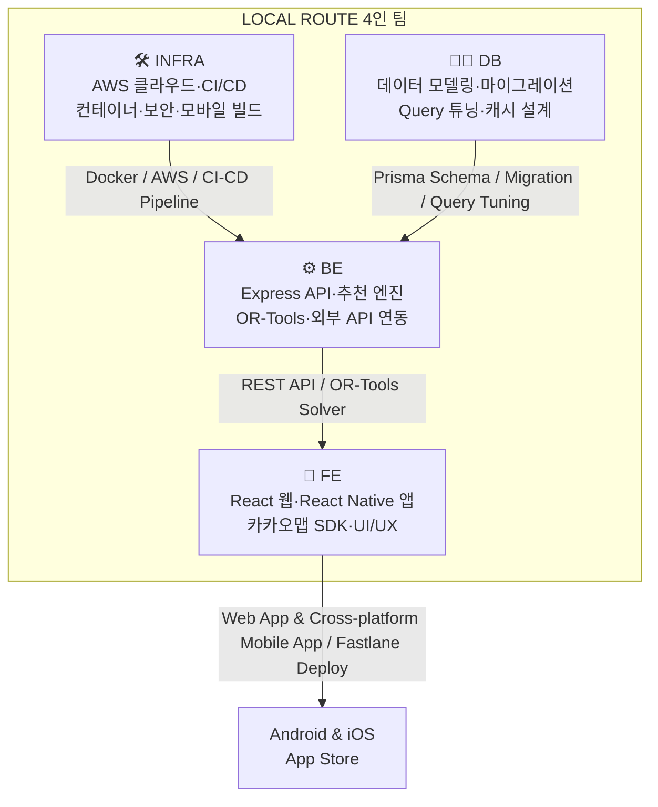
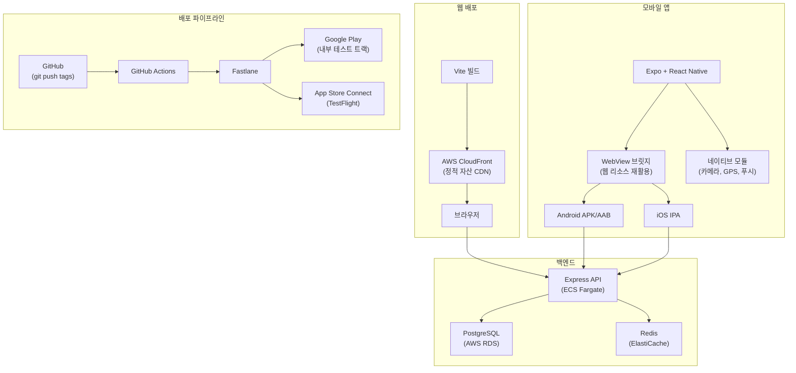
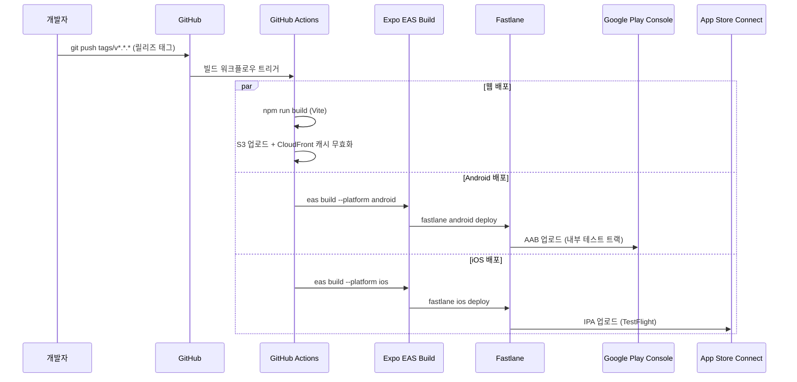

# LOCAL ROUTE 서비스 기획서 v3

**부제**: 현지인이 다시 가는 곳으로, 반려동물과 외국인도 걱정 없이 — 실행 가능한 로컬 여행 코스 자동 생성 플랫폼

작성일: 2026-08-25 | 문서 버전: v3.0 | v2 → v3 개정 요약: 팀 구성 6인→4인 변경, 웹+앱(Android/iOS) 크로스플랫폼 배포 전략 추가, 기술 스택 확정, 대중교통 경로 시각화 구현 반영

---

## 문서 표기 규칙

| 표기 | 의미 |
| --- | --- |
| **[확정 사실]** | 공식 문서·공개 자료로 확인된 사실. 조사 시점과 출처를 함께 표기 |
| **[설계 제안]** | 본 기획서에서 새로 제안하는 구조·정책·알고리즘. 팀 논의로 변경 가능 |
| **[가설·추정]** | 시장 규모, 가격, 전환율 등 검증되지 않은 수치. 반드시 실측·시장조사로 검증 필요 |
| **[추가 확인 필요]** | 공식 문서에서 명확히 확인하지 못한 항목. 계약·개발 착수 전 재확인 필수 |
| **[v3 변경]** | v2에서 v3로 변경된 항목. 변경 사유를 함께 표기 |

---

## 목차

1. Executive Summary
2. 서비스명 및 한 문장 소개
3. 문제 정의
4. 시장과 기존 서비스의 한계
5. 핵심 타깃 사용자
6. 페르소나 4명
7. 사용자 요구사항
8. 핵심 가치제안
9. 서비스 차별점
10. 주요 사용자 여정
11. 핵심 기능
12. 현지인 검증 시스템
13. 반려동물 동반 시스템
14. 외국인 지원 시스템
15. 추천 알고리즘
16. 경로 최적화 알고리즘
17. 외부 API 및 데이터
18. 시스템 아키텍처
19. 빅데이터 분산처리
20. 데이터 모델과 ERD
21. API 명세
22. 화면구조와 IA
23. 요구사항 명세 (기능·비기능)
24. 수익모델
25. 광고 신뢰 정책
26. KPI
27. **[v3 변경] 4인 팀 구성 및 역할별 기술 스택**
28. **[v3 변경] 6주 개발계획 (4인 체제)**
29. **[v3 변경] 크로스플랫폼 배포 전략 (웹 + Android + iOS)**
30. 테스트 계획
31. 발표·데모 시나리오
32. 리스크 및 대응방안
33. 향후 확장계획
34. 서비스명 후보 10개
35. 최종 결론

---

## v2 → v3 주요 변경 사항 요약

| 항목 | v2 (기존) | v3 (변경) | 변경 사유 |
| --- | --- | --- | --- |
| 팀 인원 | 6명 (FE 1, BE 1.5, 데이터엔지니어 1, 추천·최적화 1, 인프라 0.5, 디자인·기획 1) | **4명 (DB 1, INFRA 1, FE 1, BE 1)** | 실제 팀 구성 반영 |
| 플랫폼 | 모바일 웹 단일 | **웹 + Android 앱 + iOS 앱 (크로스플랫폼)** | 스토어 배포 요구사항 추가 |
| 대중교통 경로 | 카카오맵 딥링크로만 대체 | **자체 대중교통 폴백 경로 시각화 구현 완료** (지능형 우회 곡선 포함) | 구현 완료 반영 |
| 코스 카테고리 | 3가지 모드 (관광 필수/현지인/반려동물 안심) | **3가지 모드 + 10개 세부 코스 카테고리** (무일푼/갓성비/럭셔리/구수한/자연인/인생샷/뚜벅이/효도/혼행/비 오는 날) | 구현 완료 반영 |
| 프레임워크 | 미확정 | **FE: React 19 + Vite + Expo, BE: Node.js + Express + Prisma, DB: PostgreSQL + Redis** 확정 | 실제 구현 스택 반영 |
| CI/CD | 미정 | **GitHub Actions + Fastlane (Android/iOS 자동 배포)** | 앱 배포 전략 확정 |
| MVP 범위 | 기념품샵·소셜·공동편집 포함 | **핵심 여행 엔진 집중, 소셜·공동편집은 후속 단계로 이관** | 4인 체제에 맞는 현실적 범위 조정 |

> **[v3 원칙]** 1~26장의 기능 설계·알고리즘·데이터 모델·API 명세·수익모델 등 핵심 서비스 설계는 v2를 그대로 유지합니다. v3는 **실행 체제(27~29장)**를 4인 팀에 맞게 전면 재구성하고, 크로스플랫폼 배포 전략을 신규 추가합니다. 1~26장의 상세 내용은 v2 기획서를 참조하세요.

---

## 27. 4인 팀 구성 및 역할별 기술 스택

### 27.1 팀 구성

**[v3 변경]** v2의 6인 체제(FE 1, BE 1.5, 데이터엔지니어 1, 추천·최적화 1, 인프라 0.5, 디자인·PO 1)를 **4인 체제(DB, INFRA, FE, BE)**로 재편합니다.

### 27.2 역할별 상세 책임 및 기술 스택

#### 👩‍💻 DB (Database Administrator)

| 구분 | 상세 |
| --- | --- |
| **핵심 책임** | 데이터 모델 설계, 스키마 관리, 마이그레이션 전략 수립, 공간 데이터(Spatial Point) 처리, 쿼리 성능 튜닝, 캐싱 구조 설계 |
| **DBMS** | PostgreSQL 16+ — GIS 확장팩(PostGIS) 활용, 하버사인(Haversine) 최적화 쿼리 |
| **ORM** | Prisma ORM — 백엔드와 스키마 자동 동기화 및 Type-safety 확보 |
| **캐시** | Redis — 경로 매트릭스(Distance Matrix), 이동시간 행렬, 세션 캐싱 |
| **주요 작업** | 20장 ERD 24개 테이블 구현, 인덱스 전략 수립, 장소·반려동물 정책·리뷰 데이터의 조인 및 캐싱 구조 설계, 시드 데이터 60곳 적재 |
| **담당 장(章)** | 20장(데이터 모델과 ERD), 19.5장(저장소 역할 구분) |

#### 🛠️ INFRA (Infrastructure & DevOps Engineer)

| 구분 | 상세 |
| --- | --- |
| **핵심 책임** | AWS 클라우드 아키텍처 구성, 컨테이너 관리, CI/CD 파이프라인 구축, 보안 레이어 적용, 모바일 빌드 인프라 구축 |
| **클라우드** | AWS (VPC, RDS, ECS Fargate, S3, CloudFront, ALB) — 보안 분리 및 컨테이너 기반 무중단 배포 |
| **CI/CD** | GitHub Actions — 웹/앱 빌드 자동화; Fastlane — Android/iOS 스토어 배포 자동화 |
| **컨테이너** | Docker, Docker Compose — 로컬 개발 환경 표준화 및 프로덕션 배포 |
| **SSL/웹** | Nginx — 리버스 프록시; Let's Encrypt — HTTPS 인증서 자동 갱신 |
| **모니터링** | Grafana + Prometheus — 서버 메트릭, API 응답시간, 에러율 대시보드 |
| **주요 작업** | 18장 아키텍처 구현, 이미지 업로드 인프라(S3 + CloudFront CDN), Kafka 클러스터 구성, Expo EAS Build 또는 GitHub Actions macOS Runner 확보 |
| **담당 장(章)** | 18장(시스템 아키텍처), 19.6장(분산처리 성능 시연 인프라), 29장(크로스플랫폼 배포 전략) |

#### 🎨 FE (Frontend Developer)

| 구분 | 상세 |
| --- | --- |
| **핵심 책임** | 반응형 웹 UI 구현, 모바일 앱(Android/iOS) UI 구현, 카카오맵 SDK 기반 지도 인터페이스 개발, 앱 빌드 및 Fastlane 연동 배포 실행 |
| **웹 프레임워크** | React 19 (TypeScript) — 컴포넌트 기반 SPA |
| **빌드 도구** | Vite — 빠른 HMR 및 프로덕션 빌드 최적화 |
| **모바일 앱** | React Native + Expo — 크로스플랫폼 Android/iOS 앱; WebView 브릿지를 통한 웹 리소스 재활용 |
| **상태 관리** | Zustand — 가벼운 전역 상태 관리 |
| **스타일링** | CSS Variables + Vanilla CSS — 반응형 디자인 시스템 |
| **지도** | Kakao Maps JavaScript SDK — 마커, 폴리라인, 오버레이, 경로 시각화 |
| **주요 작업** | 22장 화면 구현(핵심 17개 화면), 대중교통·자차 경로 시각화(색상 구분 폴리라인), 일정 결과 타임라인 UI, 반려동물 정책 배지 UI, 다국어(한/영) 전환 |
| **담당 장(章)** | 22장(화면구조와 IA), 11장(핵심 기능 UI), 14.2장(외국인 화면 공통 요소) |

#### ⚙️ BE (Backend Developer)

| 구분 | 상세 |
| --- | --- |
| **핵심 책임** | 비즈니스 로직 구현(추천 알고리즘, 경로 최적화), RESTful API 설계, 인증/인가 처리, 외부 API 연동, 이벤트 파이프라인 구축 |
| **런타임** | Node.js (TypeScript, ES Modules) |
| **프레임워크** | Express — 라우팅, 미들웨어, Rate Limit(express-rate-limit) |
| **최적화 솔버** | Google OR-Tools (python-shell 연계) — 시간 창 제약 다일차 VRP 문제 풀이 |
| **외부 API** | 카카오맵 JS SDK, 카카오 Local API, 카카오 모빌리티 길찾기 API, 한국관광공사 TourAPI, 기상청 API |
| **이벤트** | Kafka — 38종 사용자 행동 이벤트 발행 |
| **인증** | 익명 세션 토큰(해시 기반) — 개인정보 최소화 |
| **주요 작업** | 15장 추천 엔진(규칙 기반), 16장 OR-Tools 최적화기, 21장 API 27개 엔드포인트, 12장 로컬 점수 계산, 13장 반려동물 정책 필터, 대중교통 폴백 경로 시각화 로직(부산 주요 교량·터널 우회 곡선) |
| **담당 장(章)** | 15장(추천 알고리즘), 16장(경로 최적화), 21장(API 명세), 25장(광고 신뢰 정책 코드 구현) |

### 27.3 역할별 주요 기술 스택 요약

| 역할 | 구분 | 기술 스택 / 라이브러리 | 비고 |
| :--- | :--- | :--- | :--- |
| **DB** | DBMS | PostgreSQL 16+ (PostGIS) | GIS 및 고성능 트랜잭션 최적화 |
| | ORM | Prisma ORM | 백엔드와 스키마 자동 동기화 및 Type-safety |
| | 캐시 | Redis | 경로 매트릭스·세션 캐싱 |
| **INFRA** | 클라우드 | AWS (VPC, RDS, ECS Fargate, S3, CloudFront) | 보안 분리 및 컨테이너 기반 무중단 배포 |
| | CI/CD | GitHub Actions + Fastlane | 웹/앱 빌드 및 스토어 배포 자동화 |
| | 컨테이너 | Docker, Docker Compose | 로컬 개발 및 프로덕션 환경 표준화 |
| | SSL/웹 | Nginx + Let's Encrypt | HTTPS 적용 및 리버스 프록시 |
| | 모니터링 | Grafana + Prometheus | 서버 메트릭·KPI 대시보드 |
| **FE** | 웹 프레임워크 | React 19 (TypeScript) | 컴포넌트 기반 SPA |
| | 빌드 | Vite | 웹 빌드 최적화 및 빠른 HMR |
| | 모바일 앱 | React Native + Expo | 크로스플랫폼 Android/iOS 앱 |
| | 상태 관리 | Zustand | 가벼운 전역 상태 관리 |
| | 스타일링 | CSS Variables + Vanilla CSS | 반응형 디자인 시스템 |
| | 지도 | Kakao Maps JavaScript SDK | 마커·폴리라인·오버레이 지도 인터페이스 |
| **BE** | 런타임 | Node.js (TypeScript) | ES Modules 및 Type-safe 아키텍처 |
| | 프레임워크 | Express | 라우팅·미들웨어·Rate Limit |
| | 솔버 | Google OR-Tools (python-shell) | 최적의 여행 여정 계산 |
| | 이벤트 | Apache Kafka | 38종 사용자 행동 이벤트 수집 |
| | 테스트 | Node.js 내장 Test Runner | 단위·통합 테스트 |

---

## 28. 6주 개발계획 (4인 체제)

### 28.1 팀 구성 전제와 v2 대비 범위 조정

**[v3 변경]** v2는 6명·6주로 소셜·공동편집·기념품샵 레이어까지 모두 포함했으나, 4인 체제에서는 **핵심 여행 엔진(추천·최적화·지도·반려동물·외국인)**에 집중하고, 다음을 후속 단계로 이관합니다.

| 구분 | 포함 (MVP 필수) | 제외 (후속 단계) |
| --- | --- | --- |
| **핵심** | 여행 조건·취향·반려동물 프로필 입력, 규칙 기반 추천(15.1), OR-Tools 일정 생성(16장), 3가지 모드 + 10개 코스 카테고리, 12개 필드 시간표, 카카오맵 시각화, 대중교통·자차 경로 시각화(폴백 포함), 부분 재최적화, 반려동물 정책 필터 및 최신성 배지, 한/영 다국어 UI, 로컬 점수 계산(규칙 기반), 방문 인증(GPS), 광고·자연추천 분리 구조, 지역축제 안내, 날씨 배지·우천 경보, **Android/iOS 앱 배포** | 소셜(스토리·팔로우), 공동 편집, 기념품샵 레이어, 하이브리드 추천(협업필터링/임베딩), 실시간 재탐색 자동화, 그래프DB 부정탐지, 로컬 코스 작성·판매, 실시간 커서·댓글·좋아요 |

### 28.2 주차별 계획

| 주차 | 목표 | 담당 | 구현 기능 | 완료 조건 | 위험 |
| --- | --- | --- | --- | --- | --- |
| **1주차** | 기반 구축 | 전원 | ERD·API 확정, 부산 시드 데이터 60곳 수집(TourAPI+카카오), 인프라 스캐폴딩(PostgreSQL/Redis/Docker), Expo 프로젝트 초기화, API 키 확보, CI/CD 파이프라인 초기 구성 | ERD·API 리뷰 완료, 시드 CSV 확보, 로컬 환경 기동, Expo 앱 Hello World 빌드 | 카카오·공공데이터 API 키 승인 지연 |
| **2주차** | 핵심 데이터·추천 | DB + BE | Place/PetPolicy/Trip 스키마 구현, 규칙 기반 추천 점수(15.1), 반려동물 필터, 축제 데이터 수집·기간 필터, Kafka 이벤트 기본 토픽 생성 | 추천 점수 단위 테스트 통과, 반려동물 필터 정확도 검증, 기간 겹침 판정 검증 | 로컬 점수용 초기 데이터 부족 |
| **3주차** | 일정 최적화·지도·경로 | BE + FE | OR-Tools 파이프라인(16.3), 카카오맵 연동, 일정 결과 화면, 대중교통·자차 경로 시각화(폴백 곡선 포함), 날씨 배지·우천 경보 | 3일 일정이 운영시간·예산 제약 만족(자동 테스트), 지도에 색상별 경로 렌더링 확인 | OR-Tools 성능 목표 초과 |
| **4주차** | 이벤트·수정·인증·앱 | 전원 | Kafka 38종 이벤트 발행, Flink 지표 2개(급상승 장소, Consumer Lag), 부분 재최적화, 방문 인증, Expo WebView 앱 빌드(Android/iOS), 이미지 업로드 인프라(S3) | Grafana 지표 확인, 재최적화 3초 이내, 앱 에뮬레이터 동작 확인 | 앱 빌드 환경 설정 문제 |
| **5주차** | 다국어·로컬·광고·앱 배포 | 전원 | 로컬 등급·점수 배치, 광고 분리 파이프라인, 한/영 다국어 UI, 10개 코스 카테고리 UI, Android APK 내부 테스트 트랙 배포, iOS TestFlight 빌드 업로드 | 광고/자연추천 분리 회귀 테스트 통과, 양 스토어 내부 테스트 빌드 성공 | 5주차 금요일 기능 동결 — 이후 신규 기능 금지 |
| **6주차** | 통합·부하·발표 | 전원 | 통합 테스트(30장), 부하 테스트(19.6장), 예외 처리, 발표·데모 리허설 3회 이상 | 테스트 체크리스트 통과, 데모 안정적 수행 확인 | 5주차 지연 시 데모 실패 위험 |

### 28.3 4인 체제 위험 관리 원칙

1. **5주차 금요일 기능 동결**: 6주차는 통합·버그·리허설만 수행합니다.
2. **범위 초과 시 우선 제거 순서**: 날씨 경보 → 축제 상세 → Flink 실시간 지표 → 10개 코스 카테고리 UI (3가지 기본 모드는 유지)
3. **4인 겸직 구조**: DB 담당자는 백엔드 데이터 계층 작업을 지원하고, INFRA 담당자는 FE의 앱 빌드·배포를 지원합니다.
4. **일일 스탠드업**: 매일 15분 이내로 진행상황을 공유하고 블로커를 즉시 해결합니다.

---

## 29. 크로스플랫폼 배포 전략 (웹 + Android + iOS)

### 29.1 아키텍처 개요

### 29.2 모바일 하이브리드 앱 전략

모바일 앱은 **Expo + React Native WebView** 하이브리드 아키텍처를 채택합니다.

| 구성 요소 | 역할 |
| --- | --- |
| **React Native WebView** | 메인 피드, 일정 생성기, 지도 화면 등 핵심 웹 페이지(Vite 빌드 아웃풋)를 앱 내부 웹뷰로 렌더링 |
| **네이티브 브릿지** | 카메라 업로드, GPS 실시간 위치 확인, 푸시 알림 수신을 React Native 코드와 웹뷰 간 `window.postMessage` 통신으로 중계 |
| **Expo EAS Build** | 클라우드 기반 빌드 서비스로 로컬 Mac 없이도 iOS 빌드 가능 |

**하이브리드 선택 사유**: 4인 팀에서 웹과 네이티브 앱을 각각 별도로 개발하면 FE 작업량이 3배로 늘어나 6주 내 완주가 불가능합니다. WebView 기반으로 웹 코드를 90% 재활용하면서, 카메라·GPS·푸시 등 네이티브 필수 기능만 브릿지로 연동하는 것이 현실적입니다.

### 29.3 Android 배포 상세

| 항목 | 상세 |
| --- | --- |
| **빌드 포맷** | Android App Bundle (`.aab`) — 디바이스별 다운로드 크기 최적화 |
| **최소 SDK** | API 26 (Android 8.0 Oreo) 이상 |
| **서명** | Google Play App Signing 등록, `keystore.jks`를 GitHub Secrets를 통해 빌드 러너에 동적 주입 |
| **배포 자동화** | `fastlane supply` → Google Play Developer API → 내부 테스트 트랙 자동 릴리즈 |
| **메타데이터** | 스크린샷·앱 설명·릴리즈 노트를 Fastlane `metadata` 디렉토리에서 관리, 배포 시 동시 업데이트 |
| **테스트** | 내부 테스트 → 비공개 테스트 → 프로덕션 단계적 출시 (5%→20%→100% 단계적 롤아웃) |

### 29.4 iOS 배포 상세

| 항목 | 상세 |
| --- | --- |
| **빌드 포맷** | `.ipa` (Ad-hoc / App Store Distribution) |
| **최소 버전** | iOS 15.0 이상 |
| **프로비저닝** | Fastlane Match — 암호화된 프라이빗 Git 저장소에서 인증서·프로비저닝 프로파일 공유 관리 (`App Store`, `Ad-hoc` 프로파일) |
| **서명** | `fastlane gym` — Xcode 빌드 시 배포 인증서 자동 임포트 |
| **배포 자동화** | `fastlane pilot` → Apple App Store Connect API 키 인증 → TestFlight 자동 빌드 업로드 |
| **심사** | TestFlight 내부 테스트 (25명 제한 없음) → 외부 테스트 (Beta App Review 필요) → 프로덕션 App Review 제출 |
| **빌드 환경** | Expo EAS Build (클라우드) 또는 GitHub Actions macOS Runner (self-hosted Mac mini 권장) |

### 29.5 배포 파이프라인 흐름

### 29.6 환경별 배포 구성

| 환경 | 웹 | Android | iOS | 용도 |
| --- | --- | --- | --- | --- |
| **Development** | localhost:5173 (Vite) | Expo Go 앱 | Expo Go 앱 | 로컬 개발·디버깅 |
| **Staging** | staging.localroute.kr | 내부 테스트 트랙 APK | TestFlight 빌드 | 통합 테스트·QA |
| **Production** | www.localroute.kr | Google Play 프로덕션 | App Store 프로덕션 | 실서비스 |

---

## 30. 테스트 계획

(v2 28장의 테스트 범주·엣지 케이스를 그대로 유지하되, 앱 테스트를 추가합니다)

### 30.1 추가 테스트 항목 (v3 신규)

| 범주 | 내용 |
| --- | --- |
| **앱 빌드 검증** | Android AAB / iOS IPA 빌드가 CI에서 오류 없이 완료되는지 확인 |
| **WebView 호환성** | Android WebView(Chrome 기반) / iOS WKWebView에서 카카오맵 SDK, CSS 레이아웃, 터치 이벤트가 정상 동작하는지 확인 |
| **네이티브 브릿지** | GPS 위치 수집, 카메라 사진 첨부, 푸시 알림 수신이 웹뷰↔네이티브 간 정상 통신되는지 확인 |
| **딥링크** | 앱에서 외부 카카오맵 길찾기 딥링크가 정상 작동하는지 확인 |
| **Rate Limit 우회** | `/api/course-categories` 등 정적 설정 API가 Rate Limit 대상에서 제외되어 항상 200 응답을 반환하는지 확인 |
| **대중교통 폴백 경로** | API 장애 시 지능형 우회 곡선 경로(영도대교, 부산항대교, 광안대교)가 지도에 정상 렌더링되는지 확인 |

---

## 31. 발표·데모 시나리오

(v2 29장을 유지하되, 앱 데모를 추가합니다)

### 31.1 추가 데모 장면 (v3 신규)

| # | 장면 | 보여줄 것 | 소요시간 목표 |
| --- | --- | --- | --- |
| 12 | Android 앱에서 일정 확인 | 실제 Android 기기(또는 에뮬레이터)에서 LOCAL ROUTE 앱을 열고 생성된 일정을 확인 | 20초 |
| 13 | iOS 앱에서 경로 확인 | iOS 시뮬레이터(또는 실기기)에서 카카오맵 기반 경로 시각화가 웹과 동일하게 동작함을 확인 | 20초 |
| 14 | 대중교통 경로 시각화 | 지도에서 이동수단 탭(버스/지하철/자차)을 전환하며 각각의 경로선이 실제 도로망을 따라 렌더링됨을 확인 | 30초 |

---

## 32. 리스크 및 대응방안

(v2 30장을 유지하되, 4인 체제 및 앱 배포 관련 리스크를 추가합니다)

### 32.1 추가 리스크 (v3 신규)

| 리스크 | 발생 가능성 | 영향도 | 대응방안 |
| --- | --- | --- | --- |
| **4인 체제 구현 범위 초과** | 매우 높음 | 높음 | v2 대비 소셜·공동편집·기념품샵을 후속 단계로 이관하여 범위 축소. 28.3장 우선 제거 순서를 사전 합의 |
| **iOS 빌드 환경 확보 실패** | 중 | 높음 | Expo EAS Build(클라우드) 사용으로 Mac 물리 장비 없이도 iOS 빌드 가능. 대안으로 GitHub Actions macOS Runner 활용 |
| **App Store 심사 거부** | 중 | 중 | Apple 심사 가이드라인 사전 확인, WebView 앱의 최소 네이티브 기능(GPS, 카메라) 확보로 거부 사유 사전 제거 |
| **WebView 성능 이슈** | 중 | 중 | 카카오맵 SDK 로딩 최적화(lazy loading), 이미지 최적화(WebP), 네이티브 스크롤 오버라이드 제거 |
| **크로스플랫폼 UI 차이** | 낮음 | 낮음 | Expo의 플랫폼별 스타일 분기 활용, 핵심 화면은 웹뷰 기반이므로 차이 최소화 |

---

## 33. 향후 확장계획

(v2 31장을 유지하되, 후속 단계로 이관된 기능을 명시합니다)

### 33.1 v3에서 후속 단계로 이관된 기능

| 기능 | 우선순위 | 선행 조건 |
| --- | --- | --- |
| 소셜(스토리·팔로우·신고) | 높음 | 이미지 업로드 인프라(S3+CDN) 구축 완료, UGC 모더레이션 운영 체계 수립 |
| 동행자 공동 편집 | 높음 | 권한 모델 설계 완료, 낙관적 락·충돌 처리 전략 확정 |
| 기념품샵 지도 레이어 | 중 | TourAPI 타입 38 데이터 적재 완료, MVP 레이어 사용률 확인 후 결정 |
| 하이브리드 추천(협업필터링) | 중 | 충분한 사용자 행동 데이터 축적 (최소 1,000 세션) |
| 로컬 코스 작성·판매 | 중 | 로컬 큐레이터 계정 최소 10개 확보 |
| 그래프DB 부정탐지 | 낮음 | 실제 부정행위 사례 축적 후 도입 |

---

## 34. 서비스명 후보 10개

(v2 32장과 동일)

| # | 후보명 | 컨셉 |
| --- | --- | --- |
| 1 | 로컬루트(LOCAL ROUTE) | 원안 유지, 로컬(현지) + 루트(경로)의 직관적 조합 |
| 2 | 개코(GAECO) | "개"(반려견)+"코"(코스/현지 감각)를 결합한 친근한 어감 |
| 3 | 웨이로컬(WayLocal) | "현지인의 길"을 의미, 외국인 사용자에게도 직관적 |
| 4 | 단골로(DANGOLRO) | "단골" + "路(로/길)"의 한글 조어 |
| 5 | 페트로컬(PetLocal) | 반려동물(Pet)과 로컬(Local)의 결합 |
| 6 | 로코스(LOCOURSE) | Local + Course의 축약 |
| 7 | 여기로컬(YeogiLocal) | "여기"(현재 위치)와 로컬을 결합 |
| 8 | 트루로컬(TrueLocal) | 검증된 진짜 현지 정보라는 신뢰 메시지 |
| 9 | 동네방네트립(DongneTrip) | 친숙한 한국어 표현과 여행의 결합 |
| 10 | 파우파인더(PawFinder) | 반려동물 발바닥(Paw)과 탐색(Finder)의 결합 |

---

## 35. 최종 결론

LOCAL ROUTE v3는 v2의 핵심 서비스 설계(추천 엔진·경로 최적화·반려동물 시스템·외국인 지원·광고 분리 정책)를 그대로 유지하면서, **실행 체제를 4인 팀(DB/INFRA/FE/BE)에 맞게 현실적으로 재구성**한 기획서입니다.

v2 대비 핵심 변경은 세 가지입니다.

첫째, **팀 구성을 6인에서 4인으로 축소**하면서 각 역할의 책임·기술 스택·담당 장(章)을 명확히 정의했습니다. 4인 체제에서 6주 안에 완주할 수 있도록 소셜·공동편집·기념품샵 레이어를 후속 단계로 이관하고, 핵심 여행 엔진에 집중합니다.

둘째, **크로스플랫폼 배포 전략을 신규 추가**했습니다. React Native + Expo 하이브리드 아키텍처를 채택하여 웹 코드의 90%를 재활용하면서 Android/iOS 앱을 동시에 배포합니다. Fastlane과 GitHub Actions를 활용한 CI/CD 파이프라인으로 빌드부터 스토어 배포까지 자동화합니다.

셋째, **이미 구현 완료된 기능을 반영**했습니다. 대중교통 폴백 경로 시각화(부산 주요 교량·터널 우회 곡선), 10개 코스 카테고리 시스템, Rate Limit 우회 등 실제 코드베이스에서 동작하는 기능을 기획서에 공식 반영했습니다.

이 기획서만으로 4인 팀이 웹 개발, 앱 개발, Android 배포, iOS 배포를 포함한 전 과정을 진행할 수 있습니다. 핵심 원칙은 v2와 동일합니다: 일정의 결정권은 LLM이 아니라 검증 가능한 데이터와 제약조건 최적화기에 있고, 현지인 추천은 행동 기반 인증으로 뒷받침되며, 반려동물과 외국인은 부가 옵션이 아니라 시스템의 1급 시민입니다.

---

*본 문서에 포함된 시장 규모·가격·전환율·매출 관련 수치는 별도 표기가 없어도 모두 [가설·추정]이며 실측 검증이 필요합니다. API 호출 제한·요금·저장 정책은 2026-08-25 기준 조사 결과이며 계약·개발 착수 전 공식 문서로 재확인이 필요합니다. 법률·개인정보 관련 항목은 법무 검토를 거쳐야 합니다. 1~26장의 상세 기능 설계·알고리즘·데이터 모델·API 명세·수익모델은 v2 기획서를 참조하세요.*
