# LOCAL ROUTE 통합 기획 및 실행서 v5

**부제**: 현지인이 다시 가는 곳으로, 구글맵이 못 찾는 길도 걱정 없이 — 외국인 현장 이용 완결형 로컬 여행 동행 플랫폼

- 문서 버전: v5.0 (통합 실행서)
- 작성일: 2026-08-25
- 개정 핵심: **반려동물 동반 기능 완벽 제거 및 수수료/단절 없는 외국인 현장 완결 UX 중심 전면 재편**
- 기반 문서: `LOCAL_ROUTE_기획_통합정리본_반려동물제외.md` + `LOCAL_ROUTE_기획서_v4.md` (4인 팀 실행 체제 및 크로스플랫폼 배포 전략)

---

## 목차

1. Executive Summary & 핵심 개정 사항
2. 서비스 정의 및 6대 원칙
3. 핵심 타깃 사용자 (반려동물 제거 및 외국인·로컬 집중)
4. 여행 3단계(전·중·후) 사용자 여정
5. 통합 기능 명세 (P0~P3 우선순위)
   - 5.1 온보딩 및 전역 언어 스위처
   - 5.2 먹고 싶은 한국 음식 탐색 & 일정 자동 반영
   - 5.3 식당 현장 이용 가능성 및 상세 정보
   - 5.4 장소별 한국어 말하기 & TTS 음성 재생
   - 5.5 날씨 연동 및 비상 준비물/실내 장소 교체
   - 5.6 현장 이동 지원 & 택시 카드/외부 지도
   - 5.7 방문 후 만족도 및 개인 맞춤 피드백
   - 5.8 지도 기반 추억 정리 & 자동 회고
   - 5.9 여행 피드 & 소셜 코스 복제
6. 데이터 신뢰 정책 & 출처 등급 체계
7. 프런트엔드 정보 구조(IA) 및 화면 설계 원칙
8. 4인 팀 구성 및 역할별 책임 (DB / INFRA / FE / BE)
9. 6주/15일 단기 실행 일정 (웹 MVP & 크로스플랫폼 배포)
10. 크로스플랫폼 배포 전략 (웹 + Android + iOS)
11. KPI 및 리스크 관리

---

## 1. Executive Summary & 핵심 개정 사항

### 1.1 문서 개정 요약 (v4 → v5)

| 구분 | v4 (이전) | v5 (개정) | 개정 사유 |
| --- | --- | --- | --- |
| **서비스 정체성** | 현지인 검증 + 반려동물 + 외국인 | **현지인 검증 + 외국인 현장 이용 완결** | 집중도 향상 및 불필요한 제약 제거 |
| **반려동물 기능** | 크기·몸무게·가방·휴식·병원 포함 | **전면 제거 (0%)** | 타깃 사용자 명확화 및 데이터 유지 부담 경감 |
| **탐색 단위** | 카테고리/취향 태그 위주 | **먹고 싶은 한국 음식 중심 탐색 신규 추가** | 외국인이 음식 이름으로 여행을 계획하는 실제 UX 반영 |
| **현장 의통 지원** | 택시 기사 목적지 카드 | **장소별 상황별 한국어 문장 + TTS 음성 재생** | 식당/택시/숙소 현장 주문·대화 불확실성 해소 |
| **여행 단계** | 기능 중심 나열 | **여행 전(계획) → 여행 중(실행) → 여행 후(회고)** | 시간 흐름 기반 3단계 UX 재편 |
| **여행 조건 폼** | 4단계 (기본/취향/이용조건/확인) | **3단계 (기본/취향/확인) 및 우측상단 언어스위처** | 폼 이탈률 감소 및 직관적 사용자 경험 |

---

## 2. 서비스 정의 및 6대 원칙

### 2.1 한 문장 정의

> **LOCAL ROUTE**는 현지인의 실제 방문 데이터로 검증된 장소를 바탕으로 외국인 여행자가 한국에서 겪는 **탐색 · 이동 · 주문 · 결제 · 기록의 단절을 해소**하고, 실제로 따라갈 수 있는 시간표와 현장 한국어 안내를 제공하는 로컬 여행 동행 서비스다.

### 2.2 서비스 6대 원칙

1. **검증된 데이터와 제약조건 최적화**: LLM은 번역과 의도 해석을 담당하고, 시간표와 장소 조합은 OR-Tools 최적화 엔진이 결정한다.
2. **현장 이용 가능성 우선**: 유명세보다 영어 메뉴, 해외카드, 브레이크타임, 혼밥 여부 등 현장 실행 조건을 우선 검증한다.
3. **안전 및 식단 정보의 엄격함**: 알레르기·식단 정보는 미확인 시 안전하다고 추정하지 않고 `확인 필요`로 명시한다.
4. **광고 신뢰 분리**: 광고비는 자연 추천 점수 및 로컬 점수에 절대로 영향을 주지 않으며 UI를 명확히 분리한다.
5. **사용자 데이터 주권**: GPS와 개인 여행 기록은 최소 수집하며, 공개 범위와 사진 EXIF 제거는 사용자가 통제한다.
6. **세로 흐름의 완결성**: 단순 기능 나열보다 한 명의 외국인이 `음식 선택 → 일정 반영 → 현장 주문`을 성공하는 경험을 최우선한다.

---

## 3. 핵심 타깃 사용자

1. **외국인 초행 여행자**: 한국어와 국내 전용 지도/예약 앱에 익숙하지 않으나 한국의 진짜 로컬 음식과 장소를 경험하고 싶은 여행자.
2. **로컬 경험을 원하는 국내 여행자**: 뻔한 유명 관광지 대신 현지인이 다시 찾는 숨은 명소와 효율적인 동선을 원하는 여행자.
3. **로컬 큐레이터 및 주민**: 광고가 아닌 실제 유용성과 반복 방문으로 동네 코스를 인정받고 잘못된 정보를 제보하는 로컬 사용자.

---

## 4. 여행 3단계(전·중·후) 사용자 여정

```mermaid
flowchart LR
    subgraph PRE["여행 전 (Plan)"]
        A[언어 선택 / KO-EN] --> B[기본 조건 & 식단/알레르기]
        B --> C[먹고 싶은 음식 & 취향 선택]
        C --> D[OR-Tools 일정 생성 & 날씨/준비물]
    end

    subgraph DURING["여행 중 (Execute)"]
        D --> E[오늘의 일정 & 경로 확인]
        E --> F[장소별 한국어 TTS 말하기]
        F --> G[외부 지도 연동 & 택시 카드]
        G --> H[현장 방문 & 사진/기록 저장]
    end

    subgraph POST["여행 후 (Review)"]
        H --> I[방문 만족도 & 정보 제보]
        I --> J[지도 기반 추억 지도 & 자동 회고]
        J --> K[여행 피드 공유 & 다음 추천 학습]
    end
```

---

## 5. 통합 기능 명세

### 5.1 온보딩 및 전역 언어 스위처
- 화면 우측 상단 고정 위치에 `한국어 | English` 플로팅 스위처 배치.
- 폼 입력, 오류 메시지, 지도 팝업, 장소 상세, 세션 공유 등 앱 전역 언어 즉시 동기화.

### 5.2 먹고 싶은 한국 음식 탐색 & 일정 자동 반영
- `Milmyeon`, `Dwaeji-gukbap` 등 외국인이 한국에서 꼭 먹어보고 싶은 음식을 명시적으로 선택.
- 음식별 영문명, 한국어명, 발음, 대표 사진, 맵기, 주요 재료, 알레르기 주의, 가격대 정보 제공.
- 일정 생성 시 선택한 음식을 파는 검증된 식당을 적절한 식사 시간대에 자동 배치하고 추천 이유 표시.

### 5.3 식당 현장 이용 가능성 상세
- 획일적 평점 대신 현장 이용 정보 수록: 혼밥 가능 여부, 브레이크타임, 라스트오더, 전화번호 필요 여부, 한국 계정 예약 필요 여부, 포장 가능 여부 등.

### 5.4 장소별 한국어 말하기 & TTS 음성 재생
- 현장에서 당황하지 않도록 장소 상세화면에 검수된 문장 제공 (식당: `이 메뉴 하나 주세요`, `안 맵게 해주세요` / 택시: `이 주소로 가주세요`).
- 크게 보기 전체 화면, 한국어 발음 표기, 일반/천천히 TTS 음성 재생 기능.

### 5.5 날씨 연동 및 준비물 안내
- 여행 날짜별 기온, 강수 확률, 미세먼지 정보를 행동으로 연결.
- 우천 예보 시 우산/방수 신발 준비물 안내 및 야외 장소를 실내 장소로 바꾸는 부분 재최적화 제안.

### 5.6 현장 이동 지원 & 외부 지도 연결
- 지하철 역 번호, 출구 번호, 버스 번호 및 택시 기사에게 보여줄 한국어 목적지 카드 제공.
- Google Maps, Apple Maps, Kakao Map 등 원하는 지도 앱으로 딥링크 연결.

### 5.7 방문 후 만족도 및 개인 맞춤 피드백
- 방문 완료 후 음식, 가격, 접근성, 현장 이용 편의에 대한 간편 피드백 수집.
- 만족도 결과를 사용자의 다음 추천 가중치에 자동 반영.

### 5.8 지도 기반 추억 정리 & 자동 회고
- 여행 완료 후 날짜별 경로, 사진, 방문 음식이 결합된 **추억 지도** 생성.
- `부산에서 보낸 3일` 등 자동 회고 카드 및 앨범 기능.

---

## 6. 프런트엔드 & 백엔드 4인 팀 실행 계획 (DB / INFRA / FE / BE)

| 역할 | 담당 영역 | 주요 과제 |
| --- | --- | --- |
| **DB** | PostgreSQL 16 + PostGIS | 24개 테이블 스키마 유지, 공간 쿼리 및 식단/음식 시드 데이터 적재 |
| **INFRA** | AWS + GitHub Actions | ECS Fargate 백엔드 배포, CloudFront CDN, Fastlane 모바일 빌드 자동화 |
| **FE** | React 19 + Expo | 반응형 웹 & React Native WebView 하이브리드 앱, KakaoMap SDK, TTS 인터페이스 |
| **BE** | Node.js Express + OR-Tools | 일정 최적화 엔진, REST API 27개 엔드포인트, 다국어 처리 로직 |

---

## 7. 결론 및 향후 추진

LOCAL ROUTE v5는 기존 v4의 **4인 팀 실행력 및 배포 파이프라인** 위에, **반려동물 기능을 제거하고 외국인 사용자의 현장 이용 완결성을 극대화**한 최종 실행 기획서입니다.

이 기획서를 기준으로 개발 및 테스트를 진행하며, 1단계 웹 MVP 배포와 2단계 모바일 스토어 배포를 차질 없이 완수합니다.
