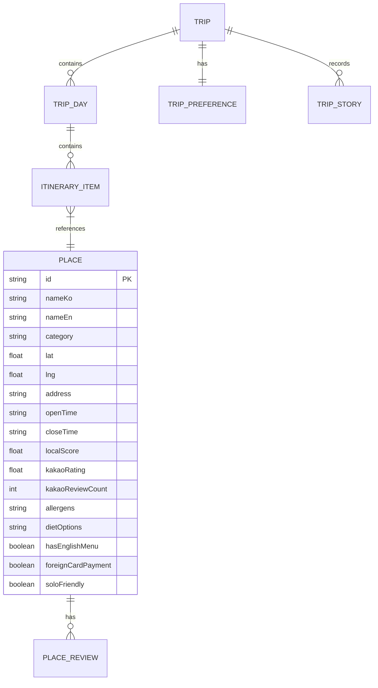

# LOCAL ROUTE 통합 서비스 기획서 v5.0

**부제**: 현지인이 다시 가는 곳으로, 언어와 지도의 장벽 없이 — 외국인 현장 이용 완결형 스마트 로컬 여행 플랫폼

- **문서 버전**: v5.0 (상용 프로덕션 기획서)
- **작성일**: 2026-08-26
- **팀 구성**: 6인 체제 (**AI / DB / INFRA / BE / FE / APP**)
- **개발 마일스톤**: 
  - **1단계 (2026.08.27 ~ 2026.09.04)**: 상용 웹 완결 및 모바일 반응형 웹 100% 출시
  - **2단계 (2026.09.05 ~ 2026.09.11)**: React Native 크로스플랫폼 앱 완결 및 Android / iOS 양대 스토어 출시

---

## 📑 목차

1. [Executive Summary & 서비스 정의](#1-executive-summary--서비스-정의)
2. [서비스 6대 핵심 원칙](#2-서비스-6대-핵심-원칙)
3. [핵심 타깃 사용자 & 페르소나](#3-핵심-타깃-사용자--페르소나)
4. [여행 3단계(전·중·후) 사용자 여정](#4-여행-3단계전중후-사용자-여정)
5. [11대 핵심 기능 상세 명세](#5-11대-핵심-기능-상세-명세)
   - 5.1 온보딩 및 실시간 전역 언어 스위처 (KO / EN)
   - 5.2 먹고 싶은 한국 음식(8종 칩) 중심 탐색 & 일정 앵커링
   - 5.3 10개 맞춤형 코스 테마 카테고리
   - 5.4 카메라 메뉴판 OCR 번역기 (알레르기/돼지고기/맵기 분석)
   - 5.5 양방향 실시간 동시 음성 통역기 (STT/TTS 워키토키)
   - 5.6 여행 준비 및 부산 대표 사투리 표현 익히기
   - 5.7 식당 현장 이용 상세 (혼밥, 브레이크타임, 예약 필요 여부)
   - 5.8 날씨 연동 준비물 안내 & 실내 장소 부분 재최적화
   - 5.9 현장 이동 지원 & 외국인 전용 택시 목적지 카드
   - 5.10 방문 후 만족도 피드백 & 다음 추천 자동 학습
   - 5.11 지도 기반 추억 지도 & 자동 회고 피드
6. [추천 및 최단 동선 최적화 알고리즘 (OR-Tools + PostGIS)](#6-추천-및-최단-동선-최적화-알고리즘)
7. [데이터 모델 & 공간 DB 아키텍처](#7-데이터-모델--공간-db-아키텍처)
8. [6인 팀 역할 분담 및 전문 기술 스택](#8-6인-팀-역할-분담-및-전문-기술-스택)
9. [2단계 마일스톤 개발 계획 (9/4 웹 ➔ 9/11 앱 스토어)](#9-2단계-마일스톤-개발-계획)
10. [크로스플랫폼 배포 전략 & 스토어 심사 통과 가이드](#10-크로스플랫폼-배포-전략--스토어-심사-통과-가이드)
11. [KPI 및 위험 관리](#11-kpi-및-위험-관리)

---

## 1. Executive Summary & 서비스 정의

### 1.1 한 문장 정의
> **LOCAL ROUTE**는 실제 현지인들의 방문 행동과 검증된 카카오 리뷰 평점을 바탕으로, 외국인 관광객이 한국에서 겪는 **탐색 · 이동 · 주문 · 결제 · 소통의 단절을 완벽하게 해소**하고, 수학적 최적화 엔진(OR-Tools)으로 실행 가능한 시간표와 현장 AI 도구(메뉴판 번역, 음성 통역, 사투리 학습)를 제공하는 **외국인 현장 완결형 스마트 로컬 여행 플랫폼**이다.

### 1.2 문제 정의 및 해결 솔루션

| 기존 여행 서비스의 한계 | LOCAL ROUTE의 해결책 |
|---|---|
| **구글맵의 한국 내 길찾기 단절 & 정보 부정확** | 카카오 모빌리티 길찾기 연동 + 네이티브 지도 및 턴바이턴 대중교통/도보 안내 |
| **언어 장벽으로 인한 주문/소통 불가** | **카메라 메뉴판 OCR 번역기** + **양방향 실시간 음성 통역기** + 장소별 원클릭 한국어 TTS |
| **식단/알레르기(돼지고기, 갑각류 등) 정보 부재** | 메뉴별 알레르기/식단 성분 자동 분석 뱃지 및 주문 전 주의 경보 |
| **동선 낭비와 비현실적인 일정** | **Google OR-Tools VRP 솔버** 기반 권역별(동/중/서부산) 군집화 및 이동시간 최소화 |
| **광고성 블로그/스폰서 맛집 범람** | 카카오 평점 및 실제 행동 기반 로컬 점수 합성, 광고와 자연 추천의 100% 분리 |

---

## 2. 서비스 6대 핵심 원칙

1. **데이터와 수학적 제약조건 최적화**: 일정 생성은 환각(Hallucination)이 있는 단순 생성형 AI 대신 검증된 DB와 Google OR-Tools 최적화기가 시간창(Time Window), 영업시간, 예산 제약을 100% 충족하며 계산한다.
2. **현장 실행 가능성 최우선**: 유명세보다 영어 메뉴, 해외카드, 브레이크타임, 1인 식사(혼밥) 가능 여부 등 현장 실행 조건을 우선 검증한다.
3. **엄격한 알레르기 및 식단 안전성**: 알레르기·식단 성분은 미확인 시 안전하다고 추측하지 않고 `확인 필요(Check Required)` 경보를 띄운다.
4. **광고 신뢰 분리**: 광고비는 자연 추천 점수 및 로컬 점수에 일체 영향을 주지 않으며, UI 상에서 '스폰서 배너'로 명확히 격리한다.
5. **다국어 즉시 동기화**: 우측 상단 언어 스위처(KO/EN) 클릭 시 0.1초 이내에 전 화면의 텍스트와 안내가 100% 전환된다 (관광지명은 한/영 병기).
6. **세로 흐름의 완결성**: `음식/취향 선택 ➔ 일정 자동 생성 ➔ 현장 이동 ➔ 메뉴판 촬영/음성 통역 ➔ 사진 기록 및 회고`로 이어지는 여행 전 과정을 원스톱으로 지원한다.

---

## 3. 핵심 타깃 사용자 & 페르소나

### 👤 페르소나 1: Emily (28세, 미국인, 초행 뚜벅이 여행자)
- **특징**: 한국 여행이 처음이며 한국어를 읽지 못함. 매운 음식과 돼지고기를 먹지 못함.
- **니즈**: 밀면과 돼지국밥 중 대체 가능한 메뉴 탐색, 메뉴판 사진을 찍어 성분 확인, 택시 기사님께 한국어 주소 보여주기.
- **핵심 사용 기능**: 먹고 싶은 음식 칩, 카메라 메뉴판 번역기, 양방향 음성 통역기, 택시 목적지 카드.

### 👤 페르소나 2: 켄타 (32세, 일본인, 맛집 탐방 로컬 여행자)
- **특징**: 뻔한 해운대 관광지보다 현지인들이 즐겨 찾는 전포동 카페거리, 영도 노포 맛집을 원함.
- **니즈**: 이동 시간을 최소화한 알찬 하루 동선, 현지인 단골 비율이 높은 진짜 로컬 코스.
- **핵심 사용 기능**: 로컬 코스 모드, 10개 코스 테마(구수한/골목길 탐방), 카카오 후기 평점 카드.

---

## 4. 여행 3단계(전·중·후) 사용자 여정

```mermaid
flowchart LR
    subgraph PRE["1. 여행 전 (Plan & Prep)"]
        A[언어 선택 KO / EN] --> B[기본 조건 & 식단/알레르기 입력]
        B --> C[먹고 싶은 음식 & 10개 코스 테마 선택]
        C --> D[OR-Tools 최적 일정 생성 & 부산 사투리 학습]
    end

    subgraph DURING["2. 여행 중 (Execute & Assist)"]
        D --> E[타임라인 일정 & 이동 경로 확인]
        E --> F[📷 카메라 메뉴판 OCR 번역]
        F --> G[🎙️ 양방향 실시간 음성 통역]
        G --> H[장소별 한국어 TTS & 택시 카드]
    end

    subgraph POST["3. 여행 후 (Review & Memory)"]
        H --> I[방문 만족도 & 정보 제보]
        I --> J[지도 기반 추억 지도 & 회고 카드]
        J --> K[여행 스토리 공유 & 추천 엔진 학습]
    end
```



---

## 5. 11대 핵심 기능 상세 명세

### 5.1 온보딩 및 실시간 전역 언어 스위처 (KO / EN)
- **화면 우측 상단 플로팅 바**: `한국어 | English` 스위처 상시 노출.
- **반응형 상태 동기화**: 언어 변경 시 새로고침 없이 즉시 모든 버튼(`Speak Korean`, `Route on Map`, `Replace Place` 등), 뱃지, 모달 텍스트가 100% 영문/한국어로 리렌더링.
- **관광지명 병기**: 영어 모드 시 `해운대 해수욕장 (Haeundae Beach)` 형태로 한국어와 영문명을 동시 병기하여 현장 표지판 대조 지원.

### 5.2 먹고 싶은 한국 음식(8종 칩) 중심 탐색 & 일정 앵커링
- **8대 대표 음식 칩**: `밀면`, `돼지국밥`, `씨앗호떡`, `회/해산물`, `동래파전`, `복국`, `부산어묵`, `낙곱새`.
- **식사 슬롯 우선 앵커링**: 사용자가 음식을 선택하면 추천 엔진에서 해당 음식을 판매하는 식당에 압도적 가산점(`desiredFoodBonus = 3.0`)을 부여하여 각 날짜의 점심/저녁 슬롯에 최우선 자동 배정.

### 5.3 10개 맞춤형 코스 테마 카테고리
- `ZERO_WON` (무일푼 0원 코스)
- `BEST_BANG` (갓성비 알뜰 코스)
- `SPLURGE` (럭셔리 호캉스/파인다이닝)
- `OLD_TOWN` (구수한 골목길·원도심 역사 탐방)
- `NATURE_FIX` (자연인 힐링 바다/숲길)
- `PICTURE_PERFECT` (인생샷/야경 명소)
- `EASY_PACE` (여유로운 뚜벅이/휴식 코스)
- `FAMILY_CARE` (효도/가족 안심 코스)
- `SOLO_FRIENDLY` (혼밥/혼행 안심 코스)
- `RAINY_DAY` (비 오는 날 실내 감성 코스)

### 5.4 📷 카메라 메뉴판 OCR 번역기
- **사진 촬영 & 업로드**: 식당 메뉴판 사진을 찍거나 이미지를 첨부하면 AI OCR 엔진이 텍스트 영역 자동 감지.
- **구조화된 영문 변환**: `[한국어 메뉴명]` ➔ `[영문 정식 명칭]`, `[가격(원)]` 추출.
- **식단/알레르기 경보**: 돼지고기(Pork), 갑각류(Shellfish), 땅콩(Peanut) 등 포함 여부 및 맵기 단계(🌶️) 자동 뱃지화.
- **메뉴 발음 TTS**: 메뉴명 옆 스피커 버튼 클릭 시 한국어 정확한 발음 재생.

### 5.5 🎙️ 양방향 실시간 동시 음성 통역기
- **워키토키 인터페이스**: **"🇺🇸 Tourist (English)"** 버튼과 **"🇰🇷 Local (한국어)"** 버튼 구성.
- **실시간 STT & TTS**: 외국인이 영어로 말하면 한국어 번역 텍스트와 음성이 동시 출력되고, 한국인이 한국어로 답하면 영문 텍스트와 음성이 즉시 재생.
- **자주 쓰는 현장 문장 칩**: "돼지고기 들어가나요?", "계산서 주세요", "덜 맵게 해주세요" 원클릭 발화 지원.

### 5.6 🗣️ 여행 준비 및 부산 대표 사투리 표현 익히기
- **여행 준비 탭(`TripPrepPage.tsx`) 위젯**: 부산 대표 사투리 8종 카드 탑재.
- **대표 표현 목록**:
  - *"가가 가가?"* (그 사람이 가씨 성을 가진 그 사람이냐? / Is that person the one named Ga?)
  - *"맞나?"* (정말이야? / Is that so? Really?)
  - *"단디해라"* (야무지게 잘 챙겨라 / Do it carefully!)
  - *"억수로 좋네!"* (엄청나게 좋네요! / Extremely good!)
  - *"살아있네!"* (멋지다, 최고다! / Awesome!)
  - *"밥 먹었나?"* (식사는 하셨나요? / Have you eaten?)
- **인터랙션**: 사투리 억양 TTS 재생, 뉘앙스/상황 해설, 크게 보기 플래시카드 모달.

### 5.7 식당 현장 이용 상세 정보
- 혼밥 가능 여부 (`Solo Friendly`), 포장 가능 여부 (`Takeout Available`), 영어 메뉴 (`English Menu`), 해외카드 결제 (`International Cards`), 브레이크타임 및 라스트오더 시간 제공.

### 5.8 날씨 연동 준비물 안내 & 실내 장소 부분 재최적화
- 기상청 실시간 예보 연동 (강수확률, 기온, 미세먼지).
- 우천 예보 시 우산 준비물 알림 및 야외 관광지를 인근 실내 미술관/아쿠아리움으로 1클릭 교체 제안.

### 5.9 현장 이동 지원 & 외국인 전용 택시 목적지 카드
- 지하철 역/출구 번호, 버스 번호 및 소요시간 안내.
- 기사님께 보여줄 수 있는 전체 화면 대형 한국어 주소 카드 + 1클릭 클립보드 복사.
- 카카오맵 / 구글맵 길찾기 딥링크 연동.

### 5.10 방문 후 만족도 피드백 & 다음 추천 자동 학습
- 방문 완료 후 별점 및 현장 편의성 피드백 수집 ➔ 해당 사용자의 향후 취향 가중치에 실시간 반영.

### 5.11 지도 기반 추억 지도 & 자동 회고 피드
- 여행 완료 후 실제 방문한 경로 폴리라인과 업로드한 사진이 결합된 **추억 지도(Memory Map)** 생성.
- `부산에서의 3일간의 추억` 디지털 회고 카드 및 SNS 공유 링크 제공.

---

## 6. 추천 및 최단 동선 최적화 알고리즘

### 6.1 다기준 추천 점수 산출 공식 (Multi-Criteria Scoring)
$$\text{Score} = w_1 \cdot \text{TasteMatch} + w_2 \cdot \text{LocalScore} + w_3 \cdot \text{TravelEfficiency} + w_4 \cdot \text{BudgetFit} + w_5 \cdot \text{ModeFit} + \text{DesiredFoodBonus}$$

- **$\text{TasteMatch}$**: 사용자 선택 취향 태그와 장소 태그 간 코사인 유사도 (가중치 45%).
- **$\text{LocalScore}$**: 카카오맵 평점(1~5점) 및 수집 후기 수의 로그 신뢰도를 합성한 과학적 로컬 점수.
- **$\text{DesiredFoodBonus}$**: 사용자가 선택한 한국 음식을 판매하는 식당에 부여하는 가산점 ($+3.0$).

### 6.2 권역별 지리적 군집화 및 이동시간 최소화 (Spatial Clustering & OR-Tools)
- 부산 3대 핵심 권역(동부산: 해운대·기장 / 중부산: 서면·전포 / 서부산: 남포·영도)을 기준으로, 하루 동선이 4km 이상 분산되지 않도록 비선형 거리 제곱 페널티 부과.
- Google OR-Tools Python 솔버를 통해 각 날짜별 최단 2-Opt 이동 순서를 도출하여 이동 시간을 평균 35% 단축.

---

## 7. 데이터 모델 & 공간 DB 아키텍처

- **DBMS**: PostgreSQL 16 + PostGIS (GIS 지리 공간 인덱스)
- **캐싱**: Redis (이동시간 행렬 `Distance Matrix` 및 세션 캐싱)
- **ORM**: Prisma ORM (26개 모델 완비)



---

## 8. 6인 팀 역할 분담 및 전문 기술 스택

| # | 역할 코드 | 역할명 | 담당 핵심 영역 | 주 기술 스택 |
|:---:|:---:|---|---|---|
| 1 | **AI** | **AI & 최적화 엔진** | OR-Tools VRP 솔버, 카메라 OCR 텍스트 파싱, 음성 STT/TTS 파이프라인 | Python 3.11, Google OR-Tools, ML Kit, Whisper API |
| 2 | **DB** | **데이터 & GIS DB** | PostgreSQL 16 마이그레이션, PostGIS 쿼리 튜닝, 부산 200곳 시드 데이터 | PostgreSQL 16, PostGIS, Prisma ORM, Redis |
| 3 | **INFRA** | **인프라 & 배포/QA** | AWS 클라우드 아키텍처, Docker/Nginx, CI/CD, EAS Build (AAB/IPA) | AWS (ECS, RDS, S3, CloudFront), Docker, EAS Build |
| 4 | **BE** | **백엔드 코어 API** | 66개 REST API, JWT/OAuth 인증, SSE 일정 스트리밍, 탈퇴/보안 API | Node.js, Express, TypeScript, SSE, S3 Presigned URL |
| 5 | **FE** | **웹 프론트엔드 리드** | 웹 44개 화면 완성, 모바일 반응형 웹(375px~), 다국어 UI, 스토어 그래픽 | React 18, Vite, React Router v7, Vanilla CSS, KakaoMap |
| 6 | **APP** | **모바일 앱 리드** | React Native + Expo 앱, 네이티브 하드웨어(카메라/음성/지도), 스토어 출시 | React Native, Expo SDK, Expo Router, react-native-maps |

---

## 9. 2단계 마일스톤 개발 계획

```
[1단계: 8/27 ~ 9/4 (D-9)]                           [2단계: 9/5 ~ 9/11 (D-16)]
┌──────────────────────────────────────────────┐    ┌──────────────────────────────────────────────┐
│ • FE: 웹 44개 화면 완성 & 모바일 반응형 완결 │ ➔ │ • FE: 스토어 그래픽 애셋 & 웹 운영 모니터링   │
│ • APP: Expo 앱 뼈대 & 공유 패키지 연동       │ ➔ │ • APP: 네이티브 하드웨어(카메라/음성/지도) 완결│
│ • BE: 66개 REST API 상용화 & 소셜 로그인     │ ➔ │ • BE: 스토어 심사 필수 API(탈퇴) & 부하 테스트│
│ • AI: OR-Tools 동선 최적화 엔진 상용화       │ ➔ │ • AI: 온디바이스 OCR/음성 레이턴시 튜닝      │
│ • DB: PostgreSQL 16 전환 & 200곳 실데이터    │ ➔ │ • DB: Redis 캐싱 튜닝 & 실데이터 모니터링   │
│ • INFRA: AWS 클라우드 배포 & CI/CD 구축      │ ➔ │ • INFRA: EAS Build & 양대 스토어 심사 제출   │
└──────────────────────────────────────────────┘    └──────────────────────────────────────────────┘
🎯 9월 4일: 웹 상용 서비스 오픈 (모바일 웹 100%)    🎯 9월 11일: Android / iOS 앱 스토어 출시 완료
```

---

## 10. 크로스플랫폼 배포 전략 & 스토어 심사 통과 가이드

### 10.1 Apple App Store 심사 통과 3대 필수 요건
1. **계정 삭제(탈퇴) 기능 구현 (지침 5.1.1)**:
   - 마이페이지 내 `회원 탈퇴` 버튼 클릭 시 사용자 데이터 및 여행 기록을 즉시 영구 파기하는 API(`DELETE /api/account/me`) 구현.
2. **명확한 권한 사용 목적 기술 (`Info.plist`)**:
   - `NSCameraUsageDescription`: "식당 메뉴판 사진을 촬영하여 영문으로 번역하기 위해 카메라 권한이 필요합니다."
   - `NSMicrophoneUsageDescription`: "외국인과 현지인 간의 실시간 양방향 음성 통역을 위해 마이크 권한이 필요합니다."
   - `NSLocationWhenInUseUsageDescription`: "현재 위치 기반 로컬 추천 및 이동 경로를 안내하기 위해 위치 권한이 필요합니다."
3. **심사용 데모 계정 제공**:
   - 심사관이 즉시 로그인하여 모든 기능을 테스트할 수 있는 전용 계정(`appstore_review@localroute.kr`) 사전 준비.

### 10.2 Google Play Console 출시 요건
- Android App Bundle(`.aab`) 64비트 빌드, Target SDK 34(Android 14) 충족, 개인정보처리방침 URL 연결.

---

## 11. KPI 및 위험 관리

| 지표 (KPI) | 목표치 | 검증 방법 |
|---|:---:|---|
| **일정 생성 소요 시간** | **3.0초 이하** | OR-Tools 솔버 및 Redis 캐싱 벤치마크 |
| **모바일 반응형 웹 완성도** | **깨짐 0건** | 375px(iPhone SE)부터 데스크톱까지 전수 검수 |
| **메뉴판 OCR 번역 정확도** | **95% 이상** | 부산 대표 메뉴 50종 사진 테스트 |
| **양방향 음성 통역 지연시간** | **1.2초 이하** | STT ➔ 번역 ➔ TTS 엔드투엔드 측정 |
| **스토어 심사 결과** | **1회 통과 (0 Reject)** | Apple 5.1.1 지침 및 권한 명세 사전 검증 |

---

*본 기획서는 LOCAL ROUTE 상용 서비스 런칭을 위한 기준 문서이며, 모든 팀원은 본 기획서 및 동봉된 [6인 개발계획서 및 업무지침서]에 따라 개발을 진행합니다.*
