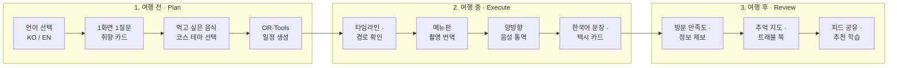
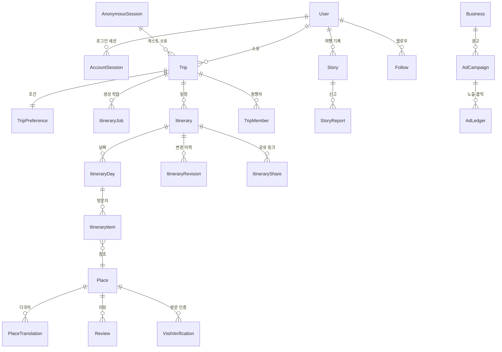

# LOCAL ROUTE 통합 서비스 기획서 v6.0

**부제** — 현지인이 다시 가는 곳으로, 언어와 지도의 장벽 없이

| 항목 | 내용 |
| --- | --- |
| 문서 버전 | **v6.0 (프로덕션 마스터)** |
| 최종 개정일 | 2026-08-26 (수) |
| 이전 버전 | v5.0 — 본 문서가 전면 대체 |
| 팀 체제 | 6인 (AI · DB · INFRA · BE · FE · APP) |
| 1차 마감 | **2026-09-04 (금)** — 웹 완결 + 모바일 반응형 |
| 2차 마감 | **2026-09-11 (금)** — 앱 개발 완료 |
| 실제 출시 예상 | **iOS 9/15 전후 · Android 9/21 전후** (11장 근거) |
| 짝 문서 | `LOCAL_ROUTE_6인_개발계획서_및_업무지침서_v6.md` |

---

## 문서 표기 규칙

이 문서는 **검증된 것과 아직 아닌 것을 구분해서** 적는다. 청사진이 사실과 다르면 그것을 믿고 일한 사람의 시간이 사라진다.

| 표기 | 의미 |
| --- | --- |
| **[실측]** | 2026-08-26 기준 저장소 코드·개발 DB를 직접 세어 확인한 값 |
| **[확정 사실]** | 공식 문서로 확인. 출처와 확인일을 함께 적는다 |
| **[데모]** | 지금은 동작하는 것처럼 보이지만 실제로는 가짜이거나 임시인 부분 |
| **[구현 필요]** | 아직 존재하지 않는다. 만들어야 한다 |
| **[가설]** | 검증되지 않은 수치·판단. 실측 전까지 의사결정 근거로 쓰지 않는다 |
| **[위험]** | 놓치면 일정이나 출시를 막는다 |

---

## v5 → v6 개정 요약

| 구분 | v5 | v6 | 개정 사유 |
| --- | --- | --- | --- |
| 현재 상태 서술 | 없음 | **5장 데모 감사 신설 (21건)** | 이 앱은 데모다. 어디서 출발하는지 모르면 계획을 세울 수 없다 |
| API 명세 | 파일별 수치가 실제와 불일치 | **실측값으로 교체** | trips 18→23, community 9→5 등 거의 모든 행이 달랐다 |
| 데이터 목표 | "부산 200곳 시드" | **결측 필드 채우기** | 이미 277곳 있다. 문제는 개수가 아니라 영문명 15%·영문주소 0%·알레르기 0% |
| Android 요건 | Target SDK 34 | **Target API 36** | 2026-08-31부터 신규 앱 필수. 34로는 업로드가 거부된다 |
| Play 출시일 | 9/11 제출 = 출시로 읽힘 | **비공개 테스트 12명·14일 규칙 반영** | 규칙을 모르면 10월로 밀린다 |
| 소셜 로그인 | 1단계 필수 | **v1.1로 이관** | 추가하는 순간 App Store 4.8이 발동해 Sign in with Apple이 필요해진다 |
| 계정 삭제 API | 있는 것처럼 서술 | **미구현 명시 · 1단계로 이동** | 실제로 없다. 심사 필수 항목이라 앞당겨야 한다 |
| 인프라 | AWS ECS·RDS·CloudFront | **단일 VM으로 시작, 확장 경로 별도** | 9일 안에 세울 수 없다. 이미지 저장소만 예외로 우선 도입 |
| GIS | PostGIS | **하버사인 + 복합 인덱스** | 277~수천 건에서는 불필요. 문서 내에서도 서술이 엇갈렸다 |
| KPI | 통제 불가·측정 불가 항목 다수 | **측정 방법이 있는 지표만** | "0 Reject", "크래시율 0%"는 KPI가 될 수 없다 |
| 기능 명세 | 무엇을 만드나 | **현재 상태 → 실서비스 요건 → 수용 기준 → 담당** | 데모를 실서비스로 바꾸는 문서이므로 |

---

## 목차

1. Executive Summary
2. 서비스 정의와 6대 원칙
3. 타깃 사용자와 페르소나
4. 여행 3단계 사용자 여정
5. **현재 구현 실측과 데모 감사**
6. 12대 핵심 기능 명세
7. 추천 및 동선 최적화 알고리즘
8. 데이터 모델 (26개)
9. API 명세 (66개)
10. 화면 구조 (44개 페이지 트리)
11. 마일스톤과 실제 출시 일정
12. 품질 규격 — 반응형 · 다국어 · 접근성
13. 데이터 신뢰 정책
14. 6인 팀 역할 요약
15. KPI
16. 리스크 관리
17. 부록

---

## 1. Executive Summary

### 1.1 한 문장 정의

> **LOCAL ROUTE**는 현지인이 실제로 다시 찾는 장소를 근거로, 외국인 여행자가 한국에서 겪는 **탐색 · 이동 · 주문 · 소통의 단절을 해소**하고, 제약조건 최적화 엔진이 계산한 **실행 가능한 시간표**와 현장에서 바로 쓰는 **한국어 도구**를 제공하는 로컬 여행 동행 서비스다.

### 1.2 지금 어디까지 와 있는가 [실측]

| 영역 | 상태 |
| --- | --- |
| 서버 | 5,024줄 · **66개 API** · 26개 데이터 모델 · 27개 마이그레이션 · 테스트 12파일 |
| 웹 | 90개 파일 · TSX 5,787줄 + CSS 3,535줄 · **화면 44개 중 완료 23 / 부분 4 / 예정 17** |
| 최적화 | Python OR-Tools 9.14 솔버 연동 (`server/solver/route_optimizer.py`) |
| 장소 데이터 | 277곳. 다만 **영문명 15% · 영문주소 0% · 알레르기 0%** |
| 앱 | **0% — 미착수** |
| 운영 | SQLite + 로컬 실행. 공개 배포 없음 |

**즉, 엔진은 서 있고 화면은 절반을 넘겼다. 남은 일은 (1) 가짜를 진짜로 바꾸고 (2) 데이터를 채우고 (3) 배포하고 (4) 앱을 만드는 것이다.**

### 1.3 해결하려는 문제

| 외국인 여행자가 겪는 단절 | LOCAL ROUTE의 해법 | 현재 상태 |
| --- | --- | --- |
| 구글맵이 한국 대중교통·도보 길찾기를 제대로 못 한다 | 카카오 모빌리티 연동 경로 안내 | 구현됨 |
| 메뉴를 읽지 못해 주문을 못 한다 | 카메라 메뉴판 번역 + 알레르기 배지 | **[데모]** 수작업 사전 113개 |
| 말이 통하지 않아 요청을 못 한다 | 양방향 음성 통역 + 장소별 한국어 문장 | **[데모]** if-else 분기 |
| 알레르기·식단 정보를 확인할 수 없다 | 메뉴별 원재료 분석과 경보 | **[데모]** 데이터 0% |
| 동선이 비효율적이라 하루가 무너진다 | OR-Tools 시간창 제약 최적화 | 구현됨 |
| 광고성 정보와 진짜 로컬을 구분할 수 없다 | 로컬 점수와 광고의 완전 분리 | 구현됨 (코드로 강제) |

### 1.4 지금 당장 결정해야 하는 것

| # | 결정 | 마감 | 이유 |
| --- | --- | --- | --- |
| 1 | Google Play·Apple Developer 계정을 **오늘 개설 착수** | 8/26 | 승인 대기는 팀이 통제할 수 없다. 계정이 없으면 8/31 비공개 테스트 시작도 못 한다 |
| 2 | 비공개 테스트용 **테스터 12명 확보** | 8/28 | Play 프로덕션 출시의 전제 조건 |
| 3 | **앱 v1 범위를 12화면으로 확정** | 8/27 | 7일에 44화면은 불가능하다 (11.4절) |
| 4 | 메뉴 OCR·번역·음성을 **어느 외부 서비스로 교체할지** | 8/28 | 계약·키 발급에 시간이 걸린다 |
| 5 | **소셜 로그인 v1.1 이관 확정** | 8/27 | 추가하면 App Store 4.8이 발동한다 |

---

## 2. 서비스 정의와 6대 원칙

### 2.1 6대 원칙

1. **검증된 데이터와 제약조건 최적화가 결정한다.**
   일정의 장소 조합과 시간표는 생성형 AI가 아니라 추천 점수와 OR-Tools 최적화기가 정한다. LLM은 번역과 의도 해석만 담당한다. 운영시간·이동시간·예산 제약을 만족하지 않는 일정은 만들지 않는다.

2. **유명세보다 현장 실행 가능성이 먼저다.**
   영어 메뉴 유무, 해외카드 결제, 브레이크타임, 혼밥 가능 여부처럼 **실제로 들어갈 수 있는가**를 우선 검증한다.

3. **안전 정보는 모르면 모른다고 말한다.**
   알레르기·식단 정보가 확인되지 않은 장소는 안전하다고 추정하지 않는다. 화면에 `확인 필요`로 표시한다. 이 원칙은 데이터가 없을 때 특히 중요하다.

4. **광고비는 추천 순위에 개입하지 못한다.**
   광고는 자연 추천과 UI에서 분리하고 `광고` 라벨을 붙인다. 음식점·카페·기념품샵 업종은 API 단계에서 광고 등록을 거부한다. 이건 정책이 아니라 코드다.

5. **언어 전환은 즉시, 전 화면에서 일어난다.**
   우측 상단 스위처를 누르면 새로고침 없이 모든 텍스트가 바뀐다. 장소명은 `해운대 해수욕장 (Haeundae Beach)` 형태로 병기해 현장 표지판과 대조할 수 있게 한다.

6. **한 사람의 여행이 끝까지 완결되는 것을 우선한다.**
   기능을 늘리는 것보다 `음식 선택 → 일정 생성 → 현장 이동 → 주문 → 기록`이 한 번 끊김 없이 되는 것이 먼저다.

### 2.2 원칙이 실제 코드에서 지켜지는 지점 [실측]

| 원칙 | 코드에서의 강제 지점 |
| --- | --- |
| 1 | `services/schedule.ts`(587줄) 시간창 제약 · `solver/route_optimizer.py` OR-Tools |
| 2 | `lib/foreignConvenience.ts` · `Place.hasEnglishMenu` · `Place.foreignCardPayment` |
| 3 | `ItemCard.tsx`의 `needsFoodCheck` 분기 — 알레르기 데이터가 없으면 경고를 띄운다 |
| 4 | `services/ads.ts` 업종 화이트리스트 · `AdLedger` 분리 계측 |
| 5 | `i18n.ts` · `LanguageSwitcher.tsx` · `PlaceTranslation` 모델 |
| 6 | 페이지 트리 `routeTree.ts` — 화면 44개가 여정 순서로 정의되어 있다 |

---

## 3. 타깃 사용자와 페르소나

### 3.1 Emily — 28세, 미국인, 초행 뚜벅이

| 항목 | 내용 |
| --- | --- |
| 상황 | 한국 첫 방문. 한글을 읽지 못한다. 3박 4일 부산 |
| 제약 | 돼지고기를 먹지 못한다. 매운 것에 약하다. 렌터카 없음 |
| 두려움 | 메뉴판 앞에서 아무것도 못 고르는 상황. 택시에서 목적지를 설명하지 못하는 상황 |
| 필요 | 밀면·돼지국밥 중 먹을 수 있는 것 구분, 메뉴판 촬영 확인, 기사에게 보여줄 한국어 주소 |
| 주 사용 기능 | 음식 칩 선택 · 메뉴판 번역 · 음성 통역 · 택시 카드 |
| **v6에서 이 사람을 위해 반드시 채워야 할 것** | **영문 장소명·영문 주소 (현재 15% / 0%)**, 알레르기 데이터 (현재 0%) |

### 3.2 켄타 — 32세, 일본인, 맛집 탐방 재방문객

| 항목 | 내용 |
| --- | --- |
| 상황 | 부산 3회차. 해운대는 이미 가봤다 |
| 필요 | 전포동 카페거리, 영도 노포처럼 현지인이 실제로 가는 곳. 이동 시간 최소화 |
| 두려움 | 블로그 광고에 속아 시간을 버리는 것 |
| 주 사용 기능 | 로컬 코스 모드 · 10개 코스 테마 · 카카오 후기 카드 |
| **반드시 채워야 할 것** | **카카오 평점·후기 데이터 (현재 0%)** — 이게 없으면 "진짜 로컬"을 증명할 근거가 없다 |

### 3.3 지은 — 26세, 한국인, 주말 여행자 [v6 신설]

| 항목 | 내용 |
| --- | --- |
| 상황 | 서울 거주. 금요일 밤 출발 2박 3일 |
| 필요 | 짧은 시간에 알찬 동선. 예산 안에서 후회 없는 선택 |
| 주 사용 기능 | 코스 테마(갓성비·인생샷) · 동행자 공동 편집 · 트래블 북 |
| 왜 넣었나 | 초기 사용자의 상당수는 국내 여행자다. 외국인 기능이 완성되기 전에도 서비스가 돌아가려면 이 사람이 쓸 수 있어야 한다 |

---

## 4. 여행 3단계 사용자 여정



### 4.1 여정 단계와 화면 매핑 [실측]

| 단계 | 화면 경로 | 구현 상태 |
| --- | --- | --- |
| 언어 선택·소개 | `/welcome` | 완료 |
| 로그인·회원가입 | `/auth/login` `/auth/signup` | 완료 |
| 취향 입력 | `/plan/basic` `/plan/taste` `/plan/conditions` `/plan/confirm` | 완료 |
| 일정 생성 | `/generating/:tripId` | 완료 |
| 여행 요약 | `/trips/:tripId/overview` | 완료 |
| 일정·동선 | `/trips/:tripId/schedule` `/schedule/:dayIndex` | 완료 |
| 경로 상세·내비 | `/trips/:tripId/scheduleNavigate` | 완료 |
| 지도 전체 | `/trips/:tripId/map` | 부분 |
| 로컬 탐색 | `/trips/:tripId/discover` (+ festivals · souvenirs) | 완료 / 부분 |
| 현장 도구 | 모달 (메뉴판 · 음성 · 사투리 · 한국어 말하기) | **데모** |
| 기록 | `/stories` `/stories/new` | 완료 |
| 여행 준비 | `/trips/:tripId/prep` | 완료 |
| 내 여행 | `/me/trips` `/me/settings` | 완료 |
| 약관·정책 | `/legal/*` | **예정** |
| 운영 콘솔 | `/admin/*` | **예정** |

---

## 5. 현재 구현 실측과 데모 감사

이 장이 v6에서 새로 생겼다. **청사진은 도착지만 그리면 안 되고 출발지를 정확히 적어야 한다.**

### 5.1 코드 규모 [실측 · 2026-08-26]

| 영역 | 값 |
| --- | --- |
| 저장소 구조 | npm workspaces 모노레포 (`server` + `web`) |
| 서버 소스 | 5,024줄 |
| 서버 라우터 | 8개 파일 |
| 서버 서비스 | 15개 파일 |
| API 엔드포인트 | **66개** |
| Prisma 모델 | **26개** |
| 마이그레이션 | 27개 |
| 서버 테스트 | 12개 파일 |
| Python 솔버 | `route_optimizer.py` 118줄 · OR-Tools 9.14.6206 |
| 웹 파일 | 90개 |
| 웹 TSX | 5,787줄 |
| 웹 CSS | 3,535줄 (`styles.css` 2,645 + `ux-overrides.css` 890) |
| 웹 컴포넌트 | 38개 |
| 화면(라우트) | **44개** — 완료 23 · 부분 4 · 예정 17 |
| CI | GitHub Actions 1개 |
| 컨테이너 | Dockerfile 2 · compose 2 · nginx.conf 1 |

**서버 주요 파일 [실측]**

| 파일 | 줄 수 | 역할 |
| --- | ---: | --- |
| `routes/trips.ts` | 705 | 여행·일정·장소·경로·재최적화 |
| `services/schedule.ts` | 587 | 시간창 제약 스케줄링 |
| `services/kakao.ts` | 538 | 카카오 로컬·모빌리티·좌표 |
| `services/recommend.ts` | 333 | 추천 점수 |
| `services/reoptimize.ts` | 330 | 부분 재최적화 |
| `services/paceLearning.ts` | 246 | 이동 속도 학습 |
| `lib/tourapi.ts` | 175 | 한국관광공사 API |
| `services/generate.ts` | 163 | 생성 파이프라인 |
| `routes/community.ts` | 160 | 방문 인증·리뷰 |
| `routes/social.ts` | 156 | 스토리·팔로우·신고 |
| `services/optimizer.ts` | 146 | 솔버 호출 |
| `routes/experience.ts` | 132 | 축제·기념품샵·날씨 |
| `routes/collaboration.ts` | 131 | 공동 편집·공유 |
| `routes/commerce.ts` | 114 | 광고·예약 |
| `routes/account.ts` | 103 | 회원가입·로그인·프로필 |
| `services/navText.ts` | 49 | 현장 한국어 문장·택시 카드 |

### 5.2 데이터 커버리지 [실측 · 개발 DB]

| 테이블 | 행 수 |
| --- | ---: |
| `Place` | **277** |
| `Trip` | 125 |
| `Itinerary` | 377 |
| `PlaceTranslation` | **36** |
| `AdCampaign` | 8 (전부 데모) |
| `Business` | 2 |
| `BookingPartner` | 1 (가짜 링크) |
| `Review` | 1 |
| `User` | 1 |
| `VisitVerification` | 1 |
| `Story` | 0 |
| `Follow` | 0 |

**장소 277곳의 필드 결측률 [실측]** — 이것이 v6의 가장 중요한 발견이다.

| 필드 | 채워짐 | 비율 | 이 필드가 없으면 무엇이 안 되나 |
| --- | ---: | ---: | --- |
| `imageUrl` | 269/277 | 97% | (양호) |
| `contentId` | 233/277 | 84% | (양호) |
| `closedDays` | 55/277 | 20% | 휴무일에 일정이 잡힌다 |
| `nameEn` | 42/277 | **15%** | 영어 모드에서 장소 이름이 한글로 나온다 |
| `nightImageUrl` | 5/277 | 2% | 야경 코스 사진이 없다 |
| `playTime` · `souvenirItems` · 행사 기간 | 3/277 | 1% | 액티비티·기념품 카드가 비어 보인다 |
| `addressEn` | 0/277 | **0%** | **택시 카드·영문 주소 기능이 성립하지 않는다** |
| `allergens` | 0/277 | **0%** | **원칙 3(안전 정보)이 데이터로 뒷받침되지 않는다** |
| `dietOptions` | 0/277 | **0%** | 채식·할랄 여행자가 쓸 수 없다 |
| `kakaoRating` 등 리뷰 6종 | 0/277 | **0%** | **"검증된 카카오 리뷰 기반"이라는 서비스 정의가 성립하지 않는다** |
| `localScoreUpdatedAt` | 0/277 | 0% | 로컬 점수의 신선도를 알 수 없다 |

> **[위험] 서비스 정체성이 데이터로 뒷받침되지 않는다.**
> 기획서는 "외국인 대상"과 "카카오 리뷰 검증"을 핵심으로 내세우는데, 영문 주소가 0%이고 카카오 평점이 0%다. **코드를 아무리 잘 만들어도 이 두 칸이 비어 있으면 데모다.** 그래서 v6는 DB 담당의 1순위 목표를 "장소 추가"가 아니라 "결측 채우기"로 바꿨다.

### 5.3 데모 감사 — 21건

#### A. 코드가 가짜인 것 (7건)

| ID | 항목 | 현재 | 근거 |
| --- | --- | --- | --- |
| **D-1** | 날씨 예보 | 날짜 문자열의 문자코드 합으로 기온·강수확률을 만든다 | `routes/experience.ts:129` · `source: "CACHED_DEMO_FORECAST"` |
| **D-2** | 웹 날씨 위젯 | 서버 값조차 안 쓰고 3일치를 화면에 하드코딩 | `WeatherPrepWidget.tsx:21` |
| **D-3** | 음성 통역 | `text.includes("pork")` 식 if-else 분기 | `VoiceTranslatorModal.tsx:130` 주석 `for demo` |
| **D-4** | 메뉴판 번역 | Tesseract.js + 수작업 사전 113개 항목 | `utils/menuOcr.ts` 191줄 |
| **D-5** | 스토리 이미지 | base64 Data URL을 DB에 저장 (요청 한도 3MB) | `routes/social.ts:23` |
| **D-6** | 예약 제휴 | `https://example.com/booking/local-route-demo` | `ensure-commerce.ts:20` |
| **D-7** | 광고 캠페인 | 데모 8건이 실제 광고처럼 노출 | DB `AdCampaign` |

#### B. 데이터가 비어 있는 것 (7건)

| ID | 항목 | 현재 | 1차 목표 (9/4) |
| --- | --- | --- | --- |
| **D-8** | 영문 장소명 | 15% | **100%** |
| **D-9** | 영문 주소 | 0% | **100%** |
| **D-10** | 알레르기 | 0% | **식당·카페 100%** (모르면 `확인 필요`) |
| **D-11** | 식단 옵션 | 0% | 식당·카페 100% |
| **D-12** | 휴무일 | 20% | **80%** |
| **D-13** | 카카오 평점·후기 | 0% | 식당 상위 50곳 |
| **D-14** | 구조화 번역 | 36행 | 277곳 전체 |

#### C. 운영·보안이 준비 안 된 것 (7건)

| ID | 항목 | 현재 | 영향 |
| --- | --- | --- | --- |
| **D-15** | 데이터베이스 | SQLite 파일 | 동시 쓰기 직렬화. 백업·복구 절차 없음 |
| **D-16** | 배포 | 로컬 실행만 | **스토어 심사 제출 불가 · 실기기 앱 테스트 불가** |
| **D-17** | 관리자 토큰 | `.env` 미설정 → 기본값 `local-route-demo-admin` | **신고 검토·삭제 API가 무방비다** |
| **D-18** | 예약 웹훅 서명 | 미설정 → 기본값 `change-before-production` | 예약 상태 위조 가능 |
| **D-19** | 이메일 인증 | 생략. 화면에도 "데모 안내" 문구 | 아무 이메일로나 가입. 비밀번호 재설정 없음 |
| **D-20** | 계정 삭제 API | **존재하지 않음** | **App Store 5.1.1(v) 위반 → 리젝** |
| **D-21** | 이미지 검색 키 | 네이버·구글 키 없음 | 사진 없는 장소는 플레이스홀더 |

#### 잘 되어 있는 것

- **비밀번호 저장**: `scrypt` + 계정별 salt + `timingSafeEqual` 비교 (`services/account.ts`). 손댈 필요 없다.
- **보안 미들웨어**: helmet · CORS 화이트리스트 · rate limit 적용됨.
- **광고 분리**: 업종 화이트리스트가 API 단에서 강제된다.
- **추정값 표기**: 이동시간이 카카오 응답이 아닐 때 `isEstimate: true`로 구분한다. 원칙 3이 코드에 살아 있다.
- **SPA fallback**: `nginx.conf`에 `try_files $uri /index.html`이 이미 있다.

### 5.4 전환 항목 분포

| 분류 | 건수 | 성격 | 병목 |
| --- | ---: | --- | --- |
| 코드 가짜 | 7 | 외부 서비스로 교체 | **계약·키 발급 시간** |
| 데이터 결측 | 7 | 콘텐츠 채우기 | **사람 손. 자동화해도 검수가 남는다** |
| 운영·보안 | 7 | 인프라·설정 | 배포와 시크릿 |

**남은 일의 절반 이상이 코드가 아니다.** 이 사실이 6인 역할 배분의 근거다(14장).

---

## 6. 12대 핵심 기능 명세

각 기능을 **현재 상태 → 실서비스 요건 → 수용 기준 → 담당 → 마감** 순으로 적는다. 수용 기준은 "됐다"를 누가 봐도 같게 판정할 수 있게 쓴다.

---

### 6.1 온보딩과 전역 언어 스위처 (KO / EN)

| 구분 | 내용 |
| --- | --- |
| **현재** | 구현됨. `/welcome` 화면과 `LanguageSwitcher.tsx`, `i18n.ts` 동작 |
| **문제** | 장소명 병기가 `nameEn` 데이터에 의존하는데 **85%가 비어 있다.** 영어 모드에서 한글 이름이 그대로 노출된다 |
| **실서비스 요건** | ① 우측 상단 고정 스위처 ② 전환 시 새로고침 없이 즉시 리렌더 ③ 장소명 `한글 (English)` 병기 ④ 오류 메시지·모달·지도 팝업까지 전부 전환 |
| **수용 기준** | 영어 모드로 전체 화면을 돌았을 때 **한글이 남아 있는 곳 0건**. 미번역 문자열 탐지 스크립트가 0을 반환 |
| **담당** | FE (화면) · DB (번역 데이터) |
| **마감** | 9/4 |

---

### 6.2 1화면 1질문 취향 카드 위저드

| 구분 | 내용 |
| --- | --- |
| **현재** | 구현됨. `TripFormPage.tsx` 482줄, 커밋 `77bccf2`에서 단계별 카드로 전환 |
| **실서비스 요건** | ① 여행 기분 ② 선호 활동 ③ 식단·알레르기 ④ 예산·인원·기간 ⑤ 뒤로가기와 새로고침에도 입력이 유지 |
| **수용 기준** | 375px 화면에서 각 단계가 세로 스크롤 1회 이내. 중간에 새로고침해도 입력값 보존 |
| **담당** | FE |
| **마감** | 9/4 |

---

### 6.3 먹고 싶은 한국 음식 8종 칩 · 일정 앵커링

| 구분 | 내용 |
| --- | --- |
| **현재** | 구현됨. `DesiredFoodPicker.tsx` · 추천 가산점 반영 |
| **8종** | 밀면 · 돼지국밥 · 씨앗호떡 · 회·해산물 · 동래파전 · 복국 · 부산어묵 · 낙곱새 |
| **문제** | 선택한 음식을 파는 식당을 식별하려면 장소에 메뉴 태그가 있어야 하는데, 현재는 `tasteTags` 추정에 의존한다 |
| **실서비스 요건** | ① 음식별 영문명·발음·맵기·주요 원재료·가격대 ② 해당 음식 판매 식당을 점심·저녁 슬롯에 우선 배정 ③ **먹지 못하는 재료(돼지고기 등)를 고른 사용자에게는 그 음식을 추천하지 않는다** |
| **수용 기준** | 8종 각각에 대해 **판매 식당이 최소 5곳** 태깅되어 있고, 선택 시 해당 식당이 식사 슬롯에 배정된다. 돼지고기 제외 설정 시 돼지국밥이 추천되지 않는다 |
| **담당** | DB (음식-식당 태깅) · AI (가산점 로직) |
| **마감** | 9/4 |

---

### 6.4 10개 코스 테마

| 코드 | 이름 |
| --- | --- |
| `ZERO_WON` | 무일푼 0원 코스 |
| `BEST_BANG` | 갓성비 알뜰 코스 |
| `SPLURGE` | 럭셔리 호캉스·파인다이닝 |
| `OLD_TOWN` | 구수한 골목길·원도심 |
| `NATURE_FIX` | 자연인 힐링 바다·숲길 |
| `PICTURE_PERFECT` | 인생샷·야경 명소 |
| `EASY_PACE` | 여유로운 뚜벅이 |
| `FAMILY_CARE` | 가족 안심 코스 |
| `SOLO_FRIENDLY` | 혼밥·혼행 안심 |
| `RAINY_DAY` | 비 오는 날 실내 감성 |

| 구분 | 내용 |
| --- | --- |
| **현재** | 구현됨. `config/course_categories.json` + `services/courseCategories.ts` |
| **문제** | `SOLO_FRIENDLY`를 판정할 **`soloFriendly` 컬럼이 스키마에 없다.** `RAINY_DAY`는 `isOutdoor`로 판정 가능하나 데이터가 부족하다 |
| **실서비스 요건** | 10개 테마 각각에 대해 후보 장소가 **하루 일정을 채울 만큼**(최소 15곳) 존재해야 한다 |
| **수용 기준** | 테마별로 2박 3일 일정을 생성했을 때 **동일 장소 반복 0건**, 테마 성격과 맞지 않는 장소 0건 |
| **담당** | DB (컬럼 추가 + 태깅) · AI (가중치) |
| **마감** | 9/4 · `soloFriendly` 컬럼 추가는 8/28 |

---

### 6.5 카메라 메뉴판 OCR 번역 [데모 → 실서비스]

| 구분 | 내용 |
| --- | --- |
| **현재 [데모]** | 브라우저 Tesseract.js OCR + **수작업 사전 113개 항목**. 사전에 없는 메뉴는 번역되지 않는다. 외부 API를 쓰지 않아 비용은 0 |
| **문제** | 한글 메뉴판은 폰트·조명·기울기 변화가 커서 Tesseract 정확도가 낮다. 사전 113개로는 실제 메뉴판을 감당할 수 없다 |
| **실서비스 요건** | ① 클라우드 OCR로 교체 (후보: Google Cloud Vision · Naver CLOVA OCR — **8/28까지 선택**) ② 메뉴명·가격 구조화 추출 ③ **부산 대표 메뉴 300종 사전 + 8대 알레르기 원재료 매핑** ④ 맵기 단계 배지 ⑤ 메뉴명 TTS |
| **폴백** | 네트워크 실패·쿼터 초과 시 기존 온디바이스 경로로 자동 전환하고 화면에 "간이 인식" 표시 |
| **수용 기준** | 부산 대표 메뉴 **50종 실사진 테스트에서 메뉴명 인식 80% 이상**, 가격 인식 70% 이상. 측정 스크립트를 저장소에 둔다 |
| **비용 관리** | 사용자당 일 10회 제한 · 결과 24시간 캐시 |
| **담당** | AI (파이프라인·사전) · BE (프록시 API·쿼터) · APP (네이티브 카메라) |
| **마감** | 웹 9/4 · 앱 9/11 |

> **[위험] 이 기능은 외부 계약이 필요하다.** 8/28까지 제공자를 정하고 키를 받지 못하면 9/4 웹 마감에서 이 기능만 데모로 남는다. 그 경우 화면에 "간이 번역"임을 정직하게 표시한다.

---

### 6.6 양방향 실시간 음성 통역 [데모 → 실서비스]

| 구분 | 내용 |
| --- | --- |
| **현재 [데모]** | `text.includes("pork")` 같은 분기로 미리 정한 문장만 반환. **번역이 아니다** |
| **실서비스 요건** | ① 실제 번역 API 연동 (후보: Papago · DeepL · Google Translate — **8/28까지 선택**) ② STT는 브라우저·네이티브 음성 인식 ③ TTS 재생 ④ 워키토키 UI (Tourist / Local 버튼) ⑤ 자주 쓰는 문장 프리셋 |
| **폴백** | 음성 인식 실패 시 **텍스트 입력으로 전환**. 번역 API 실패 시 프리셋 문장만 제공하고 그 사실을 표시 |
| **수용 기준** | STT → 번역 → TTS 왕복 **3초 이하**. 실패 시 흰 화면이 아니라 폴백 UI가 뜬다. 프리셋 12문장은 네트워크 없이도 동작 |
| **담당** | AI (파이프라인) · BE (프록시) · APP (네이티브 음성) |
| **마감** | 웹 9/4 · 앱 9/11 |

---

### 6.7 부산 사투리 표현 위젯

| 구분 | 내용 |
| --- | --- |
| **현재** | 구현됨. `BusanDialectWidget.tsx` 179줄, 여행 준비 탭 |
| **표현** | 가가 가가? · 맞나? · 단디해라 · 억수로 좋네! · 살아있네! · 밥 먹었나? 외 |
| **실서비스 요건** | ① 표현별 뉘앙스·사용 상황 해설 ② TTS 재생 ③ 플래시카드 확대 보기 ④ 영문 의미 병기 |
| **수용 기준** | 8종 전부에 한글·영문·상황 해설·TTS가 있다 |
| **담당** | FE · DB (콘텐츠) |
| **마감** | 9/4 |

---

### 6.8 장소별 한국어 말하기 모달 (4대 탭)

| 구분 | 내용 |
| --- | --- |
| **현재** | 구현됨. `SpeakModal.tsx` 188줄 · `services/navText.ts` 49줄 |
| **4대 탭** | 관광지 · 식당·카페 · 택시 · 숙소 |
| **실서비스 요건** | ① 상황별 문장 최소 14종 ② 대형 텍스트(현장에서 보여주기) ③ 한국어 발음 표기 ④ 일반·천천히 TTS ⑤ **장소 데이터의 한국어 주소를 그대로 사용** |
| **문제** | 택시 탭의 주소 카드가 `addressEn` 없이도 동작하지만, 반대로 **영어 사용자에게 보여줄 영문 주소가 0%**라 "여기가 어디인지" 본인이 확인할 수 없다 |
| **수용 기준** | 4개 탭 각각에서 문장 재생·복사·확대가 동작. 택시 카드에 한국어 주소와 영문 주소가 함께 표시 |
| **담당** | FE · DB (영문 주소) |
| **마감** | 9/4 |

---

### 6.9 카카오 평점·후기 연동과 예상 비용 [데이터 결측]

| 구분 | 내용 |
| --- | --- |
| **현재** | 코드는 구현됨(`ItemCard.tsx`의 카카오 리뷰 카드). **데이터가 0%라 화면에 아무것도 안 나온다** |
| **제약 [확정 사실]** | 카카오 로컬 API 응답에는 평점·후기 필드가 없다. 임의 크롤링은 하지 않는다 |
| **실서비스 요건** | ① 권한이 확인된 집계 데이터만 `npm run import:kakao-reviews`로 적재 ② 출처(`LICENSED_IMPORT` 또는 `MANUAL_VERIFIED`)와 수집일 표시 ③ 후기 수 30건·평균 4.0을 사전값으로 둔 베이지안 보정 ④ 집계가 없으면 **추천 점수에 반영하지 않고 화면에도 표시하지 않는다** |
| **비용 산출** | 무료 관광지 0원 · 유료 관람 15,000원 · 식당 1인 14,000원 · 카페 7,000원 · 숙소 80,000~150,000원을 기준값으로 하되 **화면에 "추정"으로 명시** |
| **수용 기준** | 식당 상위 50곳에 평점 데이터가 있고, 없는 곳은 카드가 아예 나타나지 않는다(빈 별점 금지) |
| **담당** | DB (수집·적재) · AI (보정 로직) |
| **마감** | 9/4 |

> **[위험] 이 항목은 데이터 확보 경로가 팀 외부에 있다.** 9/4까지 확보하지 못하면 서비스 정의에서 "카카오 리뷰 검증"을 빼고 "현지인 방문 기반 로컬 점수"만 남겨야 한다. 없는 것을 있다고 말하지 않는다.

---

### 6.10 날씨 연동과 실내 대체 제안 [데모 → 실서비스]

| 구분 | 내용 |
| --- | --- |
| **현재 [데모]** | 서버는 문자코드 기반 가짜 생성, 웹 위젯은 3일치 하드코딩. **두 겹으로 가짜다** |
| **실서비스 요건** | ① 기상청 단기예보 API 연동 ② 날짜별 기온·강수확률·하늘 상태 ③ 1시간 캐시 ④ 우천 시 우산 준비물 안내 ⑤ 야외 장소를 실내로 1클릭 교체 (부분 재최적화 재사용) |
| **수용 기준** | `WeatherPrepWidget`의 하드코딩 배열이 제거되고 API 값을 쓴다. API 실패 시 위젯이 숨겨지거나 "예보 없음"을 표시한다. **가짜 값을 보여주지 않는다** |
| **담당** | BE (기상청 연동) · FE (위젯 교체) |
| **마감** | 9/4 |

---

### 6.11 현장 이동 지원과 택시 목적지 카드

| 구분 | 내용 |
| --- | --- |
| **현재** | 구현됨. `GET /routes/taxi-card` · `TripNavigatePage.tsx` 274줄 · `NavigateMap.tsx` 205줄 |
| **실서비스 요건** | ① 지하철역·출구 번호, 버스 번호 ② 기사에게 보여줄 전체 화면 한국어 주소 카드 ③ 클립보드 복사 ④ 카카오맵·구글맵 딥링크 |
| **문제** | 지하철 출구 번호 등 세부 정보가 장소 데이터에 없다 |
| **수용 기준** | 임의의 장소 10곳에서 택시 카드가 한국어 주소와 함께 정상 표시. 딥링크가 양 OS에서 지도 앱을 연다 |
| **담당** | BE · APP |
| **마감** | 웹 9/4 · 앱 9/11 |

---

### 6.12 트래블 북과 추억 지도

| 구분 | 내용 |
| --- | --- |
| **현재** | 구현됨. `Story` 모델 · `TripMemorySummary.tsx` · 커밋 `2fa1f67`·`0ceaf6a` |
| **문제 [데모]** | 사진을 **base64로 DB에 저장**한다. 사용자가 늘면 DB가 감당하지 못한다 |
| **실서비스 요건** | ① 오브젝트 스토리지 업로드로 교체 ② 업로드 전 리사이즈 ③ **EXIF 제거** ④ 위치는 지역 단위로만 저장 ⑤ 여행 종료 후 지연 공개 기본값 ⑥ 방문 경로 폴리라인과 사진 결합 |
| **수용 기준** | 새 스토리 이미지가 DB가 아닌 스토리지에 저장된다. 기존 base64 데이터 마이그레이션 스크립트가 있다. 업로드한 사진의 EXIF에 GPS가 남지 않는다 |
| **담당** | INFRA (스토리지) · BE (업로드 API) · FE·APP (업로드 UI) |
| **마감** | 9/4 |

---

## 7. 추천 및 동선 최적화 알고리즘

### 7.1 다기준 추천 점수 [실측 · `services/recommend.ts` 333줄]

점수는 다음 축의 가중 합으로 계산한다.

```
Score = w1·TasteMatch      (취향 태그 일치)
      + w2·LocalScore      (현지인 재방문 기반 로컬 점수)
      + w3·TravelEfficiency(이동 효율)
      + w4·BudgetFit       (예산 적합도)
      + w5·ForeignerEase   (외국인 현장 이용 편의)
      + w6·PetFit          (v6에서 미사용 · 0 처리)
      + w7·Freshness       (정보 신선도)
      + DesiredFoodBonus   (선택한 음식 판매 식당 가산점)
      - LandmarkPenalty    (코스 테마별 관광지 페널티)
```

- 가중치는 **코스 테마별로 배수 조정**된다 (`config/course_categories.json`의 `weightMultipliers`).
- `DesiredFoodBonus`는 사용자가 고른 8종 음식을 파는 식당에 부여한다.
- **광고비는 이 식에 들어가지 않는다.** 원칙 4의 구현 지점이다.

### 7.2 로컬 점수 산출

| 입력 | 처리 |
| --- | --- |
| 방문 인증(`VisitVerification`) | GPS 검증된 실제 방문만 집계 |
| 리뷰(`Review`) | 방문 인증을 거친 리뷰만 반영 |
| 카카오 평점·후기 | 권한 확인된 집계만. **후기 30건·평균 4.0을 사전값으로 둔 베이지안 보정**으로 소수 후기의 극단값을 완화 |
| 신선도 | `localScoreUpdatedAt` 기준. 오래된 점수는 신뢰도를 낮춘다 |

> **[실측] 현재 방문 인증 1건, 리뷰 1건, 카카오 데이터 0건.** 로컬 점수는 지금 시드 값에 의존한다. 실사용 데이터가 쌓이기 전까지는 이 한계를 화면에 정직하게 표시한다.

### 7.3 권역 군집화와 시간창 스케줄링

- 부산을 3대 권역으로 나눠 하루 동선이 흩어지지 않게 한다: **동부산**(해운대·기장) · **중부산**(서면·전포) · **서부산**(남포·영도).
- 하루 안에서 권역을 넘나들 때 **거리 제곱 페널티**를 부과한다.
- `services/schedule.ts`(587줄)가 운영시간·체류시간·이동시간·식사 슬롯 제약을 만족하는 시간표를 만든다.

### 7.4 OR-Tools 솔버 [실측]

| 항목 | 값 |
| --- | --- |
| 위치 | `server/solver/route_optimizer.py` (118줄) |
| 버전 | `ortools==9.14.6206` |
| 호출 | `services/optimizer.ts`(146줄)가 Python 프로세스를 실행 |
| 폴백 | 솔버 실패·타임아웃 시 TypeScript 휴리스틱 스케줄러로 자동 전환 |
| CI | GitHub Actions에서 `pip install -r server/requirements-optimizer.txt` 후 테스트 |

**성능 목표 [가설 → 측정 필요]**

v5는 "이동시간 35% 단축"을 단정했으나 근거가 없었다. v6은 다음으로 대체한다.

- 동일 조건 10개 시나리오에 대해 **최적화 적용 / 미적용**의 총 이동시간을 측정하고 **결과를 그대로 기록**한다.
- 목표치를 미리 정하지 않는다. 측정 결과가 기대에 못 미치면 그것이 개선 과제가 된다.
- 측정 스크립트는 `npm run smoke:pace`를 확장해 만든다.

### 7.5 부분 재최적화 [실측 · `services/reoptimize.ts` 330줄]

사용자가 장소를 고정·제외·교체하면 **그 날짜만** 다시 계산한다. 고정 장소와 다른 날짜는 유지된다.

| 동작 | 엔드포인트 |
| --- | --- |
| 고정·제외·교체 | `POST /api/itineraries/:id/days/:dayIndex/reoptimize` |
| 날짜 재계획 | `POST /api/itineraries/:id/days/:dayIndex/replan` |
| 순서 변경 | `PATCH /api/itineraries/:id/days/:dayIndex/reorder` |
| 되돌리기 | `POST /api/itineraries/:id/undo` (`ItineraryRevision` 기반) |
| 대체 후보 | `GET /api/itineraries/:id/items/:itemId/alternatives` |

### 7.6 페이스 학습 [실측 · `services/paceLearning.ts` 246줄]

사용자의 실제 이동 속도를 학습해 다음 일정의 이동 시간 추정에 반영한다.

| 엔드포인트 | 역할 |
| --- | --- |
| `POST /api/itineraries/:id/items/:itemId/progress` | 실제 도착·이동 기록 |
| `GET /api/itineraries/:id/pace` | 지연 위험 항목과 예상 도착 시각 |
| `GET /api/trips/:tripId/rhythm` | 여행 리듬 브리핑 |

---

## 8. 데이터 모델 — 26개 [실측]

### 8.1 실제 모델 목록

v5의 ERD는 `TRIP_DAY`·`TRIP_STORY`·`PLACE_REVIEW` 같은 존재하지 않는 이름을 썼다. 아래가 실제다.

| 도메인 | 모델 |
| --- | --- |
| 장소·콘텐츠 | `Place` · `PlaceTranslation` |
| 여행·일정 | `Trip` · `TripPreference` · `ItineraryJob` · `Itinerary` · `ItineraryDay` · `ItineraryItem` · `ItineraryRevision` |
| 계정·세션 | `User` · `AccountSession` · `AnonymousSession` |
| 검증·평판 | `VisitVerification` · `Review` · `LocalProfile` |
| 협업·공유 | `TripMember` · `ItineraryShare` |
| 소셜 | `Story` · `StoryReport` · `Follow` |
| 커머스 | `Business` · `AdCampaign` · `AdLedger` · `BookingPartner` · `BookingRecord` |
| 시스템 | `EventOutbox` |

### 8.2 핵심 관계



### 8.3 `Place` 주요 컬럼 [실측 · 42개 컬럼]

| 그룹 | 컬럼 | 현재 채움률 |
| --- | --- | --- |
| 기본 | `nameKo` `category` `address` `lat` `lng` | 100% |
| 다국어 | `nameEn` · `addressEn` | **15% · 0%** |
| 운영 | `openTime` `closeTime` `closedDays` `recommendedStayMin` | 100% · 100% · **20%** · 100% |
| 비용 | `priceTier` | 100% |
| 외국인 편의 | `hasEnglishMenu` `foreignCardPayment` `foreignAssistance` | 100% |
| 안전 | `allergens` · `dietOptions` | **0% · 0%** |
| 평판 | `localScore` `localScoreSource` `localScoreUpdatedAt` | 100% · 100% · **0%** |
| 카카오 | `kakaoPlaceId` `kakaoRating` `kakaoReviewCount` 외 4종 | **전부 0%** |
| 이미지 | `imageUrl` · `nightImageUrl` | 97% · 2% |
| 분류 | `tasteTags` `isOutdoor` `playTime` `souvenirItems` | 100% · 100% · 1% · 1% |
| 출처 | `dataSource` `contentId` | 100% · 84% |

### 8.4 v6에서 추가할 컬럼 [구현 필요]

| 컬럼 | 이유 | 담당 | 마감 |
| --- | --- | --- | --- |
| `soloFriendly` (boolean) | `SOLO_FRIENDLY` 코스 테마와 원칙 2의 "혼밥 가능"을 판정할 근거가 없다 | DB | 8/28 |
| `breakTime` (string) | 브레이크타임은 원칙 2의 핵심인데 컬럼이 없다 | DB | 8/28 |
| `lastOrderTime` (string) | 라스트오더 | DB | 8/28 |
| `subwayExit` (string) | 지하철 출구 번호 (6.11 요건) | DB | 9/1 |

### 8.5 인덱스 설계 [설계 제안]

| 테이블 | 인덱스 | 이유 |
| --- | --- | --- |
| `Place` | `(category, isActive)` | 추천 1단계 후보 조회 |
| `Place` | `(lat, lng)` 복합 | 근접 검색 바운딩 박스 |
| `Place` | `(localScore DESC)` | 상위 정렬 |
| `ItineraryItem` | `(itineraryDayId, sortOrder)` | 일자별 정렬 |
| `ItineraryDay` | `(itineraryId, dayIndex)` | 일자 조회 |
| `Trip` | `(userId, createdAt DESC)` | 내 여행 목록 |
| `Story` | `(publishedAt DESC)` 부분 인덱스 | 피드 |
| `EventOutbox` | 미발행 부분 인덱스 | 이벤트 디스패처 |

**PostGIS는 도입하지 않는다.** 277~수천 건 규모에서는 바운딩 박스 1차 필터 + 하버사인 정렬로 충분하고, 확장 설치·학습 비용이 9일 일정에 맞지 않는다. v1.1 이후 재검토한다.

---

## 9. API 명세 — 66개 [실측]

### 9.1 라우터별 분포

v5의 표는 거의 모든 행이 실제와 달랐다. 아래가 실측값이다.

| 라우터 파일 | 엔드포인트 | 주 담당 | 대표 경로 |
| --- | ---: | :-: | --- |
| `routes/trips.ts` | **23** | BE · AI 공동 | `/trips` `/trips/:id/itinerary` `/places` `/routes/directions` |
| `routes/social.ts` | **9** | BE | `/stories` `/users/:id/follow` `/moderation/*` |
| `routes/commerce.ts` | **8** | BE | `/ads` `/bookings/*` `/businesses/*` |
| `routes/collaboration.ts` | **7** | BE | `/itineraries/:id/share` `/s/:slug` `/collaboration/invites/*` |
| `routes/account.ts` | **5** | BE | `/auth/register` `/auth/login` `/auth/me` `/auth/logout` |
| `routes/community.ts` | **5** | BE | `/places/:id/reviews` `/places/:id/visits/verify` `/local-profile` |
| `routes/experience.ts` | **5** | AI · BE | `/festivals` `/events` `/shops/souvenir` `/weather` |
| `routes/analytics.ts` | **3** | BE | `/analytics/kpis` `/events` `/events/catalog` |
| `index.ts` | **1** | INFRA | `/health` |
| **합계** | **66** | | |

### 9.2 `trips.ts` 23개 내부 분담

한 파일에 23개가 몰려 있어 두 사람이 함께 쓴다. 경로 성격으로 나눈다.

| 갈래 | 담당 | 대표 경로 |
| --- | :-: | --- |
| 여행 생성·조회·설정 | BE | `POST /trips` · `GET /trips` · `GET /trips/:id/itinerary` · `PATCH /trips/:id/preferences` |
| 생성 job · SSE | BE | `POST /trips/:id/itineraries:generate` · `GET /itinerary-jobs/:jobId/events` |
| 재최적화·재계획·순서·되돌리기 | **AI** | `/reoptimize` · `/replan` · `/reorder` · `/undo` |
| 추천 부가 | **AI** | `/alternatives` · `/course-categories` · `/pace` · `/rhythm` |
| 장소·경로·검색 | **AI** | `/places` · `/places/:id/image` · `/locations/search` · `/routes/directions` · `/routes/taxi-card` |

**규칙**: `trips.ts`를 고칠 때는 상대방을 리뷰어로 지정한다. 한 파일을 둘이 쓰는 유일한 예외다.

### 9.3 v6에서 추가할 API [구현 필요]

| 엔드포인트 | 이유 | 담당 | 마감 |
| --- | --- | :-: | --- |
| **`DELETE /api/auth/me`** | **App Store 5.1.1(v) 계정 삭제 의무.** 없으면 리젝된다 | BE | **9/1** |
| `POST /api/auth/password/reset-request` | 비밀번호 재설정 경로가 없다 | BE | 9/3 |
| `POST /api/uploads/story-image` | 스토리 이미지를 오브젝트 스토리지로 (D-5 해소) | BE·INFRA | 9/2 |
| `POST /api/tools/ocr` | 클라우드 OCR 프록시 (키 노출 방지·쿼터 관리) | BE·AI | 9/2 |
| `POST /api/tools/translate` | 번역 API 프록시 | BE·AI | 9/2 |

### 9.4 인증 방식 [실측 + 결정]

| 항목 | 현재 | v6 결정 |
| --- | --- | --- |
| 익명 세션 | `POST /auth/anonymous` → 토큰 해시 | 유지 |
| 계정 | 이메일 + `scrypt`(salt 개별) + `AccountSession` | 유지 |
| 비밀번호 규칙 | 8~64자, 영문·숫자·특수문자 | 유지 |
| 이메일 인증 | **없음** | v1.1 (9/4까지는 화면에 안내 유지) |
| 소셜 로그인 | 없음 | **v1.1로 이관 — 3.3절 근거** |
| JWT 전환 | 없음 | 하지 않는다. 현재 토큰 방식으로 충분 |

> **[확정 사실] 소셜 로그인을 넣지 않는 이유.** App Store 지침 4.8은 "자사 계정 시스템만 사용하는 앱"을 예외로 둔다. 지금 구조는 예외에 해당한다. 카카오·구글 로그인을 추가하는 순간 Sign in with Apple 구현이 사실상 필요해지고, 9/11 일정에 심사 리스크를 스스로 만든다. (출처: Apple App Store Review Guidelines 4.8, 2026-08-26 확인)

---

## 10. 화면 구조 — 44개 [실측]

### 10.1 페이지 트리

화면 정의의 단일 진실 공급원은 `web/src/routes/routeTree.ts`다. 화면을 추가할 때는 이 파일부터 고친다.

```
/                                시작 화면
├── /welcome                     첫 방문 소개·언어 선택          [완료]
├── /onboarding                  앱 온보딩·권한 요청              [앱 전용·예정]
├── /auth/login  /auth/signup    로그인·회원가입                  [완료]
│
├── /plan                        여행 조건 입력
│   ├── basic · taste · conditions · confirm                    [완료]
├── /generating/:tripId          일정 생성 진행 (SSE)             [완료]
│
├── /trips/:tripId               여행 대시보드
│   ├── overview                 여행 요약                        [완료]
│   ├── schedule                 일정·동선                        [완료]
│   │   ├── :dayIndex            특정 날짜                        [완료]
│   │   └── navigate             경로 상세·내비                   [완료]
│   ├── map                      지도 전체보기                    [부분]
│   ├── discover                 로컬 8종 카테고리                [완료]
│   │   ├── festivals            축제 목록                        [부분]
│   │   └── souvenirs            기념품샵                         [부분]
│   ├── together                 함께·여행 기록                   [완료]
│   ├── prep                     여행 준비                        [완료]
│   └── collaborate              동행자 공동 편집                 [부분]
│
├── /places/:placeId             장소 상세                        [예정]
│   └── reviews                  리뷰·방문 인증                   [예정]
├── /stories                     스토리 피드                      [완료]
│   ├── new                      스토리 작성                      [완료]
│   └── :storyId                 스토리 상세                      [예정]
├── /users/:userId               사용자 프로필                    [예정]
│
├── /me                          내 정보
│   ├── trips                    내 여행 목록                     [완료]
│   ├── local                    로컬 등급                        [후속]
│   └── settings                 프로필·설정·계정 삭제            [완료→보강]
│
├── /s/:slug                     공유된 일정 (읽기 전용)          [완료]
├── /invite/:token               동행 초대 수락                   [완료]
│
├── /admin                       운영 콘솔                        [웹 전용]
│   ├── moderation               신고 검토 큐                     [예정·심사 필수]
│   ├── kpis                     KPI 대시보드                     [후속]
│   └── ads                      광고 캠페인 관리                 [후속]
│
├── /legal                       약관·정책                        [예정·심사 필수]
│   ├── terms · privacy · open-source
└── /*                           페이지를 찾을 수 없음            [예정]
```

### 10.2 마일스톤별 화면 수 [실측]

| 마일스톤 | 화면 | 완료 | 부분 | 예정 |
| --- | ---: | ---: | ---: | ---: |
| M1 웹 | 20 | 15 | 1 | 4 |
| M2 앱 | 14 | 6 | 3 | 5 |
| M3 심사 필수 | 7 | 0 | 0 | **7** |
| M4 후속 | 3 | 0 | 0 | 3 |
| **합계** | **44** | **23** | **4** | **17** |

> **심사 필수 7개가 전부 미착수다.** 약관·개인정보 처리방침·오픈소스 고지·신고 검토 큐·앱 온보딩·설정 보강이 여기 들어간다. 이것들이 없으면 앱이 아무리 잘 돌아도 리젝된다.

---

## 11. 마일스톤과 실제 출시 일정

### 11.1 두 마일스톤

| 코드 | 이름 | 마감 | 완료 판정 (DoD) |
| --- | --- | --- | --- |
| **W** | 웹 완결 + 반응형 | **9/4 (금)** | 공개 도메인 HTTPS · PostgreSQL 운영 DB · 화면 44개 동작 · **360~1920px 깨짐 0건** · 데모 코드 7건 해소 · 관리자 토큰·웹훅 시크릿 설정 · 계정 삭제 API 동작 |
| **A** | 앱 개발 완료 | **9/11 (금)** | Android·iOS 실기기 크래시 0건 · 앱 v1 12화면 동작 · EAS 프로덕션 빌드 · TestFlight·Play 비공개 트랙 업로드 |

### 11.2 [위험] Google Play 출시는 9/11이 아니다 [확정 사실]

> 출처: Google Play Console 고객센터 「새로운 개인 개발자 계정의 앱 테스트 요구사항」 (2026-08-25 확인)

2023-11-13 이후 생성된 **개인** Play Console 계정은:

- 테스터 **최소 12명**
- **연속 14일** 비공개 테스트
- 이후 프로덕션 신청 → 검토 **최대 7일**

**대응 — 비공개 테스트를 앱 완성 전에 시작한다.**

올리는 빌드는 완성품일 필요가 없다. 설치되고 크래시 없이 켜지면 된다.

| 날짜 | 할 일 | 결과 |
| --- | --- | --- |
| 8/26 | Play·Apple 개발자 계정 개설 착수 | — |
| 8/28 | **테스터 12명 확보** | — |
| **8/31** | Expo 껍데기 빌드 업로드 → **비공개 테스트 시작** | 14일 카운트 시작 |
| 9/1~9/14 | 개발하며 빌드 갱신 | 카운트 계속 |
| **9/14** | 요건 충족 → 프로덕션 신청 | — |
| 9/14~9/21 | 검토 대기 | — |
| **9/21 전후** | **Play 출시** | |

### 11.3 [위험] Target API 36이 필요하다 [확정 사실]

> 출처: Android Developers 「Target API level requirements for Google Play apps」 (2026-08-26 확인)

**2026년 8월 31일부터 신규 앱과 업데이트는 target API level 36 (Android 16)** 을 충족해야 한다. 기존 앱이 새 사용자에게 계속 노출되려면 API 35가 필요하다.

- v5 문서의 "Target SDK 34"로는 **업로드가 거부된다.**
- 대응: `targetSdkVersion 36` · `compileSdkVersion 36`. **8/27까지 Expo SDK가 API 36을 지원하는지 확인**하고, 미지원이면 Expo 버전 상향 또는 `expo-build-properties`로 명시 지정한다.
- 연장 신청(최대 2026-11-01)은 가능하나 출시일이 밀리므로 최후 수단으로만 둔다.

### 11.4 [위험] 7일에 44화면 앱은 불가능하다

| 항목 | 값 |
| --- | --- |
| 앱에 필요한 화면 | 약 40개 (운영 콘솔 4개 제외) |
| 가용 일수 | 7일(9/5~9/11) 중 실제 구현 **6일** |
| 필요 속도 | **하루 6.7화면** + 네이티브 기능 + 빌드·서명 |

**판정: 불가능하다.** 무리하면 크래시가 남고, 크래시는 리젝 1순위 사유다. 리젝 1회에 1~2주가 날아가므로 **급한 앱이 오히려 출시를 늦춘다.**

**앱 v1 범위 — 12화면 [설계 제안]**

| 넣는다 | 이유 |
| --- | --- |
| 시작 · 온보딩(권한 고지) | 심사 필수 |
| 로그인 · 회원가입 | |
| 여행 조건 입력 (압축) | |
| 일정 생성 진행 | |
| 여행 요약 | |
| 일정·동선 (네이티브 지도) | **앱의 존재 이유** |
| 장소 상세 · 한국어 말하기 | **앱의 존재 이유** |
| 메뉴판 촬영 번역 | **앱의 존재 이유** |
| 음성 통역 | **앱의 존재 이유** |
| 여행 기록 작성 (네이티브 카메라) | |
| 내 여행 목록 | |
| 설정 (언어·**계정 삭제**) · 약관·정책 | 심사 필수 |

| 뺀다 → v1.1 | 대체 |
| --- | --- |
| 로컬 탐색 8종 · 축제 · 기념품샵 | 앱 내 웹뷰 |
| 스토리 피드 · 팔로우 · 프로필 | 앱 내 웹뷰 |
| 공동 편집 · 공유 관리 | 앱 내 웹뷰 |
| 여행 준비(광고·사투리) | 앱 내 웹뷰 |
| 운영 콘솔 | 웹 전용 유지 |

**9/4에 웹이 반응형으로 완성되어 있으면 웹뷰 대체가 자연스럽다.** 1차 마감이 2차 마감을 구하는 구조다.

### 11.5 실제 출시 예상

| 플랫폼 | 제출 | 승인 | 출시 |
| --- | --- | --- | --- |
| **iOS** | 9/12 | 24~72시간 (신규 앱은 더 걸릴 수 있음) | **9/15 전후** |
| **Android** | 9/14 프로덕션 신청 | 최대 7일 | **9/21 전후** |

> **iOS가 먼저, Android가 나중이다.** 이해관계자에게 미리 알려야 한다.

---

## 12. 품질 규격 — 반응형 · 다국어 · 접근성

### 12.1 반응형 규격 [v6 신설]

**문제 [실측]**: 현재 CSS의 브레이크포인트가 **9종으로 난립**한다 — 520 · 640 · 680 · 720 · 760 · 840 · 900 · 1100 · 1101px. "모바일에서 완벽하게"가 목표인데 기준 자체가 없다.

**표준 브레이크포인트 4종 [설계 제안]**

| 이름 | 범위 | 대표 기기 | 레이아웃 |
| --- | --- | --- | --- |
| `sm` | 360 ~ 599px | iPhone SE(375) · Galaxy S(360) | 1열. 하단 탭 네비게이션 |
| `md` | 600 ~ 1023px | 태블릿 세로 · 큰 폰 가로 | 1~2열. 상단 가로 네비게이션 |
| `lg` | 1024 ~ 1439px | 노트북 | 사이드바 + 본문 |
| `xl` | 1440px ~ | 데스크톱 | 사이드바 + 본문 + 지도 패널 |

**이행 규칙**

- 기존 9종을 4종으로 정리한다. 남길 값: `599px` · `1023px` · `1439px` (max-width 기준).
- 새 미디어쿼리는 이 4종 외의 값을 쓰지 않는다.
- **최소 지원 폭은 360px**이다. v5의 375px보다 낮게 잡는 이유는 Galaxy S 계열이 360px이기 때문이다.

**검수 매트릭스 — 9/4 판정 기준**

| 폭 | 확인 항목 |
| --- | --- |
| 360px | 가로 스크롤 0 · 버튼 겹침 0 · 텍스트 잘림 0 |
| 375px | 동일 |
| 414px | 동일 |
| 768px | 2열 전환 정상 · 지도 비율 유지 |
| 1024px | 사이드바 등장 · 본문 최소폭 확보 |
| 1440px | 지도 패널 등장 · 최대폭 제한 동작 |
| 1920px | 콘텐츠가 과도하게 늘어나지 않음 |

**전 화면 × 7폭 = 308회 확인.** 자동 캡처 스크립트로 1차 걸러내고 육안 검수는 주요 20화면에 집중한다.

**특히 취약한 화면 [실측 근거]**

| 화면 | 위험 | 이유 |
| --- | --- | --- |
| 일정·동선 | 높음 | 목록 + 지도 2열 구조. 좁은 폭에서 지도가 뭉개진다 |
| 경로 상세·내비 | 높음 | `NavigateMap.tsx` 205줄. 오버레이가 많다 |
| 장소 카드 | 중간 | 사진 172px + 본문 + 버튼 5개 |
| 각종 모달 | 중간 | 메뉴판·음성·한국어 말하기·대체 장소 |
| 로컬 탐색 | 중간 | 8종 아코디언 |
| 취향 위저드 | 중간 | 카드 캐러셀 |

### 12.2 다국어 규격

| 항목 | 기준 |
| --- | --- |
| 지원 언어 | 한국어 · 영어 |
| 전환 방식 | 우측 상단 고정 스위처. **새로고침 없이 즉시** |
| 범위 | 버튼 · 라벨 · 오류 메시지 · 모달 · 지도 팝업 · 이메일 · 빈 상태 문구 |
| 장소명 | `해운대 해수욕장 (Haeundae Beach)` 병기 |
| 주소 | 한국어 주소(택시용) + 영문 주소(본인 확인용) **둘 다** |
| 날짜·숫자 | `Intl` API로 로케일 포맷 |
| 미번역 탐지 | 영어 모드에서 한글 정규식(`[가-힣]`)이 남은 노드를 찾는 스크립트를 CI에 추가 |

**수용 기준**: 영어 모드로 44개 화면을 순회했을 때 **의도치 않은 한글 0건**. 장소명 병기는 예외로 허용한다.

### 12.3 접근성 최소 기준 [v6 신설]

스토어 심사와 무관하지 않다. Apple은 접근성 미흡을 리젝 사유로 든다.

| 항목 | 기준 |
| --- | --- |
| 대비 | 본문 텍스트 4.5:1 이상 |
| 터치 영역 | 최소 44 × 44px |
| 레이블 | 아이콘 전용 버튼에 `aria-label` 필수 |
| 포커스 | 키보드 탭 이동 시 포커스 링이 보인다 |
| 본문 건너뛰기 | `skip-link` 유지 (이미 구현됨) |
| 동작 감소 | `prefers-reduced-motion` 존중 (이미 일부 적용됨) |
| 스크린리더 | 주요 흐름(조건 입력 → 생성 → 결과)이 읽힌다 |

---

## 13. 데이터 신뢰 정책

이 서비스가 다른 여행 앱과 다르다고 말할 수 있는 근거다. **코드로 강제하고, 화면에 표시한다.**

### 13.1 광고와 자연 추천의 분리

| 규칙 | 구현 |
| --- | --- |
| 광고비는 추천 점수·로컬 점수에 영향을 주지 않는다 | `services/recommend.ts`의 점수식에 광고 항이 없다 |
| 허용 업종만 광고할 수 있다 | 숙박·렌터카·여행보험·택시·공항이동. **음식점·카페·기념품샵은 API가 거부한다** (`services/ads.ts`) |
| 광고는 UI에서 분리한다 | `광고` 라벨 + "자연 추천과 분리된 유료 노출" 고지 |
| 노출·클릭을 별도 원장에 기록한다 | `AdLedger` |

**[데모] 현재 광고 캠페인 8건이 전부 데모다.** 9/4까지 실제 제휴가 없으면 **데모 캠페인을 비활성화하고 광고 영역을 숨긴다.** 가짜 광고를 실제처럼 보여주지 않는다.

### 13.2 안전 정보 — 모르면 모른다고 한다

| 상황 | 화면 표시 |
| --- | --- |
| 알레르기 정보 있음 | 원재료 배지 표시 |
| 알레르기 정보 없음 | **"알레르기·식단 정보가 없어 주문 전 확인이 필요합니다"** (이미 `ItemCard.tsx`에 구현됨) |
| 식단 옵션 없음 | 동일 |

**절대 하지 않는 것**: 정보가 없다는 이유로 "안전함"으로 처리하는 것.

### 13.3 추정값 표기

| 항목 | 규칙 |
| --- | --- |
| 이동시간 | 카카오 응답이면 그대로, 하버사인 추정이면 **"예상 이동시간 · 실제 경로와 다를 수 있음"** 표기 (구현됨) |
| 비용 | 가격대 기반 추정. **"예상"** 표기 |
| 날씨 | 실제 예보가 아니면 표시하지 않는다 (6.10) |
| 카카오 평점 | 승인된 집계가 없으면 카드 자체를 띄우지 않는다 |

### 13.4 개인정보

| 항목 | 규칙 | 구현 |
| --- | --- | --- |
| 위치 | 방문 인증에만 사용. 저장은 지역 단위 격자 | `workers/privacy-cleanup.ts` |
| 사진 | 업로드 시 **EXIF 제거** | `routes/social.ts` |
| 스토리 공개 | 여행 종료 후 지연 공개가 기본값 | 구현됨 |
| 공유 링크 | 출발지·연락처·정확 위치 **제외** | 구현됨 |
| 보존 기간 | 토픽별 보존기간 적용 후 폐기 | `privacy:cleanup` 배치 |
| 계정 삭제 | **[구현 필요]** 앱·웹 모두에서 가능해야 한다 | 9/1 마감 |

---

## 14. 6인 팀 역할 요약

상세는 짝 문서 `LOCAL_ROUTE_6인_개발계획서_및_업무지침서_v6.md`에 있다. 여기서는 요약만 둔다.

| 코드 | 역할 | 1단계 (~9/4) 핵심 | 2단계 (~9/11) 핵심 |
| --- | --- | --- | --- |
| **AI** | AI · 최적화 엔진 | OR-Tools 안정화 · OCR/번역 파이프라인 실서비스 전환 · 추천 튜닝 | 앱 OCR·음성 정규화 · 이상치 검증 |
| **DB** | 데이터 · DB | **PostgreSQL 전환 · 결측 필드 채우기(영문명·주소·알레르기)** · 컬럼 4종 추가 | Redis 캐시 · 앱용 경량 데이터셋 |
| **INFRA** | 인프라 · 배포 · QA | **staging·프로덕션 배포 · 스토어 계정 · 8/31 껍데기 빌드** | EAS 빌드 · 스토어 제출 · 심사 대응 |
| **BE** | 백엔드 API | `packages/shared` 분리 · **계정 삭제 API** · OCR/번역 프록시 · 이미지 업로드 | 앱 대응 · 심사용 데모 데이터 |
| **FE** | 웹 프론트엔드 | **44화면 완성 · 반응형 4종 표준화 · 약관 3종 · 데모 위젯 교체** | 스토어 그래픽 · 웹뷰 연동 · 핫픽스 |
| **APP** | 모바일 앱 | Expo 셸 · shared 연동 · **8/31 껍데기 빌드 산출** | **12화면 + 네이티브 4종 완성** |

**후반 인력 이동**: 9/5부터 FE·BE·DB가 앱 화면 구현에 합류한다. 7일 앱 일정의 유일한 현실적 근거다.

---

## 15. KPI

v5의 KPI 중 측정 불가·통제 불가 항목을 걷어내고, **측정 방법이 있는 것만** 남겼다.

### 15.1 제품 품질

| 지표 | 목표 | 측정 방법 |
| --- | --- | --- |
| 일정 생성 소요 시간 | **5초 이하 (p95)** | 생성 job 로그의 소요시간 분포 |
| 반응형 깨짐 | **0건** | 44화면 × 7폭 캡처 검수 (12.1) |
| 영어 모드 미번역 | **0건** | 한글 정규식 탐지 스크립트 |
| 메뉴명 OCR 인식률 | **80% 이상** | 부산 대표 메뉴 50종 실사진 세트 |
| 음성 통역 왕복 | **3초 이하** | STT→번역→TTS 엔드투엔드 측정 |
| 실기기 크래시 | **심사 시나리오 12종 × 2회 반복에서 0건** | 실기기 수동 테스트 |

### 15.2 데이터 커버리지 [v6 신설 · 가장 중요]

| 지표 | 현재 | 9/4 목표 |
| --- | ---: | ---: |
| 영문 장소명 | 15% | **100%** |
| 영문 주소 | 0% | **100%** |
| 알레르기 정보 (식당·카페) | 0% | **100%** (모르면 `확인 필요`) |
| 휴무일 | 20% | **80%** |
| 카카오 평점 (식당 상위 50) | 0% | **100%** |
| 코스 테마별 후보 장소 | 미측정 | **테마당 15곳 이상** |
| 음식 8종별 판매 식당 | 미측정 | **종당 5곳 이상** |

### 15.3 사용자 행동 [출시 후]

| 지표 | 정의 |
| --- | --- |
| 조건 입력 완주율 | 위저드 시작 → 일정 생성 도달 |
| 일정 저장률 | 생성 → 저장·공유 |
| 현장 도구 사용률 | 여행 중 메뉴판·음성·한국어 문장 실행 횟수 |
| 재방문율 | 7일 내 재접속 |
| 기록 작성률 | 여행 종료 → 스토리 작성 |

### 15.4 측정하지 않는 것

| 항목 | 이유 |
| --- | --- |
| "스토어 심사 0 Reject" | 팀이 통제할 수 없다. 대신 **리젝 방지 체크리스트 전수 통과**를 관리한다 |
| "크래시율 0%" | 표본 없이 0%는 측정 불가. 시나리오 기준으로 대체 |
| "이동시간 35% 단축" | 비교 기준이 없었다. **측정 후 결과를 기록**하는 방식으로 대체 |

---

## 16. 리스크 관리

| ID | 리스크 | 영향 | 가능성 | 대응 | 담당 | 트리거 |
| --- | --- | :-: | :-: | --- | :-: | --- |
| R-1 | **Target API 36 미충족으로 업로드 거부** | 치명 | 중 | 8/27까지 Expo SDK 지원 확인. 미지원 시 버전 상향 | INFRA | 8/27 확인 결과 |
| R-2 | **Play 비공개 테스트 지연으로 9월 출시 실패** | 치명 | 높음 | 8/31 껍데기 빌드로 시작. 테스터 12명 8/28 확보 | INFRA | 8/31 미시작 |
| R-3 | **스토어 계정 개설·승인 지연** | 치명 | 중 | 8/26 즉시 착수. 3일 내 미승인 시 지원팀 문의 | INFRA | 8/29 |
| R-4 | **staging 지연으로 앱 작업 대기** | 치명 | 중 | 8/28 마감 고정. 미완 시 임시 터널링으로라도 공개 엔드포인트 확보 | INFRA | 8/28 |
| R-5 | **`packages/shared` 지연** | 높음 | 중 | 8/28 마감. 늦으면 앱은 타입 복사로 진행 후 교체 | BE | 8/28 |
| R-6 | **OCR·번역 외부 서비스 미확보** | 높음 | 중 | 8/28까지 제공자 결정. 실패 시 기존 온디바이스 유지하고 화면에 "간이" 표시 | AI | 8/28 |
| R-7 | **카카오 평점 데이터 미확보** | 중 | 높음 | 서비스 정의에서 "카카오 리뷰 검증"을 빼고 로컬 점수만 남긴다 | DB | 9/2 |
| R-8 | **영문 데이터 채우기 미완** | 높음 | 중 | 자동 번역 초벌 + 사람 검수. 전원 참여 작업으로 전환 | DB | 9/1 진척 50% 미만 |
| R-9 | **PostgreSQL 전환 후 일정 결과 변형** | 높음 | 중 | 전환 다음 날을 검증 전용으로. 동일 조건 결과 대조표 | DB·BE | 8/29 대조 불일치 |
| R-10 | **7일 앱 일정 실패** | 치명 | 높음 | 12화면 범위 고정. 9/8까지 진척 50% 미만이면 추가 축소 | APP | 9/8 |
| R-11 | **iOS 심사 리젝** | 높음 | 중 | 제출 전 체크리스트 24항목 전수 통과. 리젝 시 24시간 내 재제출 | INFRA | 9/13~ |
| R-12 | **네이티브 기능이 한쪽 OS에서만 동작** | 높음 | 높음 | 9/5에 4개 권한을 양 OS 실기기에서 먼저 확인 | APP | 9/6 |
| R-13 | **관리자 토큰 기본값 노출** | 중 | — | 8/27 즉시 설정. 이미 발생한 보안 구멍이다 | INFRA | 즉시 |
| R-14 | **외부 API 쿼터 초과** | 중 | 중 | 8/27 한도 확인. Redis 캐시로 호출 절감 | AI·DB | 8/27 |
| R-15 | **팀원 부재** | 높음 | 중 | 전 역할 백업 지정. 작업은 반드시 PR로 남긴다 | 전원 | 상시 |

---

## 17. 부록

### 17.1 용어

| 용어 | 의미 |
| --- | --- |
| 로컬 점수 | 현지인이 반복 방문하는 정도를 나타내는 지표. 광고비가 개입하지 않는다 |
| 자연 추천 | 광고와 무관하게 추천 엔진이 선정한 결과 |
| 부분 재최적화 | 일정 전체가 아니라 해당 날짜만 다시 계산 |
| 시간창 제약 | 운영시간·체류시간·이동시간을 모두 만족해야 한다는 조건 |
| 익명 세션 | 회원가입 없이 기기 단위로 발급되는 해시 토큰 |
| 지연 공개 | 스토리를 여행 종료 후 공개하는 기본 설정 |
| DoD | Definition of Done. 마일스톤을 날짜가 아니라 조건으로 판정 |
| EAS | Expo Application Services. macOS 없이 iOS 빌드를 만드는 서비스 |
| AAB | Android App Bundle. Play Store 업로드 형식 |
| 비공개 테스트 | Play의 Closed testing. 신규 개인 계정은 12명·14일 의무 |

### 17.2 환경변수

| 이름 | 용도 | 현재 |
| --- | --- | --- |
| `DATABASE_URL` | DB 접속 | 설정됨 (SQLite → PostgreSQL 전환 예정) |
| `KAKAO_REST_API_KEY` | 카카오 로컬·모빌리티 | **설정됨** |
| `VITE_KAKAO_JS_KEY` | 지도 SDK (브라우저 노출 → **도메인 제한 필수**) | **설정됨** |
| `TOUR_API_KEY` | 한국관광공사 | **설정됨** |
| `ADMIN_TOKEN` | 운영 콘솔 | **미설정 — 즉시 조치** |
| `BOOKING_WEBHOOK_SECRET` | 예약 웹훅 서명 | **미설정 — 즉시 조치** |
| `NAVER_SEARCH_CLIENT_ID/SECRET` | 이미지 검색 | 미설정 |
| `GOOGLE_CUSTOM_SEARCH_KEY/CX` | 이미지 검색 보조 | 미설정 |
| `CORS_ORIGINS` | 허용 오리진 | 배포 시 설정 |
| `REDIS_URL` | 캐시 | 미도입 |
| `OCR_API_KEY` | 클라우드 OCR | **[구현 필요]** |
| `TRANSLATE_API_KEY` | 번역 | **[구현 필요]** |
| `KMA_API_KEY` | 기상청 단기예보 | **[구현 필요]** |
| `STORAGE_*` | 오브젝트 스토리지 | **[구현 필요]** |
| `EXPO_TOKEN` | EAS 빌드 자동화 | **[구현 필요]** |

### 17.3 자주 쓰는 명령어

```bash
# 개발
npm run dev                              # 서버(:4000) + 웹(:5173)
npm run doctor                           # 환경 점검

# DB
npx prisma migrate dev --name <이름>      # 개발용 (운영 금지)
npx prisma migrate deploy                # 운영 배포용
npx prisma studio
npm run seed --workspace server
npm run seed:translations --workspace server
npm run seed:commerce --workspace server
npm run seed:v2 --workspace server
npm run seed:discover-tags --workspace server
npm run import:tourapi --workspace server
npm run import:kakao-reviews --workspace server -- <파일.json>

# 검증
npm test --workspace server
npm run build --workspace server
npm run build --workspace web
npx tsc -b web
npm audit --audit-level=high
npm run smoke:pace

# 페이지 트리
node web/scripts/print-route-tree.mjs tree
node web/scripts/print-route-tree.mjs table
node web/scripts/print-route-tree.mjs stats

# 배치
npm run privacy:cleanup --workspace server
npm run events:dispatch --workspace server

# 앱 (도입 후)
eas build --platform android --profile production
eas build --platform ios --profile production
eas submit --platform android --latest
eas submit --platform ios --latest
```

### 17.4 참고 문서

| 문서 | 용도 |
| --- | --- |
| `LOCAL_ROUTE_6인_개발계획서_및_업무지침서_v6.md` | 역할별 상세 업무·일자별 계획·체크리스트 |
| `LOCAL_ROUTE_문서검토보고서.md` | v5에서 무엇을 왜 고쳤는지의 기록 |
| `README.md` | 실행 방법 |
| `DEPLOYMENT.md` | 배포·운영 절차 |
| `web/src/routes/routeTree.ts` | 화면 정의의 단일 진실 공급원 |
| `server/prisma/schema.prisma` | 데이터 모델 |

---

## 결론

이 기획서가 v5와 다른 점은 하나다. **지금 무엇이 진짜이고 무엇이 아닌지를 먼저 적었다.**

- 코드는 5,024줄 · API 66개 · 화면 44개 중 23개가 실제로 동작한다.
- 그러나 날씨는 문자코드로 만든 가짜고, 음성 통역은 if-else 분기이며, 영문 주소는 0%다.
- 이 둘을 같은 문서에 적어야 팀이 어디에 힘을 쓸지 판단할 수 있다.

일정에서 반드시 기억할 세 가지:

1. **8/26 — 스토어 계정 개설을 오늘 시작한다.** 승인 대기는 통제할 수 없다.
2. **8/31 — 껍데기 빌드로 Play 비공개 테스트를 시작한다.** 이날을 놓치면 9월 출시가 사라진다.
3. **Target API 36.** 34로는 업로드가 거부된다.

그리고 범위에 대해 한 가지. **9/11에 12화면짜리 앱이 스토어에 올라가는 것이 성공이고, 40화면을 시도하다 크래시로 리젝당하는 것이 실패다.** 앱은 출시한 뒤 업데이트하는 것이다.

---

*LOCAL ROUTE 통합 서비스 기획서 v6.0 · 2026-08-26*
